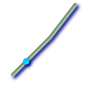

Linear Referencing
==================

ST\_LineInterpolatePoint
Returns a point interpolated along a line. Second argument is a float8
between 0 and 1 representing fraction of total length of linestring the
point has to be located.
geometry
ST\_LineInterpolatePoint
geometry
a\_linestring
float
a\_fraction
Description
-----------

Returns a point interpolated along a line. First argument must be a
LINESTRING. Second argument is a float8 between 0 and 1 representing
fraction of total linestring length the point has to be located.

See ? for computing the line location nearest to a Point.

    **Note**

    Since release 1.1.1 this function also interpolates M and Z values
    (when present), while prior releases set them to 0.0.

Availability: 0.8.2, Z and M supported added in 1.1.1

Changed: 2.1.0. Up to 2.0.x this was called ST\_LineInterpolatePoint.

Z\_SUPPORT

Examples
--------

|A linestring with the interpolated point at 20% position (0.20)|

::

    --Return point 20% along 2d line
    SELECT ST_AsEWKT(ST_LineInterpolatePoint(the_line, 0.20))
        FROM (SELECT ST_GeomFromEWKT('LINESTRING(25 50, 100 125, 150 190)') as the_line) As foo;
       st_asewkt
    ----------------
     POINT(51.5974135047432 76.5974135047432)

::

    --Return point mid-way of 3d line
    SELECT ST_AsEWKT(ST_LineInterpolatePoint(the_line, 0.5))
        FROM (SELECT ST_GeomFromEWKT('LINESTRING(1 2 3, 4 5 6, 6 7 8)') as the_line) As foo;

        st_asewkt
    --------------------
     POINT(3.5 4.5 5.5)

    --find closest point on a line to a point or other geometry
     SELECT ST_AsText(ST_LineInterpolatePoint(foo.the_line, ST_LineLocatePoint(foo.the_line, ST_GeomFromText('POINT(4 3)'))))
    FROM (SELECT ST_GeomFromText('LINESTRING(1 2, 4 5, 6 7)') As the_line) As foo;
       st_astext
    ----------------
     POINT(3 4)

See Also
--------

?, ?, ?, ?

ST\_LineLocatePoint
Returns a float between 0 and 1 representing the location of the closest
point on LineString to the given Point, as a fraction of total 2d line
length.
float
ST\_LineLocatePoint
geometry
a\_linestring
geometry
a\_point
Description
-----------

Returns a float between 0 and 1 representing the location of the closest
point on LineString to the given Point, as a fraction of total `2d
line <#ST_Length2D>`__ length.

You can use the returned location to extract a Point (?) or a substring
(?).

This is useful for approximating numbers of addresses

Availability: 1.1.0

Changed: 2.1.0. Up to 2.0.x this was called ST\_Line\_Locate\_Point.

Examples
--------

::

    --Rough approximation of finding the street number of a point along the street
    --Note the whole foo thing is just to generate dummy data that looks
    --like house centroids and street
    --We use ST_DWithin to exclude
    --houses too far away from the street to be considered on the street
    SELECT ST_AsText(house_loc) As as_text_house_loc,
        startstreet_num +
            CAST( (endstreet_num - startstreet_num)
                * ST_LineLocatePoint(street_line, house_loc) As integer) As street_num
    FROM
    (SELECT ST_GeomFromText('LINESTRING(1 2, 3 4)') As street_line,
        ST_MakePoint(x*1.01,y*1.03) As house_loc, 10 As startstreet_num,
            20 As endstreet_num
    FROM generate_series(1,3) x CROSS JOIN generate_series(2,4) As y)
    As foo
    WHERE ST_DWithin(street_line, house_loc, 0.2);

     as_text_house_loc | street_num
    -------------------+------------
     POINT(1.01 2.06)  |         10
     POINT(2.02 3.09)  |         15
     POINT(3.03 4.12)  |         20

     --find closest point on a line to a point or other geometry
     SELECT ST_AsText(ST_LineInterpolatePoint(foo.the_line, ST_LineLocatePoint(foo.the_line, ST_GeomFromText('POINT(4 3)'))))
    FROM (SELECT ST_GeomFromText('LINESTRING(1 2, 4 5, 6 7)') As the_line) As foo;
       st_astext
    ----------------
     POINT(3 4)

See Also
--------

?, ?, ?, ?

ST\_LineSubstring
Return a linestring being a substring of the input one starting and
ending at the given fractions of total 2d length. Second and third
arguments are float8 values between 0 and 1.
geometry
ST\_LineSubstring
geometry
a\_linestring
float
startfraction
float
endfraction
Description
-----------

Return a linestring being a substring of the input one starting and
ending at the given fractions of total 2d length. Second and third
arguments are float8 values between 0 and 1. This only works with
LINESTRINGs. To use with contiguous MULTILINESTRINGs use in conjunction
with ?.

If 'start' and 'end' have the same value this is equivalent to ?.

See ? for computing the line location nearest to a Point.

    **Note**

    Since release 1.1.1 this function also interpolates M and Z values
    (when present), while prior releases set them to unspecified values.

Availability: 1.1.0, Z and M supported added in 1.1.1

Changed: 2.1.0. Up to 2.0.x this was called ST\_LineSubstring.

Z\_SUPPORT

Examples
--------

|A linestring seen with 1/3 midrange overlaid (0.333, 0.666)|

::

    --Return the approximate 1/3 mid-range part of a linestring
    SELECT ST_AsText(ST_Line_SubString(ST_GeomFromText('LINESTRING(25 50, 100 125, 150 190)'), 0.333, 0.666));

                                               st_astext
    ------------------------------------------------------------------------------------------------
    LINESTRING(69.2846934853974 94.2846934853974,100 125,111.700356260683 140.210463138888)

    --The below example simulates a while loop in
    --SQL using PostgreSQL generate_series() to cut all
    --linestrings in a table to 100 unit segments
    -- of which no segment is longer than 100 units
    -- units are measured in the SRID units of measurement
    -- It also assumes all geometries are LINESTRING or contiguous MULTILINESTRING
    --and no geometry is longer than 100 units*10000
    --for better performance you can reduce the 10000
    --to match max number of segments you expect

    SELECT field1, field2, ST_LineSubstring(the_geom, 100.00*n/length,
      CASE
        WHEN 100.00*(n+1) < length THEN 100.00*(n+1)/length
        ELSE 1
      END) As the_geom
    FROM
      (SELECT sometable.field1, sometable.field2,
      ST_LineMerge(sometable.the_geom) AS the_geom,
      ST_Length(sometable.the_geom) As length
      FROM sometable
      ) AS t
    CROSS JOIN generate_series(0,10000) AS n
    WHERE n*100.00/length < 1;
                

See Also
--------

?, ?, ?

ST\_LocateAlong
Return a derived geometry collection value with elements that match the
specified measure. Polygonal elements are not supported.
geometry
ST\_LocateAlong
geometry
ageom\_with\_measure
float
a\_measure
float
offset
Description
-----------

Return a derived geometry collection value with elements that match the
specified measure. Polygonal elements are not supported.

If an offset is provided, the resultant will be offset to the left or
right of the input line by the specified number of units. A positive
offset will be to the left, and a negative one to the right.

Semantic is specified by: ISO/IEC CD 13249-3:200x(E) - Text for
Continuation CD Editing Meeting

Availability: 1.1.0 by old name ST\_Locate\_Along\_Measure.

Changed: 2.0.0 in prior versions this used to be called
ST\_Locate\_Along\_Measure. The old name has been deprecated and will be
removed in the future but is still available.

    **Note**

    Use this function only for geometries with an M component

M\_SUPPORT

Examples
--------

::

    SELECT ST_AsText(the_geom)
            FROM
            (SELECT ST_LocateAlong(
                ST_GeomFromText('MULTILINESTRINGM((1 2 3, 3 4 2, 9 4 3),
            (1 2 3, 5 4 5))'),3) As the_geom) As foo;

                             st_asewkt
    -----------------------------------------------------------
     MULTIPOINT M (1 2 3)

    --Geometry collections are difficult animals so dump them
    --to make them more digestable
    SELECT ST_AsText((ST_Dump(the_geom)).geom)
        FROM
        (SELECT ST_LocateAlong(
                ST_GeomFromText('MULTILINESTRINGM((1 2 3, 3 4 2, 9 4 3),
        (1 2 3, 5 4 5))'),3) As the_geom) As foo;

       st_asewkt
    ---------------
     POINTM(1 2 3)
     POINTM(9 4 3)
     POINTM(1 2 3)
        

See Also
--------

?, ?

ST\_LocateBetween
Return a derived geometry collection value with elements that match the
specified range of measures inclusively. Polygonal elements are not
supported.
geometry
ST\_LocateBetween
geometry
geomA
float
measure\_start
float
measure\_end
float
offset
Description
-----------

Return a derived geometry collection value with elements that match the
specified range of measures inclusively. Polygonal elements are not
supported.

Semantic is specified by: ISO/IEC CD 13249-3:200x(E) - Text for
Continuation CD Editing Meeting

Availability: 1.1.0 by old name ST\_Locate\_Between\_Measures.

Changed: 2.0.0 - in prior versions this used to be called
ST\_Locate\_Between\_Measures. The old name has been deprecated and will
be removed in the future but is still available for backward
compatibility.

M\_SUPPORT

Examples
--------

::

    SELECT ST_AsText(the_geom)
            FROM
            (SELECT ST_LocateBetween(
                ST_GeomFromText('MULTILINESTRING M ((1 2 3, 3 4 2, 9 4 3),
            (1 2 3, 5 4 5))'),1.5, 3) As the_geom) As foo;

                                 st_asewkt
    ------------------------------------------------------------------------
     GEOMETRYCOLLECTION M (LINESTRING M (1 2 3,3 4 2,9 4 3),POINT M (1 2 3))

    --Geometry collections are difficult animals so dump them
    --to make them more digestable
    SELECT ST_AsText((ST_Dump(the_geom)).geom)
            FROM
            (SELECT ST_LocateBetween(
                ST_GeomFromText('MULTILINESTRING M ((1 2 3, 3 4 2, 9 4 3),
            (1 2 3, 5 4 5))'),1.5, 3) As the_geom) As foo;

               st_asewkt
    --------------------------------
     LINESTRING M (1 2 3,3 4 2,9 4 3)
     POINT M (1 2 3)

See Also
--------

?, ?

ST\_LocateBetweenElevations
Return a derived geometry (collection) value with elements that
intersect the specified range of elevations inclusively. Only 3D, 4D
LINESTRINGS and MULTILINESTRINGS are supported.
geometry
ST\_LocateBetweenElevations
geometry
geom\_mline
float
elevation\_start
float
elevation\_end
Description
-----------

Return a derived geometry (collection) value with elements that
intersect the specified range of elevations inclusively. Only 3D, 3DM
LINESTRINGS and MULTILINESTRINGS are supported.

Availability: 1.4.0

Z\_SUPPORT

Examples
--------

::

    SELECT ST_AsEWKT(ST_LocateBetweenElevations(
                ST_GeomFromEWKT('LINESTRING(1 2 3, 4 5 6)'),2,4)) As ewelev;
                                       ewelev
    ----------------------------------------------------------------
        MULTILINESTRING((1 2 3,2 3 4))

    SELECT ST_AsEWKT(ST_LocateBetweenElevations(
                ST_GeomFromEWKT('LINESTRING(1 2 6, 4 5 -1, 7 8 9)'),6,9)) As ewelev;

                    ewelev
    ----------------------------------------------------------------
    GEOMETRYCOLLECTION(POINT(1 2 6),LINESTRING(6.1 7.1 6,7 8 9))

    --Geometry collections are difficult animals so dump them
    --to make them more digestable
    SELECT ST_AsEWKT((ST_Dump(the_geom)).geom)
            FROM
            (SELECT ST_LocateBetweenElevations(
                ST_GeomFromEWKT('LINESTRING(1 2 6, 4 5 -1, 7 8 9)'),6,9) As the_geom) As foo;

               st_asewkt
    --------------------------------
    POINT(1 2 6)
    LINESTRING(6.1 7.1 6,7 8 9)

See Also
--------

?

ST\_InterpolatePoint
Return the value of the measure dimension of a geometry at the point
closed to the provided point.
float
ST\_InterpolatePoint
geometry
line
geometry
point
Description
-----------

Return the value of the measure dimension of a geometry at the point
closed to the provided point.

Availability: 2.0.0

Z\_SUPPORT

Examples
--------

::

    SELECT ST_InterpolatePoint('LINESTRING M (0 0 0, 10 0 20)', 'POINT(5 5)');
     st_interpolatepoint 
     ---------------------
                            10
        

See Also
--------

?, ?, ?

ST\_AddMeasure
Return a derived geometry with measure elements linearly interpolated
between the start and end points. If the geometry has no measure
dimension, one is added. If the geometry has a measure dimension, it is
over-written with new values. Only LINESTRINGS and MULTILINESTRINGS are
supported.
geometry
ST\_AddMeasure
geometry
geom\_mline
float
measure\_start
float
measure\_end
Description
-----------

Return a derived geometry with measure elements linearly interpolated
between the start and end points. If the geometry has no measure
dimension, one is added. If the geometry has a measure dimension, it is
over-written with new values. Only LINESTRINGS and MULTILINESTRINGS are
supported.

Availability: 1.5.0

Z\_SUPPORT

Examples
--------

::

    SELECT ST_AsText(ST_AddMeasure(
    ST_GeomFromEWKT('LINESTRING(1 0, 2 0, 4 0)'),1,4)) As ewelev;
               ewelev             
    --------------------------------
     LINESTRINGM(1 0 1,2 0 2,4 0 4)

    SELECT ST_AsText(ST_AddMeasure(
    ST_GeomFromEWKT('LINESTRING(1 0 4, 2 0 4, 4 0 4)'),10,40)) As ewelev;
                     ewelev                 
    ----------------------------------------
     LINESTRING(1 0 4 10,2 0 4 20,4 0 4 40)

    SELECT ST_AsText(ST_AddMeasure(
    ST_GeomFromEWKT('LINESTRINGM(1 0 4, 2 0 4, 4 0 4)'),10,40)) As ewelev;
                     ewelev                 
    ----------------------------------------
     LINESTRINGM(1 0 10,2 0 20,4 0 40)
     
    SELECT ST_AsText(ST_AddMeasure(
    ST_GeomFromEWKT('MULTILINESTRINGM((1 0 4, 2 0 4, 4 0 4),(1 0 4, 2 0 4, 4 0 4))'),10,70)) As ewelev;
                                 ewelev                              
    -----------------------------------------------------------------
     MULTILINESTRINGM((1 0 10,2 0 20,4 0 40),(1 0 40,2 0 50,4 0 70))

