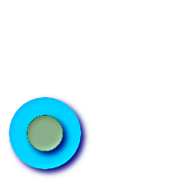

Spatial Relationships and Measurements
======================================

ST\_3DClosestPoint Returns the 3-dimensional point on g1 that is closest
to g2. This is the first point of the 3D shortest line. geometry
ST\_3DClosestPoint geometry g1 geometry g2 Description -----------

Returns the 3-dimensional point on g1 that is closest to g2. This is the
first point of the 3D shortest line. The 3D length of the 3D shortest
line is the 3D distance.

Z\_SUPPORT

P\_SUPPORT

Availability: 2.0.0

Examples
--------

+------------------------------------------------------------------------+
| linestring and point -- both 3d and 2d closest point                   |
+------------------------------------------------------------------------+
| SELECT ST\_AsEWKT(ST\_3DClosestPoint(line,pt)) AS cp3d\_line\_pt,      |
| ST\_AsEWKT(ST\_ClosestPoint(line,pt)) As cp2d\_line\_pt FROM (SELECT   |
| 'POINT(100 100 30)'::geometry As pt, 'LINESTRING (20 80 20, 98 190 1,  |
| 110 180 3, 50 75 1000)'::geometry As line ) As foo;                    |
+------------------------------------------------------------------------+
| cp3d\_line\_pt \| cp2d\_line\_pt                                       |
| -----------------------------------------------------------+---------- |
| --------------------------------                                       |
| POINT(54.6993798867619 128.935022917228 11.5475869506606) \|           |
| POINT(73.0769230769231 115.384615384615)                               |
+------------------------------------------------------------------------+
| linestring and multipoint -- both 3d and 2d closest point              |
+------------------------------------------------------------------------+
| SELECT ST\_AsEWKT(ST\_3DClosestPoint(line,pt)) AS cp3d\_line\_pt,      |
| ST\_AsEWKT(ST\_ClosestPoint(line,pt)) As cp2d\_line\_pt FROM (SELECT   |
| 'MULTIPOINT(100 100 30, 50 74 1000)'::geometry As pt, 'LINESTRING (20  |
| 80 20, 98 190 1, 110 180 3, 50 75 900)'::geometry As line ) As foo;    |
+------------------------------------------------------------------------+
| cp3d\_line\_pt \| cp2d\_line\_pt                                       |
| -----------------------------------------------------------+---------- |
| ----                                                                   |
| POINT(54.6993798867619 128.935022917228 11.5475869506606) \| POINT(50  |
| 75)                                                                    |
+------------------------------------------------------------------------+
| Multilinestring and polygon both 3d and 2d closest point               |
+------------------------------------------------------------------------+
| SELECT ST\_AsEWKT(ST\_3DClosestPoint(poly, mline)) As cp3d,            |
| ST\_AsEWKT(ST\_ClosestPoint(poly, mline)) As cp2d FROM (SELECT         |
| ST\_GeomFromEWKT('POLYGON((175 150 5, 20 40 5, 35 45 5, 50 60 5, 100   |
| 100 5, 175 150 5))') As poly, ST\_GeomFromEWKT('MULTILINESTRING((175   |
| 155 2, 20 40 20, 50 60 -2, 125 100 1, 175 155 1), (1 10 2, 5 20 1))')  |
| As mline ) As foo; cp3d \| cp2d                                        |
| -------------------------------------------+--------------             |
| POINT(39.993580415989 54.1889925532825 5) \| POINT(20 40)              |
+------------------------------------------------------------------------+

See Also
--------

?, ?, ?, ?

ST\_3DDistance For geometry type Returns the 3-dimensional cartesian
minimum distance (based on spatial ref) between two geometries in
projected units. float ST\_3DDistance geometry g1 geometry g2
Description -----------

For geometry type returns the 3-dimensional minimum cartesian distance
between two geometries in projected units (spatial ref units).

Z\_SUPPORT

P\_SUPPORT

SQLMM\_COMPLIANT SQL-MM ?

SFCGAL\_ENHANCED

Availability: 2.0.0

Examples
--------

::

    -- Geometry example - units in meters (SRID: 2163 US National Atlas Equal area) (3D point and line compared 2D point and line)
    -- Note: currently no vertical datum support so Z is not transformed and assumed to be same units as final.
    SELECT ST_3DDistance(
                ST_Transform(ST_GeomFromEWKT('SRID=4326;POINT(-72.1235 42.3521 4)'),2163),
                ST_Transform(ST_GeomFromEWKT('SRID=4326;LINESTRING(-72.1260 42.45 15, -72.123 42.1546 20)'),2163)
            ) As dist_3d,
            ST_Distance(
                ST_Transform(ST_GeomFromText('POINT(-72.1235 42.3521)',4326),2163),
                ST_Transform(ST_GeomFromText('LINESTRING(-72.1260 42.45, -72.123 42.1546)', 4326),2163)
            ) As dist_2d;

         dist_3d      |     dist_2d
    ------------------+-----------------
     127.295059324629 | 126.66425605671

    -- Multilinestring and polygon both 3d and 2d distance
    -- Same example as 3D closest point example
    SELECT ST_3DDistance(poly, mline) As dist3d,
        ST_Distance(poly, mline) As dist2d 
            FROM (SELECT  ST_GeomFromEWKT('POLYGON((175 150 5, 20 40 5, 35 45 5, 50 60 5, 100 100 5, 175 150 5))') As poly,
                    ST_GeomFromEWKT('MULTILINESTRING((175 155 2, 20 40 20, 50 60 -2, 125 100 1, 175 155 1),
                    (1 10 2, 5 20 1))') As mline ) As foo;
          dist3d       | dist2d
    -------------------+--------
     0.716635696066337 |      0          

See Also
--------

?, ?, ?, ?, ?, ?

ST\_3DDWithin For 3d (z) geometry type Returns true if two geometries 3d
distance is within number of units. boolean ST\_3DDWithin geometry g1
geometry g2 double precision distance\_of\_srid Description -----------

For geometry type returns true if the 3d distance between two objects is
within distance\_of\_srid specified projected units (spatial ref units).

Z\_SUPPORT

P\_SUPPORT

SQLMM\_COMPLIANT SQL-MM ?

Availability: 2.0.0

Examples
--------

::

    -- Geometry example - units in meters (SRID: 2163 US National Atlas Equal area) (3D point and line compared 2D point and line)
    -- Note: currently no vertical datum support so Z is not transformed and assumed to be same units as final.
    SELECT ST_3DDWithin(
                ST_Transform(ST_GeomFromEWKT('SRID=4326;POINT(-72.1235 42.3521 4)'),2163),
                ST_Transform(ST_GeomFromEWKT('SRID=4326;LINESTRING(-72.1260 42.45 15, -72.123 42.1546 20)'),2163),
                126.8
            ) As within_dist_3d,
    ST_DWithin(
                ST_Transform(ST_GeomFromEWKT('SRID=4326;POINT(-72.1235 42.3521 4)'),2163),
                ST_Transform(ST_GeomFromEWKT('SRID=4326;LINESTRING(-72.1260 42.45 15, -72.123 42.1546 20)'),2163),
                126.8
            ) As within_dist_2d;

     within_dist_3d | within_dist_2d
    ----------------+----------------
     f              | t

See Also
--------

?, ?, ?, ?, ?

ST\_3DDFullyWithin Returns true if all of the 3D geometries are within
the specified distance of one another. boolean ST\_3DDFullyWithin
geometry g1 geometry g2 double precision distance Description
-----------

Returns true if the 3D geometries are fully within the specified
distance of one another. The distance is specified in units defined by
the spatial reference system of the geometries. For this function to
make sense, the source geometries must both be of the same coordinate
projection, having the same SRID.

    **Note**

    This function call will automatically include a bounding box
    comparison that will make use of any indexes that are available on
    the geometries.

Availability: 2.0.0

Z\_SUPPORT

P\_SUPPORT

Examples
--------

::

            -- This compares the difference between fully within and distance within as well
            -- as the distance fully within for the 2D footprint of the line/point vs. the 3d fully within
            SELECT ST_3DDFullyWithin(geom_a, geom_b, 10) as D3DFullyWithin10, ST_3DDWithin(geom_a, geom_b, 10) as D3DWithin10, 
        ST_DFullyWithin(geom_a, geom_b, 20) as D2DFullyWithin20, 
        ST_3DDFullyWithin(geom_a, geom_b, 20) as D3DFullyWithin20 from 
            (select ST_GeomFromEWKT('POINT(1 1 2)') as geom_a,
            ST_GeomFromEWKT('LINESTRING(1 5 2, 2 7 20, 1 9 100, 14 12 3)') as geom_b) t1;
     d3dfullywithin10 | d3dwithin10 | d2dfullywithin20 | d3dfullywithin20
    ------------------+-------------+------------------+------------------
     f                | t           | t                | f 

See Also
--------

?, ?, ?, ?

ST\_3DIntersects Returns TRUE if the Geometries "spatially intersect" in
3d - only for points and linestrings boolean ST\_3DIntersects geometry
geomA geometry geomB Description -----------

Overlaps, Touches, Within all imply spatial intersection. If any of the
aforementioned returns true, then the geometries also spatially
intersect. Disjoint implies false for spatial intersection.

Availability: 2.0.0

    **Note**

    This function call will automatically include a bounding box
    comparison that will make use of any indexes that are available on
    the geometries.

Z\_SUPPORT

P\_SUPPORT

SQLMM\_COMPLIANT SQL-MM 3: ?

Geometry Examples
-----------------

::

    SELECT ST_3DIntersects(pt, line), ST_Intersects(pt,line) 
        FROM (SELECT 'POINT(0 0 2)'::geometry As pt, 
            'LINESTRING (0 0 1, 0 2 3 )'::geometry As line) As foo;
     st_3dintersects | st_intersects
    -----------------+---------------
     f               | t
    (1 row)
            

See Also
--------

?

ST\_3DLongestLine Returns the 3-dimensional longest line between two
geometries geometry ST\_3DLongestLine geometry g1 geometry g2
Description -----------

Returns the 3-dimensional longest line between two geometries. The
function will only return the first longest line if more than one. The
line returned will always start in g1 and end in g2. The 3D length of
the line this function returns will always be the same as ? returns for
g1 and g2.

Availability: 2.0.0

Z\_SUPPORT

P\_SUPPORT

Examples
--------

+------------------------------------------------------------------------+
| linestring and point -- both 3d and 2d longest line                    |
+------------------------------------------------------------------------+
| SELECT ST\_AsEWKT(ST\_3DLongestLine(line,pt)) AS lol3d\_line\_pt,      |
| ST\_AsEWKT(ST\_LongestLine(line,pt)) As lol2d\_line\_pt FROM (SELECT   |
| 'POINT(100 100 30)'::geometry As pt, 'LINESTRING (20 80 20, 98 190 1,  |
| 110 180 3, 50 75 1000)'::geometry As line ) As foo;                    |
+------------------------------------------------------------------------+
| lol3d\_line\_pt \| lol2d\_line\_pt                                     |
| -----------------------------------+----------------------------       |
| LINESTRING(50 75 1000,100 100 30) \| LINESTRING(98 190,100 100)        |
+------------------------------------------------------------------------+
| linestring and multipoint -- both 3d and 2d longest line               |
+------------------------------------------------------------------------+
| SELECT ST\_AsEWKT(ST\_3DLongestLine(line,pt)) AS lol3d\_line\_pt,      |
| ST\_AsEWKT(ST\_LongestLine(line,pt)) As lol2d\_line\_pt FROM (SELECT   |
| 'MULTIPOINT(100 100 30, 50 74 1000)'::geometry As pt, 'LINESTRING (20  |
| 80 20, 98 190 1, 110 180 3, 50 75 900)'::geometry As line ) As foo;    |
+------------------------------------------------------------------------+
| lol3d\_line\_pt \| lol2d\_line\_pt                                     |
| ---------------------------------+--------------------------           |
| LINESTRING(98 190 1,50 74 1000) \| LINESTRING(98 190,50 74)            |
+------------------------------------------------------------------------+
| Multilinestring and polygon both 3d and 2d longest line                |
+------------------------------------------------------------------------+
| SELECT ST\_AsEWKT(ST\_3DLongestLine(poly, mline)) As lol3d,            |
| ST\_AsEWKT(ST\_LongestLine(poly, mline)) As lol2d FROM (SELECT         |
| ST\_GeomFromEWKT('POLYGON((175 150 5, 20 40 5, 35 45 5, 50 60 5, 100   |
| 100 5, 175 150 5))') As poly, ST\_GeomFromEWKT('MULTILINESTRING((175   |
| 155 2, 20 40 20, 50 60 -2, 125 100 1, 175 155 1), (1 10 2, 5 20 1))')  |
| As mline ) As foo; lol3d \| lol2d                                      |
| ------------------------------+--------------------------              |
| LINESTRING(175 150 5,1 10 2) \| LINESTRING(175 150,1 10)               |
+------------------------------------------------------------------------+

See Also
--------

?, ?, ?, ?, ?

ST\_3DMaxDistance For geometry type Returns the 3-dimensional cartesian
maximum distance (based on spatial ref) between two geometries in
projected units. float ST\_3DMaxDistance geometry g1 geometry g2
Description -----------

For geometry type returns the 3-dimensional maximum cartesian distance
between two geometries in projected units (spatial ref units).

Z\_SUPPORT

P\_SUPPORT

Availability: 2.0.0

Examples
--------

::

    -- Geometry example - units in meters (SRID: 2163 US National Atlas Equal area) (3D point and line compared 2D point and line)
    -- Note: currently no vertical datum support so Z is not transformed and assumed to be same units as final.
    SELECT ST_3DMaxDistance(
                ST_Transform(ST_GeomFromEWKT('SRID=4326;POINT(-72.1235 42.3521 10000)'),2163),
                ST_Transform(ST_GeomFromEWKT('SRID=4326;LINESTRING(-72.1260 42.45 15, -72.123 42.1546 20)'),2163)
            ) As dist_3d,
            ST_MaxDistance(
                ST_Transform(ST_GeomFromEWKT('SRID=4326;POINT(-72.1235 42.3521 10000)'),2163),
                ST_Transform(ST_GeomFromEWKT('SRID=4326;LINESTRING(-72.1260 42.45 15, -72.123 42.1546 20)'),2163)
            ) As dist_2d;

         dist_3d      |     dist_2d
    ------------------+------------------
     24383.7467488441 | 22247.8472107251

See Also
--------

?, ?, ?, ?

ST\_3DShortestLine Returns the 3-dimensional shortest line between two
geometries geometry ST\_3DShortestLine geometry g1 geometry g2
Description -----------

Returns the 3-dimensional shortest line between two geometries. The
function will only return the first shortest line if more than one, that
the function finds. If g1 and g2 intersects in just one point the
function will return a line with both start and end in that
intersection-point. If g1 and g2 are intersecting with more than one
point the function will return a line with start and end in the same
point but it can be any of the intersecting points. The line returned
will always start in g1 and end in g2. The 3D length of the line this
function returns will always be the same as ? returns for g1 and g2.

Availability: 2.0.0

Z\_SUPPORT

P\_SUPPORT

Examples
--------

+-------------------------------------------------------------------------+
| linestring and point -- both 3d and 2d shortest line                    |
+-------------------------------------------------------------------------+
| SELECT ST\_AsEWKT(ST\_3DShortestLine(line,pt)) AS shl3d\_line\_pt,      |
| ST\_AsEWKT(ST\_ShortestLine(line,pt)) As shl2d\_line\_pt FROM (SELECT   |
| 'POINT(100 100 30)'::geometry As pt, 'LINESTRING (20 80 20, 98 190 1,   |
| 110 180 3, 50 75 1000)'::geometry As line ) As foo;                     |
+-------------------------------------------------------------------------+
| shl3d\_line\_pt \| shl2d\_line\_pt                                      |
| ----------------------------------------------------------------------- |
| -----+------------------------------------------------------            |
| LINESTRING(54.6993798867619 128.935022917228 11.5475869506606,100 100   |
| 30) \| LINESTRING(73.0769230769231 115.384615384615,100 100)            |
+-------------------------------------------------------------------------+
| linestring and multipoint -- both 3d and 2d shortest line               |
+-------------------------------------------------------------------------+
| SELECT ST\_AsEWKT(ST\_3DShortestLine(line,pt)) AS shl3d\_line\_pt,      |
| ST\_AsEWKT(ST\_ShortestLine(line,pt)) As shl2d\_line\_pt FROM (SELECT   |
| 'MULTIPOINT(100 100 30, 50 74 1000)'::geometry As pt, 'LINESTRING (20   |
| 80 20, 98 190 1, 110 180 3, 50 75 900)'::geometry As line ) As foo;     |
+-------------------------------------------------------------------------+
| shl3d\_line\_pt \| shl2d\_line\_pt                                      |
| ----------------------------------------------------------------------- |
| ----+------------------------                                           |
| LINESTRING(54.6993798867619 128.935022917228 11.5475869506606,100 100   |
| 30) \| LINESTRING(50 75,50 74)                                          |
+-------------------------------------------------------------------------+
| Multilinestring and polygon both 3d and 2d shortest line                |
+-------------------------------------------------------------------------+
| SELECT ST\_AsEWKT(ST\_3DShortestLine(poly, mline)) As shl3d,            |
| ST\_AsEWKT(ST\_ShortestLine(poly, mline)) As shl2d FROM (SELECT         |
| ST\_GeomFromEWKT('POLYGON((175 150 5, 20 40 5, 35 45 5, 50 60 5, 100    |
| 100 5, 175 150 5))') As poly, ST\_GeomFromEWKT('MULTILINESTRING((175    |
| 155 2, 20 40 20, 50 60 -2, 125 100 1, 175 155 1), (1 10 2, 5 20 1))')   |
| As mline ) As foo; shl3d \| shl2d                                       |
| ----------------------------------------------------------------------- |
| ----------------------------+------------------------                   |
| LINESTRING(39.993580415989 54.1889925532825 5,40.4078575708294          |
| 53.6052383805529 5.03423778139177) \| LINESTRING(20 40,20 40)           |
+-------------------------------------------------------------------------+

See Also
--------

?, ?, ?, ?, ?

ST\_Area Returns the area of the surface if it is a polygon or
multi-polygon. For "geometry" type area is in SRID units. For
"geography" area is in square meters. float ST\_Area geometry g1 float
ST\_Area geography geog boolean use\_spheroid=true Description
-----------

Returns the area of the geometry if it is a polygon or multi-polygon.
Return the area measurement of an ST\_Surface or ST\_MultiSurface value.
For geometry Area is in the units of the srid. For geography area is in
square meters and defaults to measuring about the spheroid of the
geography (currently only WGS84). To measure around the faster but less
accurate sphere -- ST\_Area(geog,false).

Enhanced: 2.0.0 - support for 2D polyhedral surfaces was introduced.

SFS\_COMPLIANT

SQLMM\_COMPLIANT SQL-MM 3: 8.1.2, 9.5.3

P\_SUPPORT

    **Note**

    For polyhedral surfaces, only supports 2D polyhedral surfaces (not
    2.5D). For 2.5D, may give a non-zero answer, but only for the faces
    that sit completely in XY plane.

SFCGAL\_ENHANCED

Examples
--------

Return area in square feet for a plot of Massachusetts land and multiply
by conversion to get square meters. Note this is in square feet because
2249 is Mass State Plane Feet

::

    SELECT ST_Area(the_geom) As sqft, ST_Area(the_geom)*POWER(0.3048,2) As sqm
            FROM (SELECT
            ST_GeomFromText('POLYGON((743238 2967416,743238 2967450,
                743265 2967450,743265.625 2967416,743238 2967416))',2249) ) As foo(the_geom);
      sqft   |     sqm
    ---------+-------------
     928.625 | 86.27208552

Return area square feet and transform to Massachusetts state plane
meters (26986) to get square meters. Note this is in square feet because
2249 is Mass State Plane Feet and transformed area is in square meters
since 26986 is state plane mass meters

::

    SELECT ST_Area(the_geom) As sqft, ST_Area(ST_Transform(the_geom,26986)) As sqm
            FROM (SELECT
            ST_GeomFromText('POLYGON((743238 2967416,743238 2967450,
                743265 2967450,743265.625 2967416,743238 2967416))',2249) ) As foo(the_geom);
      sqft   |       sqm
    ---------+------------------
     928.625 | 86.2724304199219
                

Return area square feet and square meters using Geography data type.
Note that we transform to our geometry to geography (before you can do
that make sure your geometry is in WGS 84 long lat 4326). Geography
always measures in meters. This is just for demonstration to compare.
Normally your table will be stored in geography data type already.

::

    SELECT ST_Area(the_geog)/POWER(0.3048,2) As sqft_spheroid,  ST_Area(the_geog,false)/POWER(0.3048,2) As sqft_sphere, ST_Area(the_geog) As sqm_spheroid
            FROM (SELECT
            geography(
            ST_Transform(
                ST_GeomFromText('POLYGON((743238 2967416,743238 2967450,743265 2967450,743265.625 2967416,743238 2967416))',
                    2249
                    ) ,4326
                )
            )
        ) As foo(the_geog);
     sqft_spheroid   |   sqft_sphere    |   sqm_spheroid
    -----------------+------------------+------------------
    928.684405217197 | 927.186481558724 | 86.2776044452694

     --if your data is in geography already
     SELECT ST_Area(the_geog)/POWER(0.3048,2) As  sqft, ST_Area(the_geog) As sqm
        FROM somegeogtable;

See Also
--------

?, ?, ?, ?

ST\_Azimuth Returns the north-based azimuth as the angle in radians
measured clockwise from the vertical on pointA to pointB. float
ST\_Azimuth geometry pointA geometry pointB float ST\_Azimuth geography
pointA geography pointB Description -----------

Returns the azimuth in radians of the segment defined by the given
point-geometries, or NULL if the two points are coincident. The azimuth
is north-based and is measured clockwise: North = 0; East = PI/2; South
= PI; West = 3PI/2.

The Azimuth is mathematical concept defined as the angle, in this case
measured in radian, between a reference plane and a point.

Availability: 1.1.0

Enhanced: 2.0.0 support for geography was introduced.

Azimuth is especially useful in conjunction with ST\_Translate for
shifting an object along its perpendicular axis. See upgis\_lineshift
`Plpgsqlfunctions PostGIS wiki
section <http://trac.osgeo.org/postgis/wiki/UsersWikiplpgsqlfunctions>`__
for example of this.

Examples
--------

Geometry Azimuth in degrees

::

    SELECT ST_Azimuth(ST_Point(25,45), ST_Point(75,100))/(2*pi())*360 as degA_B,
        ST_Azimuth(ST_Point(75,100), ST_Point(25,45))/(2*pi())*360 As degB_A;
        
    -- NOTE easier to remember syntax using PostgreSQL built-in degrees function --
    -- Both yield same answer --
    SELECT degrees( ST_Azimuth(ST_Point(25,45), ST_Point(75,100)) ) as degA_B,
        degrees( ST_Azimuth(ST_Point(75,100), ST_Point(25,45)) ) As degB_A;

          dega_b       |     degb_a
    ------------------+------------------
     42.2736890060937 | 222.273689006094

+-----------------------------------------------------------------------------------------------------+------------------------------------------------------------------------------------------------------+
| Green: the start Point(25,45) with its vertical. Yellow: degA\_B as the path to travel (azimuth).   | Green: the start Point(75,100) with its vertical. Yellow: degB\_A as the path to travel (azimuth).   |
+-----------------------------------------------------------------------------------------------------+------------------------------------------------------------------------------------------------------+

See Also
--------

?, ?, ?, `PostgreSQL Math
Functions <http://www.postgresql.org/docs/current/interactive/functions-math.html>`__

ST\_Centroid Returns the geometric center of a geometry. geometry
ST\_Centroid geometry g1 Description -----------

Computes the geometric center of a geometry, or equivalently, the center
of mass of the geometry as a ``POINT``. For [``MULTI``\ ]\ ``POINT``\ s,
this is computed as the arithmetic mean of the input coordinates. For
[``MULTI``\ ]\ ``LINESTRING``\ s, this is computed as the weighted
length of each line segment. For [``MULTI``\ ]\ ``POLYGON``\ s, "weight"
is thought in terms of area. If an empty geometry is supplied, an empty
``GEOMETRYCOLLECTION`` is returned. If ``NULL`` is supplied, ``NULL`` is
returned.

The centroid is equal to the centroid of the set of component Geometries
of highest dimension (since the lower-dimension geometries contribute
zero "weight" to the centroid).

    **Note**

    Computation will be more accurate if performed by the GEOS module
    (enabled at compile time).

SFS\_COMPLIANT

SQLMM\_COMPLIANT SQL-MM 3: 8.1.4, 9.5.5

Examples
--------

In each of the following illustrations, the blue dot represents the
centroid of the source geometry.

+--------------------------------+----------------------------------------+
| Centroid of a ``MULTIPOINT``   | Centroid of a ``LINESTRING``           |
+--------------------------------+----------------------------------------+
| Centroid of a ``POLYGON``      | Centroid of a ``GEOMETRYCOLLECTION``   |
+--------------------------------+----------------------------------------+

::

    SELECT ST_AsText(ST_Centroid('MULTIPOINT ( -1 0, -1 2, -1 3, -1 4, -1 7, 0 1, 0 3, 1 1, 2 0, 6 0, 7 8, 9 8, 10 6 )'));
                    st_astext
    ------------------------------------------
     POINT(2.30769230769231 3.30769230769231)
    (1 row)

See Also
--------

?

ST\_ClosestPoint Returns the 2-dimensional point on g1 that is closest
to g2. This is the first point of the shortest line. geometry
ST\_ClosestPoint geometry g1 geometry g2 Description -----------

Returns the 2-dimensional point on g1 that is closest to g2. This is the
first point of the shortest line.

    **Note**

    If you have a 3D Geometry, you may prefer to use ?.

Availability: 1.5.0

Examples
--------

+-----------------------------------------------+---------------------------+
| Closest between point and linestring is the   | closest point on polygon  |
| point itself, but closest point between a     | A to polygon B            |
| linestring and point is the point on line     |                           |
| string that is closest.                       |                           |
+-----------------------------------------------+---------------------------+
| SELECT ST\_AsText(ST\_ClosestPoint(pt,line))  | SELECT ST\_AsText(        |
| AS cp\_pt\_line,                              | ST\_ClosestPoint(         |
| ST\_AsText(ST\_ClosestPoint(line,pt)) As      | ST\_GeomFromText('POLYGON |
| cp\_line\_pt FROM (SELECT 'POINT(100          | ((175                     |
| 100)'::geometry As pt, 'LINESTRING (20 80, 98 | 150, 20 40, 50 60, 125    |
| 190, 110 180, 50 75 )'::geometry As line ) As | 100, 175 150))'),         |
| foo;                                          | ST\_Buffer(ST\_GeomFromTe |
|                                               | xt('POINT(110             |
|                                               | 170)'), 20) ) ) As ptwkt; |
+-----------------------------------------------+---------------------------+
| cp\_pt\_line \| cp\_line\_pt                  | ptwkt                     |
| ----------------+---------------------------- | ------------------------- |
| --------------                                | -----------------         |
| POINT(100 100) \| POINT(73.0769230769231      | POINT(140.752120669087    |
| 115.384615384615)                             | 125.695053378061)         |
+-----------------------------------------------+---------------------------+

See Also
--------

?,?, ?, ?, ?

ST\_Contains Returns true if and only if no points of B lie in the
exterior of A, and at least one point of the interior of B lies in the
interior of A. boolean ST\_Contains geometry geomA geometry geomB
Description -----------

Geometry A contains Geometry B if and only if no points of B lie in the
exterior of A, and at least one point of the interior of B lies in the
interior of A. An important subtlety of this definition is that A does
not contain its boundary, but A does contain itself. Contrast that to ?
where geometry A does not Contain Properly itself.

Returns TRUE if geometry B is completely inside geometry A. For this
function to make sense, the source geometries must both be of the same
coordinate projection, having the same SRID. ST\_Contains is the inverse
of ST\_Within. So ST\_Contains(A,B) implies ST\_Within(B,A) except in
the case of invalid geometries where the result is always false
regardless or not defined.

Performed by the GEOS module

    **Important**

    Do not call with a ``GEOMETRYCOLLECTION`` as an argument

    **Important**

    Do not use this function with invalid geometries. You will get
    unexpected results.

This function call will automatically include a bounding box comparison
that will make use of any indexes that are available on the geometries.
To avoid index use, use the function \_ST\_Contains.

NOTE: this is the "allowable" version that returns a boolean, not an
integer.

SFS\_COMPLIANT s2.1.1.2 // s2.1.13.3 - same as within(geometry B,
geometry A)

SQLMM\_COMPLIANT SQL-MM 3: 5.1.31

There are certain subtleties to ST\_Contains and ST\_Within that are not
intuitively obvious. For details check out `Subtleties of OGC Covers,
Contains,
Within <http://lin-ear-th-inking.blogspot.com/2007/06/subtleties-of-ogc-covers-spatial.html>`__

Examples
--------

The ``ST_Contains`` predicate returns ``TRUE`` in all the following
illustrations.

+-----------------------------------+-----------------------------+
| ``LINESTRING`` / ``MULTIPOINT``   | ``POLYGON`` / ``POINT``     |
+-----------------------------------+-----------------------------+
| ``POLYGON`` / ``LINESTRING``      | ``POLYGON`` / ``POLYGON``   |
+-----------------------------------+-----------------------------+

The ``ST_Contains`` predicate returns ``FALSE`` in all the following
illustrations.

+--------------------------------+--------------------------------+
| ``POLYGON`` / ``MULTIPOINT``   | ``POLYGON`` / ``LINESTRING``   |
+--------------------------------+--------------------------------+

::

    -- A circle within a circle
    SELECT ST_Contains(smallc, bigc) As smallcontainsbig,
           ST_Contains(bigc,smallc) As bigcontainssmall,
           ST_Contains(bigc, ST_Union(smallc, bigc)) as bigcontainsunion,
           ST_Equals(bigc, ST_Union(smallc, bigc)) as bigisunion,
           ST_Covers(bigc, ST_ExteriorRing(bigc)) As bigcoversexterior,
           ST_Contains(bigc, ST_ExteriorRing(bigc)) As bigcontainsexterior
    FROM (SELECT ST_Buffer(ST_GeomFromText('POINT(1 2)'), 10) As smallc,
                 ST_Buffer(ST_GeomFromText('POINT(1 2)'), 20) As bigc) As foo;

    -- Result
      smallcontainsbig | bigcontainssmall | bigcontainsunion | bigisunion | bigcoversexterior | bigcontainsexterior
    ------------------+------------------+------------------+------------+-------------------+---------------------
     f                | t                | t                | t          | t        | f

    -- Example demonstrating difference between contains and contains properly
    SELECT ST_GeometryType(geomA) As geomtype, ST_Contains(geomA,geomA) AS acontainsa, ST_ContainsProperly(geomA, geomA) AS acontainspropa,
       ST_Contains(geomA, ST_Boundary(geomA)) As acontainsba, ST_ContainsProperly(geomA, ST_Boundary(geomA)) As acontainspropba
    FROM (VALUES ( ST_Buffer(ST_Point(1,1), 5,1) ),
                 ( ST_MakeLine(ST_Point(1,1), ST_Point(-1,-1) ) ),
                 ( ST_Point(1,1) )
          ) As foo(geomA);

      geomtype    | acontainsa | acontainspropa | acontainsba | acontainspropba
    --------------+------------+----------------+-------------+-----------------
    ST_Polygon    | t          | f              | f           | f
    ST_LineString | t          | f              | f           | f
    ST_Point      | t          | t              | f           | f

See Also
--------

?, ?, ?, ?, ?, ?

ST\_ContainsProperly Returns true if B intersects the interior of A but
not the boundary (or exterior). A does not contain properly itself, but
does contain itself. boolean ST\_ContainsProperly geometry geomA
geometry geomB Description -----------

Returns true if B intersects the interior of A but not the boundary (or
exterior).

A does not contain properly itself, but does contain itself.

Every point of the other geometry is a point of this geometry's
interior. The DE-9IM Intersection Matrix for the two geometries matches
[T\*\*FF\*FF\*] used in ?

    **Note**

    From JTS docs slightly reworded: The advantage to using this
    predicate over ? and ? is that it can be computed efficiently, with
    no need to compute topology at individual points.

    An example use case for this predicate is computing the
    intersections of a set of geometries with a large polygonal
    geometry. Since intersection is a fairly slow operation, it can be
    more efficient to use containsProperly to filter out test geometries
    which lie wholly inside the area. In these cases the intersection is
    known a priori to be exactly the original test geometry.

Availability: 1.4.0 - requires GEOS >= 3.1.0.

    **Important**

    Do not call with a ``GEOMETRYCOLLECTION`` as an argument

    **Important**

    Do not use this function with invalid geometries. You will get
    unexpected results.

This function call will automatically include a bounding box comparison
that will make use of any indexes that are available on the geometries.
To avoid index use, use the function \_ST\_ContainsProperly.

Examples
--------

::

        --a circle within a circle
        SELECT ST_ContainsProperly(smallc, bigc) As smallcontainspropbig,
        ST_ContainsProperly(bigc,smallc) As bigcontainspropsmall,
        ST_ContainsProperly(bigc, ST_Union(smallc, bigc)) as bigcontainspropunion,
        ST_Equals(bigc, ST_Union(smallc, bigc)) as bigisunion,
        ST_Covers(bigc, ST_ExteriorRing(bigc)) As bigcoversexterior,
        ST_ContainsProperly(bigc, ST_ExteriorRing(bigc)) As bigcontainsexterior
        FROM (SELECT ST_Buffer(ST_GeomFromText('POINT(1 2)'), 10) As smallc,
        ST_Buffer(ST_GeomFromText('POINT(1 2)'), 20) As bigc) As foo;
        --Result
      smallcontainspropbig | bigcontainspropsmall | bigcontainspropunion | bigisunion | bigcoversexterior | bigcontainsexterior
    ------------------+------------------+------------------+------------+-------------------+---------------------
     f                     | t                    | f                    | t          | t                 | f

     --example demonstrating difference between contains and contains properly
     SELECT ST_GeometryType(geomA) As geomtype, ST_Contains(geomA,geomA) AS acontainsa, ST_ContainsProperly(geomA, geomA) AS acontainspropa,
     ST_Contains(geomA, ST_Boundary(geomA)) As acontainsba, ST_ContainsProperly(geomA, ST_Boundary(geomA)) As acontainspropba
     FROM (VALUES ( ST_Buffer(ST_Point(1,1), 5,1) ),
              ( ST_MakeLine(ST_Point(1,1), ST_Point(-1,-1) ) ),
              ( ST_Point(1,1) )
        ) As foo(geomA);

      geomtype    | acontainsa | acontainspropa | acontainsba | acontainspropba
    --------------+------------+----------------+-------------+-----------------
    ST_Polygon    | t          | f              | f           | f
    ST_LineString | t          | f              | f           | f
    ST_Point      | t          | t              | f           | f
     

See Also
--------

?, ?, ?, ?, ?, ?, ?, ?

ST\_Covers Returns 1 (TRUE) if no point in Geometry B is outside
Geometry A boolean ST\_Covers geometry geomA geometry geomB boolean
ST\_Covers geography geogpolyA geography geogpointB Description
-----------

Returns 1 (TRUE) if no point in Geometry/Geography B is outside
Geometry/Geography A

Performed by the GEOS module

    **Important**

    Do not call with a ``GEOMETRYCOLLECTION`` as an argument

    **Important**

    For geography only Polygon covers point is supported.

    **Important**

    Do not use this function with invalid geometries. You will get
    unexpected results.

This function call will automatically include a bounding box comparison
that will make use of any indexes that are available on the geometries.
To avoid index use, use the function \_ST\_Covers.

Availability: 1.2.2 - requires GEOS >= 3.0

Availability: 1.5 - support for geography was introduced.

NOTE: this is the "allowable" version that returns a boolean, not an
integer.

Not an OGC standard, but Oracle has it too.

There are certain subtleties to ST\_Contains and ST\_Within that are not
intuitively obvious. For details check out `Subtleties of OGC Covers,
Contains,
Within <http://lin-ear-th-inking.blogspot.com/2007/06/subtleties-of-ogc-covers-spatial.html>`__

Examples
--------

Geometry example

::

        --a circle covering a circle
    SELECT ST_Covers(smallc,smallc) As smallinsmall,
        ST_Covers(smallc, bigc) As smallcoversbig,
        ST_Covers(bigc, ST_ExteriorRing(bigc)) As bigcoversexterior,
        ST_Contains(bigc, ST_ExteriorRing(bigc)) As bigcontainsexterior
    FROM (SELECT ST_Buffer(ST_GeomFromText('POINT(1 2)'), 10) As smallc,
        ST_Buffer(ST_GeomFromText('POINT(1 2)'), 20) As bigc) As foo;
        --Result
     smallinsmall | smallcoversbig | bigcoversexterior | bigcontainsexterior
    --------------+----------------+-------------------+---------------------
     t            | f              | t                 | f
    (1 row) 

Geeography Example

::

    -- a point with a 300 meter buffer compared to a point, a point and its 10 meter buffer
    SELECT ST_Covers(geog_poly, geog_pt) As poly_covers_pt, 
        ST_Covers(ST_Buffer(geog_pt,10), geog_pt) As buff_10m_covers_cent
        FROM (SELECT ST_Buffer(ST_GeogFromText('SRID=4326;POINT(-99.327 31.4821)'), 300) As geog_poly,
                    ST_GeogFromText('SRID=4326;POINT(-99.33 31.483)') As geog_pt ) As foo;
                    
     poly_covers_pt | buff_10m_covers_cent
    ----------------+------------------
     f              | t
            

See Also
--------

?, ?, ?

ST\_CoveredBy Returns 1 (TRUE) if no point in Geometry/Geography A is
outside Geometry/Geography B boolean ST\_CoveredBy geometry geomA
geometry geomB boolean ST\_CoveredBy geography geogA geography geogB
Description -----------

Returns 1 (TRUE) if no point in Geometry/Geography A is outside
Geometry/Geography B

Performed by the GEOS module

    **Important**

    Do not call with a ``GEOMETRYCOLLECTION`` as an argument

    **Important**

    Do not use this function with invalid geometries. You will get
    unexpected results.

Availability: 1.2.2 - requires GEOS >= 3.0

This function call will automatically include a bounding box comparison
that will make use of any indexes that are available on the geometries.
To avoid index use, use the function \_ST\_CoveredBy.

NOTE: this is the "allowable" version that returns a boolean, not an
integer.

Not an OGC standard, but Oracle has it too.

There are certain subtleties to ST\_Contains and ST\_Within that are not
intuitively obvious. For details check out `Subtleties of OGC Covers,
Contains,
Within <http://lin-ear-th-inking.blogspot.com/2007/06/subtleties-of-ogc-covers-spatial.html>`__

Examples
--------

::

        --a circle coveredby a circle
    SELECT ST_CoveredBy(smallc,smallc) As smallinsmall,
        ST_CoveredBy(smallc, bigc) As smallcoveredbybig,
        ST_CoveredBy(ST_ExteriorRing(bigc), bigc) As exteriorcoveredbybig,
        ST_Within(ST_ExteriorRing(bigc),bigc) As exeriorwithinbig
    FROM (SELECT ST_Buffer(ST_GeomFromText('POINT(1 2)'), 10) As smallc,
        ST_Buffer(ST_GeomFromText('POINT(1 2)'), 20) As bigc) As foo;
        --Result
     smallinsmall | smallcoveredbybig | exteriorcoveredbybig | exeriorwithinbig
    --------------+-------------------+----------------------+------------------
     t            | t                 | t                    | f
    (1 row) 

See Also
--------

?, ?, ?, ?

ST\_Crosses Returns TRUE if the supplied geometries have some, but not
all, interior points in common. boolean ST\_Crosses geometry g1 geometry
g2 Description -----------

``ST_Crosses`` takes two geometry objects and returns ``TRUE`` if their
intersection "spatially cross", that is, the geometries have some, but
not all interior points in common. The intersection of the interiors of
the geometries must not be the empty set and must have a dimensionality
less than the the maximum dimension of the two input geometries.
Additionally, the intersection of the two geometries must not equal
either of the source geometries. Otherwise, it returns ``FALSE``.

In mathematical terms, this is expressed as:

TODO: Insert appropriate MathML markup here or use a gif. Simple HTML
markup does not work well in both IE and Firefox. |image0|

The DE-9IM Intersection Matrix for the two geometries is:

-  ``T*T******`` (for Point/Line, Point/Area, and Line/Area situations)

-  ``T*****T**`` (for Line/Point, Area/Point, and Area/Line situations)

-  ``0********`` (for Line/Line situations)

For any other combination of dimensions this predicate returns false.

The OpenGIS Simple Features Specification defines this predicate only
for Point/Line, Point/Area, Line/Line, and Line/Area situations. JTS /
GEOS extends the definition to apply to Line/Point, Area/Point and
Area/Line situations as well. This makes the relation symmetric.

    **Important**

    Do not call with a ``GEOMETRYCOLLECTION`` as an argument

    **Note**

    This function call will automatically include a bounding box
    comparison that will make use of any indexes that are available on
    the geometries.

SFS\_COMPLIANT s2.1.13.3

SQLMM\_COMPLIANT SQL-MM 3: 5.1.29

Examples
--------

The following illustrations all return ``TRUE``.

+-----------------------------------+-----------------------------------+
| ``MULTIPOINT`` / ``LINESTRING``   | ``MULTIPOINT`` / ``POLYGON``      |
+-----------------------------------+-----------------------------------+
| ``LINESTRING`` / ``POLYGON``      | ``LINESTRING`` / ``LINESTRING``   |
+-----------------------------------+-----------------------------------+

Consider a situation where a user has two tables: a table of roads and a
table of highways.

+-----------------------------------------------------------------------------------------------------------------+-------------------------------------------------------------------------------------------------------------------+
| CREATE TABLE roads ( id serial NOT NULL, the\_geom geometry, CONSTRAINT roads\_pkey PRIMARY KEY (road\_id) );   | CREATE TABLE highways ( id serial NOT NULL, the\_gem geometry, CONSTRAINT roads\_pkey PRIMARY KEY (road\_id) );   |
+-----------------------------------------------------------------------------------------------------------------+-------------------------------------------------------------------------------------------------------------------+

To determine a list of roads that cross a highway, use a query similiar
to:

SELECT roads.id FROM roads, highways WHERE ST\_Crosses(roads.the\_geom,
highways.the\_geom);

ST\_LineCrossingDirection Given 2 linestrings, returns a number between
-3 and 3 denoting what kind of crossing behavior. 0 is no crossing.
integer ST\_LineCrossingDirection geometry linestringA geometry
linestringB Description -----------

Given 2 linestrings, returns a number between -3 and 3 denoting what
kind of crossing behavior. 0 is no crossing. This is only supported for
``LINESTRING``

Definition of integer constants is as follows:

-  0: LINE NO CROSS

-  -1: LINE CROSS LEFT

-  1: LINE CROSS RIGHT

-  -2: LINE MULTICROSS END LEFT

-  2: LINE MULTICROSS END RIGHT

-  -3: LINE MULTICROSS END SAME FIRST LEFT

-  3: LINE MULTICROSS END SAME FIRST RIGHT

Availability: 1.4

Examples
--------

+-------------------------------------+-------------------------------------+
| Line 1 (green), Line 2 ball is      | Line 1 (green), Line 2 (blue) ball  |
| start point, triangle are end       | is start point, triangle are end    |
| points. Query below.                | points. Query below.                |
+-------------------------------------+-------------------------------------+
| SELECT                              | SELECT                              |
| ST\_LineCrossingDirection(foo.line1 | ST\_LineCrossingDirection(foo.line1 |
| ,                                   | ,                                   |
| foo.line2) As l1\_cross\_l2 ,       | foo.line2) As l1\_cross\_l2 ,       |
| ST\_LineCrossingDirection(foo.line2 | ST\_LineCrossingDirection(foo.line2 |
| ,                                   | ,                                   |
| foo.line1) As l2\_cross\_l1 FROM (  | foo.line1) As l2\_cross\_l1 FROM (  |
| SELECT                              | SELECT                              |
| ST\_GeomFromText('LINESTRING(25     | ST\_GeomFromText('LINESTRING(25     |
| 169,89 114,40 70,86 43)') As line1, | 169,89 114,40 70,86 43)') As line1, |
| ST\_GeomFromText('LINESTRING(171    | ST\_GeomFromText('LINESTRING (171   |
| 154,20 140,71 74,161 53)') As line2 | 154, 20 140, 71 74, 2.99 90.16)')   |
| ) As foo;                           | As line2 ) As foo;                  |
+-------------------------------------+-------------------------------------+
| l1\_cross\_l2 \| l2\_cross\_l1      | l1\_cross\_l2 \| l2\_cross\_l1      |
| -------------+------------- 3 \| -3 | -------------+------------- 2 \| -2 |
+-------------------------------------+-------------------------------------+
| Line 1 (green), Line 2 (blue) ball  | Line 1 (green), Line 2 (blue) ball  |
| is start point, triangle are end    | is start point, triangle are end    |
| points. Query below.                | points. Query below.                |
+-------------------------------------+-------------------------------------+
| SELECT                              | SELECT                              |
| ST\_LineCrossingDirection(foo.line1 | ST\_LineCrossingDirection(foo.line1 |
| ,                                   | ,                                   |
| foo.line2) As l1\_cross\_l2 ,       | foo.line2) As l1\_cross\_l2 ,       |
| ST\_LineCrossingDirection(foo.line2 | ST\_LineCrossingDirection(foo.line2 |
| ,                                   | ,                                   |
| foo.line1) As l2\_cross\_l1 FROM (  | foo.line1) As l2\_cross\_l1 FROM    |
| SELECT                              | (SELECT                             |
| ST\_GeomFromText('LINESTRING(25     | ST\_GeomFromText('LINESTRING(25     |
| 169,89 114,40 70,86 43)') As line1, | 169,89 114,40 70,86 43)') As line1, |
| ST\_GeomFromText('LINESTRING (20    | ST\_GeomFromText('LINESTRING(2.99   |
| 140, 71 74, 161 53)') As line2 ) As | 90.16,71 74,20 140,171 154)') As    |
| foo;                                | line2 ) As foo;                     |
+-------------------------------------+-------------------------------------+

::

    SELECT s1.gid, s2.gid, ST_LineCrossingDirection(s1.the_geom, s2.the_geom)
        FROM streets s1 CROSS JOIN streets s2 ON (s1.gid != s2.gid AND s1.the_geom && s2.the_geom )
    WHERE ST_CrossingDirection(s1.the_geom, s2.the_geom) > 0;

See Also
--------

?

ST\_Disjoint Returns TRUE if the Geometries do not "spatially intersect"
- if they do not share any space together. boolean ST\_Disjoint geometry
A geometry B Description -----------

Overlaps, Touches, Within all imply geometries are not spatially
disjoint. If any of the aforementioned returns true, then the geometries
are not spatially disjoint. Disjoint implies false for spatial
intersection.

    **Important**

    Do not call with a ``GEOMETRYCOLLECTION`` as an argument

Performed by the GEOS module

    **Note**

    This function call does not use indexes

    **Note**

    NOTE: this is the "allowable" version that returns a boolean, not an
    integer.

SFS\_COMPLIANT s2.1.1.2 //s2.1.13.3 - a.Relate(b, 'FF\*FF\*\*\*\*')

SQLMM\_COMPLIANT SQL-MM 3: 5.1.26

Examples
--------

::

    SELECT ST_Disjoint('POINT(0 0)'::geometry, 'LINESTRING ( 2 0, 0 2 )'::geometry);
     st_disjoint
    ---------------
     t
    (1 row)
    SELECT ST_Disjoint('POINT(0 0)'::geometry, 'LINESTRING ( 0 0, 0 2 )'::geometry);
     st_disjoint
    ---------------
     f
    (1 row)
            

See Also
--------

?ST\_Intersects

ST\_Distance For geometry type Returns the 2-dimensional cartesian
minimum distance (based on spatial ref) between two geometries in
projected units. For geography type defaults to return spheroidal
minimum distance between two geographies in meters. float ST\_Distance
geometry g1 geometry g2 float ST\_Distance geography gg1 geography gg2
float ST\_Distance geography gg1 geography gg2 boolean use\_spheroid
Description -----------

For geometry type returns the 2-dimensional minimum cartesian distance
between two geometries in projected units (spatial ref units). For
geography type defaults to return the minimum distance around WGS 84
spheroid between two geographies in meters. Pass in false to return
answer in sphere instead of spheroid.

SFS\_COMPLIANT

SQLMM\_COMPLIANT SQL-MM 3: 5.1.23

CURVE\_SUPPORT

SFCGAL\_ENHANCED

Availability: 1.5.0 geography support was introduced in 1.5. Speed
improvements for planar to better handle large or many vertex geometries

Enhanced: 2.1.0 improved speed for geography. See `Making Geography
faster <http://blog.opengeo.org/2012/07/12/making-geography-faster/>`__
for details.

Enhanced: 2.1.0 - support for curved geometries was introduced.

Basic Geometry Examples
-----------------------

::

    --Geometry example - units in planar degrees 4326 is WGS 84 long lat unit=degrees
    SELECT ST_Distance(
            ST_GeomFromText('POINT(-72.1235 42.3521)',4326),
            ST_GeomFromText('LINESTRING(-72.1260 42.45, -72.123 42.1546)', 4326)
        );
    st_distance
    -----------------
    0.00150567726382282

    -- Geometry example - units in meters (SRID: 26986 Massachusetts state plane meters) (most accurate for Massachusetts)
    SELECT ST_Distance(
                ST_Transform(ST_GeomFromText('POINT(-72.1235 42.3521)',4326),26986),
                ST_Transform(ST_GeomFromText('LINESTRING(-72.1260 42.45, -72.123 42.1546)', 4326),26986)
            );
    st_distance
    -----------------
    123.797937878454

    -- Geometry example - units in meters (SRID: 2163 US National Atlas Equal area) (least accurate)
    SELECT ST_Distance(
                ST_Transform(ST_GeomFromText('POINT(-72.1235 42.3521)',4326),2163),
                ST_Transform(ST_GeomFromText('LINESTRING(-72.1260 42.45, -72.123 42.1546)', 4326),2163)
            );

    st_distance
    ------------------
    126.664256056812

Geography Examples
------------------

::

    -- same as geometry example but note units in meters - use sphere for slightly faster less accurate
    SELECT ST_Distance(gg1, gg2) As spheroid_dist, ST_Distance(gg1, gg2, false) As sphere_dist 
    FROM (SELECT
        ST_GeographyFromText('SRID=4326;POINT(-72.1235 42.3521)') As gg1,
        ST_GeographyFromText('SRID=4326;LINESTRING(-72.1260 42.45, -72.123 42.1546)') As gg2
        ) As foo  ;

      spheroid_dist   |   sphere_dist
    ------------------+------------------
     123.802076746848 | 123.475736916397

See Also
--------

?, ?, ?, ?, ?, ?

ST\_HausdorffDistance Returns the Hausdorff distance between two
geometries. Basically a measure of how similar or dissimilar 2
geometries are. Units are in the units of the spatial reference system
of the geometries. float ST\_HausdorffDistance geometry g1 geometry g2
float ST\_HausdorffDistance geometry g1 geometry g2 float densifyFrac
Description -----------

Implements algorithm for computing a distance metric which can be
thought of as the "Discrete Hausdorff Distance". This is the Hausdorff
distance restricted to discrete points for one of the geometries.
`Wikipedia article on Hausdorff
distance <http://en.wikipedia.org/wiki/Hausdorff_distance>`__ `Martin
Davis note on how Hausdorff Distance calculation was used to prove
correctness of the CascadePolygonUnion
approach. <http://lin-ear-th-inking.blogspot.com/2009/01/computing-geometric-similarity.html>`__

When densifyFrac is specified, this function performs a segment
densification before computing the discrete hausdorff distance. The
densifyFrac parameter sets the fraction by which to densify each
segment. Each segment will be split into a number of equal-length
subsegments, whose fraction of the total length is closest to the given
fraction.

    **Note**

    The current implementation supports only vertices as the discrete
    locations. This could be extended to allow an arbitrary density of
    points to be used.

    **Note**

    This algorithm is NOT equivalent to the standard Hausdorff distance.
    However, it computes an approximation that is correct for a large
    subset of useful cases. One important part of this subset is
    Linestrings that are roughly parallel to each other, and roughly
    equal in length. This is a useful metric for line matching.

Availability: 1.5.0 - requires GEOS >= 3.2.0

Examples
--------

::

    postgis=# SELECT st_HausdorffDistance(
                    'LINESTRING (0 0, 2 0)'::geometry,
                    'MULTIPOINT (0 1, 1 0, 2 1)'::geometry);
     st_hausdorffdistance
     ----------------------
                         1
    (1 row)
                

    postgis=# SELECT st_hausdorffdistance('LINESTRING (130 0, 0 0, 0 150)'::geometry, 'LINESTRING (10 10, 10 150, 130 10)'::geometry, 0.5);
     st_hausdorffdistance
     ----------------------
                        70
    (1 row)
                

ST\_MaxDistance Returns the 2-dimensional largest distance between two
geometries in projected units. float ST\_MaxDistance geometry g1
geometry g2 Description -----------

Some useful description here.

    **Note**

    Returns the 2-dimensional maximum distance between two linestrings
    in projected units. If g1 and g2 is the same geometry the function
    will return the distance between the two vertices most far from each
    other in that geometry.

Availability: 1.5.0

Examples
--------

::

    postgis=# SELECT ST_MaxDistance('POINT(0 0)'::geometry, 'LINESTRING ( 2 0, 0 2 )'::geometry);
       st_maxdistance
    -----------------
     2
    (1 row)

    postgis=# SELECT ST_MaxDistance('POINT(0 0)'::geometry, 'LINESTRING ( 2 2, 2 2 )'::geometry);
      st_maxdistance  
    ------------------
     2.82842712474619
    (1 row)

See Also
--------

?, ?

ST\_Distance\_Sphere Returns minimum distance in meters between two
lon/lat geometries. Uses a spherical earth and radius of 6370986 meters.
Faster than ST\_Distance\_Spheroid , but less accurate. PostGIS versions
prior to 1.5 only implemented for points. float ST\_Distance\_Sphere
geometry geomlonlatA geometry geomlonlatB Description -----------

Returns minimum distance in meters between two lon/lat points. Uses a
spherical earth and radius of 6370986 meters. Faster than ?, but less
accurate. PostGIS Versions prior to 1.5 only implemented for points.

    **Note**

    This function currently does not look at the SRID of a geometry and
    will always assume its in WGS 84 long lat. Prior versions of this
    function only support points.

Availability: 1.5 - support for other geometry types besides points was
introduced. Prior versions only work with points.

Examples
--------

::

    SELECT round(CAST(ST_Distance_Sphere(ST_Centroid(the_geom), ST_GeomFromText('POINT(-118 38)',4326)) As numeric),2) As dist_meters,
    round(CAST(ST_Distance(ST_Transform(ST_Centroid(the_geom),32611),
            ST_Transform(ST_GeomFromText('POINT(-118 38)', 4326),32611)) As numeric),2) As dist_utm11_meters,
    round(CAST(ST_Distance(ST_Centroid(the_geom), ST_GeomFromText('POINT(-118 38)', 4326)) As numeric),5) As dist_degrees,
    round(CAST(ST_Distance(ST_Transform(the_geom,32611),
            ST_Transform(ST_GeomFromText('POINT(-118 38)', 4326),32611)) As numeric),2) As min_dist_line_point_meters
    FROM
        (SELECT ST_GeomFromText('LINESTRING(-118.584 38.374,-118.583 38.5)', 4326) As the_geom) as foo;
         dist_meters | dist_utm11_meters | dist_degrees | min_dist_line_point_meters
        -------------+-------------------+--------------+----------------------------
            70424.47 |          70438.00 |      0.72900 |                   65871.18

See Also
--------

?, ?

ST\_Distance\_Spheroid Returns the minimum distance between two lon/lat
geometries given a particular spheroid. PostGIS versions prior to 1.5
only support points. float ST\_Distance\_Spheroid geometry geomlonlatA
geometry geomlonlatB spheroid measurement\_spheroid Description
-----------

Returns minimum distance in meters between two lon/lat geometries given
a particular spheroid. See the explanation of spheroids given for ?.
PostGIS version prior to 1.5 only support points.

    **Note**

    This function currently does not look at the SRID of a geometry and
    will always assume its represented in the coordinates of the passed
    in spheroid. Prior versions of this function only support points.

Availability: 1.5 - support for other geometry types besides points was
introduced. Prior versions only work with points.

Examples
--------

::

    SELECT round(CAST(
            ST_Distance_Spheroid(ST_Centroid(the_geom), ST_GeomFromText('POINT(-118 38)',4326), 'SPHEROID["WGS 84",6378137,298.257223563]')
                As numeric),2) As dist_meters_spheroid,
            round(CAST(ST_Distance_Sphere(ST_Centroid(the_geom), ST_GeomFromText('POINT(-118 38)',4326)) As numeric),2) As dist_meters_sphere,
    round(CAST(ST_Distance(ST_Transform(ST_Centroid(the_geom),32611),
            ST_Transform(ST_GeomFromText('POINT(-118 38)', 4326),32611)) As numeric),2) As dist_utm11_meters
    FROM
        (SELECT ST_GeomFromText('LINESTRING(-118.584 38.374,-118.583 38.5)', 4326) As the_geom) as foo;
     dist_meters_spheroid | dist_meters_sphere | dist_utm11_meters
    ----------------------+--------------------+-------------------
                 70454.92 |           70424.47 |          70438.00

See Also
--------

?, ?

ST\_DFullyWithin Returns true if all of the geometries are within the
specified distance of one another boolean ST\_DFullyWithin geometry g1
geometry g2 double precision distance Description -----------

Returns true if the geometries is fully within the specified distance of
one another. The distance is specified in units defined by the spatial
reference system of the geometries. For this function to make sense, the
source geometries must both be of the same coordinate projection, having
the same SRID.

    **Note**

    This function call will automatically include a bounding box
    comparison that will make use of any indexes that are available on
    the geometries.

Availability: 1.5.0

Examples
--------

::

    postgis=# SELECT ST_DFullyWithin(geom_a, geom_b, 10) as DFullyWithin10, ST_DWithin(geom_a, geom_b, 10) as DWithin10, ST_DFullyWithin(geom_a, geom_b, 20) as DFullyWithin20 from 
            (select ST_GeomFromText('POINT(1 1)') as geom_a,ST_GeomFromText('LINESTRING(1 5, 2 7, 1 9, 14 12)') as geom_b) t1;
       
    -----------------
     DFullyWithin10 | DWithin10 | DFullyWithin20 |
    ---------------+----------+---------------+
     f             | t        | t             |  

See Also
--------

?, ?

ST\_DWithin Returns true if the geometries are within the specified
distance of one another. For geometry units are in those of spatial
reference and For geography units are in meters and measurement is
defaulted to use\_spheroid=true (measure around spheroid), for faster
check, use\_spheroid=false to measure along sphere. boolean ST\_DWithin
geometry g1 geometry g2 double precision distance\_of\_srid boolean
ST\_DWithin geography gg1 geography gg2 double precision
distance\_meters boolean ST\_DWithin geography gg1 geography gg2 double
precision distance\_meters boolean use\_spheroid Description -----------

Returns true if the geometries are within the specified distance of one
another.

For Geometries: The distance is specified in units defined by the
spatial reference system of the geometries. For this function to make
sense, the source geometries must both be of the same coordinate
projection, having the same SRID.

For geography units are in meters and measurement is defaulted to
use\_spheroid=true (measure around WGS 84 spheroid), for faster check,
use\_spheroid=false to measure along sphere.

    **Note**

    This function call will automatically include a bounding box
    comparison that will make use of any indexes that are available on
    the geometries.

    **Note**

    Prior to 1.3, ST\_Expand was commonly used in conjunction with &&
    and ST\_Distance to achieve the same effect and in pre-1.3.4 this
    function was basically short-hand for that construct. From 1.3.4,
    ST\_DWithin uses a more short-circuit distance function which should
    make it more efficient than prior versions for larger buffer
    regions.

    **Note**

    Use ST\_3DDWithin if you have 3D geometries.

SFS\_COMPLIANT

Availability: 1.5.0 support for geography was introduced

Enhanced: 2.1.0 improved speed for geography. See `Making Geography
faster <http://blog.opengeo.org/2012/07/12/making-geography-faster/>`__
for details.

Enhanced: 2.1.0 support for curved geometries was introduced.

Examples
--------

::

    --Find the nearest hospital to each school
    --that is within 3000 units of the school.
    -- We do an ST_DWithin search to utilize indexes to limit our search list
    -- that the non-indexable ST_Distance needs to process
    --If the units of the spatial reference is meters then units would be meters
    SELECT DISTINCT ON (s.gid) s.gid, s.school_name, s.the_geom, h.hospital_name
        FROM schools s
            LEFT JOIN hospitals h ON ST_DWithin(s.the_geom, h.the_geom, 3000)
        ORDER BY s.gid, ST_Distance(s.the_geom, h.the_geom);

    --The schools with no close hospitals
    --Find all schools with no hospital within 3000 units
    --away from the school.  Units is in units of spatial ref (e.g. meters, feet, degrees)
    SELECT s.gid, s.school_name
        FROM schools s
            LEFT JOIN hospitals h ON ST_DWithin(s.the_geom, h.the_geom, 3000)
        WHERE h.gid IS NULL;
                  

See Also
--------

?, ?

ST\_Equals Returns true if the given geometries represent the same
geometry. Directionality is ignored. boolean ST\_Equals geometry A
geometry B Description -----------

Returns TRUE if the given Geometries are "spatially equal". Use this for
a 'better' answer than '='. Note by spatially equal we mean
ST\_Within(A,B) = true and ST\_Within(B,A) = true and also mean ordering
of points can be different but represent the same geometry structure. To
verify the order of points is consistent, use ST\_OrderingEquals (it
must be noted ST\_OrderingEquals is a little more stringent than simply
verifying order of points are the same).

    **Important**

    This function will return false if either geometry is invalid even
    if they are binary equal.

SFS\_COMPLIANT s2.1.1.2

SQLMM\_COMPLIANT SQL-MM 3: 5.1.24

Examples
--------

::

    SELECT ST_Equals(ST_GeomFromText('LINESTRING(0 0, 10 10)'),
            ST_GeomFromText('LINESTRING(0 0, 5 5, 10 10)'));
     st_equals
    -----------
     t
    (1 row)

    SELECT ST_Equals(ST_Reverse(ST_GeomFromText('LINESTRING(0 0, 10 10)')),
            ST_GeomFromText('LINESTRING(0 0, 5 5, 10 10)'));
     st_equals
    -----------
     t
    (1 row)

See Also
--------

?, ?, ?, ?

ST\_HasArc Returns true if a geometry or geometry collection contains a
circular string boolean ST\_HasArc geometry geomA Description
-----------

Returns true if a geometry or geometry collection contains a circular
string

Availability: 1.2.3?

Z\_SUPPORT

CURVE\_SUPPORT

Examples
--------

::

    SELECT ST_HasArc(ST_Collect('LINESTRING(1 2, 3 4, 5 6)', 'CIRCULARSTRING(1 1, 2 3, 4 5, 6 7, 5 6)'));
            st_hasarc
            --------
            t
            

See Also
--------

?, ?

ST\_Intersects Returns TRUE if the Geometries/Geography "spatially
intersect in 2D" - (share any portion of space) and FALSE if they don't
(they are Disjoint). For geography -- tolerance is 0.00001 meters (so
any points that close are considered to intersect) boolean
ST\_Intersects geometry geomA geometry geomB boolean ST\_Intersects
geography geogA geography geogB Description -----------

If a geometry or geography shares any portion of space then they
intersect. For geography -- tolerance is 0.00001 meters (so any points
that are close are considered to intersect)

Overlaps, Touches, Within all imply spatial intersection. If any of the
aforementioned returns true, then the geometries also spatially
intersect. Disjoint implies false for spatial intersection.

    **Important**

    Do not call with a ``GEOMETRYCOLLECTION`` as an argument for
    geometry version. The geography version supports GEOMETRYCOLLECTION
    since its a thin wrapper around distance implementation.

Performed by the GEOS module (for geometry), geography is native

Availability: 1.5 support for geography was introduced.

    **Note**

    This function call will automatically include a bounding box
    comparison that will make use of any indexes that are available on
    the geometries.

    **Note**

    For geography, this function has a distance tolerance of about
    0.00001 meters and uses the sphere rather than spheroid calculation.

    **Note**

    NOTE: this is the "allowable" version that returns a boolean, not an
    integer.

SFS\_COMPLIANT s2.1.1.2 //s2.1.13.3 - ST\_Intersects(g1, g2 ) --> Not
(ST\_Disjoint(g1, g2 ))

SQLMM\_COMPLIANT SQL-MM 3: 5.1.27

SFCGAL\_ENHANCED

Geometry Examples
-----------------

::

    SELECT ST_Intersects('POINT(0 0)'::geometry, 'LINESTRING ( 2 0, 0 2 )'::geometry);
     st_intersects
    ---------------
     f
    (1 row)
    SELECT ST_Intersects('POINT(0 0)'::geometry, 'LINESTRING ( 0 0, 0 2 )'::geometry);
     st_intersects
    ---------------
     t
    (1 row)
            

Geography Examples
------------------

::

    SELECT ST_Intersects(
            ST_GeographyFromText('SRID=4326;LINESTRING(-43.23456 72.4567,-43.23456 72.4568)'),
            ST_GeographyFromText('SRID=4326;POINT(-43.23456 72.4567772)')
            );

     st_intersects
    ---------------
    t

See Also
--------

?, ?

ST\_Length Returns the 2d length of the geometry if it is a linestring
or multilinestring. geometry are in units of spatial reference and
geography are in meters (default spheroid) float ST\_Length geometry
a\_2dlinestring float ST\_Length geography geog boolean
use\_spheroid=true Description -----------

For geometry: Returns the cartesian 2D length of the geometry if it is a
linestring, multilinestring, ST\_Curve, ST\_MultiCurve. 0 is returned
for areal geometries. For areal geometries use ST\_Perimeter. Geometry:
Measurements are in the units of the spatial reference system of the
geometry. Geography: Units are in meters and also acts as a Perimeter
function for areal geogs.

Currently for geometry this is an alias for ST\_Length2D, but this may
change to support higher dimensions.

    **Warning**

    Changed: 2.0.0 Breaking change -- in prior versions applying this to
    a MULTI/POLYGON of type geography would give you the perimeter of
    the POLYGON/MULTIPOLYGON. In 2.0.0 this was changed to return 0 to
    be in line with geometry behavior. Please use ST\_Perimeter if you
    want the perimeter of a polygon

    **Note**

    For geography measurement defaults spheroid measurement. To use the
    faster less accurate sphere use ST\_Length(gg,false);

SFS\_COMPLIANT s2.1.5.1

SQLMM\_COMPLIANT SQL-MM 3: 7.1.2, 9.3.4

Availability: 1.5.0 geography support was introduced in 1.5.

SFCGAL\_ENHANCED

Geometry Examples
-----------------

Return length in feet for line string. Note this is in feet because 2249
is Mass State Plane Feet

::

    SELECT ST_Length(ST_GeomFromText('LINESTRING(743238 2967416,743238 2967450,743265 2967450,
    743265.625 2967416,743238 2967416)',2249));
    st_length
    ---------
     122.630744000095

    --Transforming WGS 84 linestring to Massachusetts state plane meters
    SELECT ST_Length(
        ST_Transform(
            ST_GeomFromEWKT('SRID=4326;LINESTRING(-72.1260 42.45, -72.1240 42.45666, -72.123 42.1546)'),
            26986
        )
    );
    st_length
    ---------
    34309.4563576191
                

Geography Examples
------------------

Return length of WGS 84 geography line

::

                -- default calculation is using a sphere rather than spheroid
    SELECT ST_Length(the_geog) As length_spheroid,  ST_Length(the_geog,false) As length_sphere
    FROM (SELECT ST_GeographyFromText(
    'SRID=4326;LINESTRING(-72.1260 42.45, -72.1240 42.45666, -72.123 42.1546)') As the_geog)
     As foo;
     length_spheroid  |  length_sphere
    ------------------+------------------
     34310.5703627305 | 34346.2060960742
    (1 row)
                

See Also
--------

?, ?, ?, ?, ?

ST\_Length2D Returns the 2-dimensional length of the geometry if it is a
linestring or multi-linestring. This is an alias for ST\_Length float
ST\_Length2D geometry a\_2dlinestring Description -----------

Returns the 2-dimensional length of the geometry if it is a linestring
or multi-linestring. This is an alias for ``ST_Length``

See Also
--------

?, ?

ST\_3DLength Returns the 3-dimensional or 2-dimensional length of the
geometry if it is a linestring or multi-linestring. float ST\_3DLength
geometry a\_3dlinestring Description -----------

Returns the 3-dimensional or 2-dimensional length of the geometry if it
is a linestring or multi-linestring. For 2-d lines it will just return
the 2-d length (same as ST\_Length and ST\_Length2D)

Z\_SUPPORT

Changed: 2.0.0 In prior versions this used to be called ST\_Length3D

Examples
--------

Return length in feet for a 3D cable. Note this is in feet because 2249
is Mass State Plane Feet

::

    SELECT ST_3DLength(ST_GeomFromText('LINESTRING(743238 2967416 1,743238 2967450 1,743265 2967450 3,
    743265.625 2967416 3,743238 2967416 3)',2249));
    ST_3DLength
    -----------
    122.704716741457
            

See Also
--------

?, ?

ST\_Length\_Spheroid Calculates the 2D or 3D length of a
linestring/multilinestring on an ellipsoid. This is useful if the
coordinates of the geometry are in longitude/latitude and a length is
desired without reprojection. float ST\_Length\_Spheroid geometry
a\_linestring spheroid a\_spheroid Description -----------

Calculates the length of a geometry on an ellipsoid. This is useful if
the coordinates of the geometry are in longitude/latitude and a length
is desired without reprojection. The ellipsoid is a separate database
type and can be constructed as follows:

::

    SPHEROID[<NAME>,<SEMI-MAJOR
              AXIS>,<INVERSE FLATTENING>]

    SPHEROID["GRS_1980",6378137,298.257222101]

    **Note**

    Will return 0 for anything that is not a MULTILINESTRING or
    LINESTRING

Z\_SUPPORT

Examples
--------

::

    SELECT ST_Length_Spheroid( geometry_column,
                  'SPHEROID["GRS_1980",6378137,298.257222101]' )
                  FROM geometry_table;

    SELECT ST_Length_Spheroid( the_geom, sph_m ) As tot_len,
    ST_Length_Spheroid(ST_GeometryN(the_geom,1), sph_m) As len_line1,
    ST_Length_Spheroid(ST_GeometryN(the_geom,2), sph_m) As len_line2
                  FROM (SELECT ST_GeomFromText('MULTILINESTRING((-118.584 38.374,-118.583 38.5),
        (-71.05957 42.3589 , -71.061 43))') As the_geom,
    CAST('SPHEROID["GRS_1980",6378137,298.257222101]' As spheroid) As sph_m)  as foo;
        tot_len      |    len_line1     |    len_line2
    ------------------+------------------+------------------
     85204.5207562955 | 13986.8725229309 | 71217.6482333646

     --3D
    SELECT ST_Length_Spheroid( the_geom, sph_m ) As tot_len,
    ST_Length_Spheroid(ST_GeometryN(the_geom,1), sph_m) As len_line1,
    ST_Length_Spheroid(ST_GeometryN(the_geom,2), sph_m) As len_line2
                  FROM (SELECT ST_GeomFromEWKT('MULTILINESTRING((-118.584 38.374 20,-118.583 38.5 30),
        (-71.05957 42.3589 75, -71.061 43 90))') As the_geom,
    CAST('SPHEROID["GRS_1980",6378137,298.257222101]' As spheroid) As sph_m)  as foo;

         tot_len      |    len_line1    |    len_line2
    ------------------+-----------------+------------------
     85204.5259107402 | 13986.876097711 | 71217.6498130292

See Also
--------

?, ?, ?

ST\_Length2D\_Spheroid Calculates the 2D length of a
linestring/multilinestring on an ellipsoid. This is useful if the
coordinates of the geometry are in longitude/latitude and a length is
desired without reprojection. float ST\_Length2D\_Spheroid geometry
a\_linestring spheroid a\_spheroid Description -----------

Calculates the 2D length of a geometry on an ellipsoid. This is useful
if the coordinates of the geometry are in longitude/latitude and a
length is desired without reprojection. The ellipsoid is a separate
database type and can be constructed as follows:

::

    SPHEROID[<NAME>,<SEMI-MAJOR
              AXIS>,<INVERSE FLATTENING>]

    SPHEROID["GRS_1980",6378137,298.257222101]

    **Note**

    Will return 0 for anything that is not a MULTILINESTRING or
    LINESTRING

    **Note**

    This is much like ? and ? except it will throw away the Z coordinate
    in calculations.

Examples
--------

::

    SELECT ST_Length2D_Spheroid( geometry_column,
                  'SPHEROID["GRS_1980",6378137,298.257222101]' )
                  FROM geometry_table;

    SELECT ST_Length2D_Spheroid( the_geom, sph_m ) As tot_len,
    ST_Length2D_Spheroid(ST_GeometryN(the_geom,1), sph_m) As len_line1,
    ST_Length2D_Spheroid(ST_GeometryN(the_geom,2), sph_m) As len_line2
                  FROM (SELECT ST_GeomFromText('MULTILINESTRING((-118.584 38.374,-118.583 38.5),
        (-71.05957 42.3589 , -71.061 43))') As the_geom,
    CAST('SPHEROID["GRS_1980",6378137,298.257222101]' As spheroid) As sph_m)  as foo;
        tot_len      |    len_line1     |    len_line2
    ------------------+------------------+------------------
     85204.5207562955 | 13986.8725229309 | 71217.6482333646

     --3D Observe same answer
    SELECT ST_Length2D_Spheroid( the_geom, sph_m ) As tot_len,
    ST_Length2D_Spheroid(ST_GeometryN(the_geom,1), sph_m) As len_line1,
    ST_Length2D_Spheroid(ST_GeometryN(the_geom,2), sph_m) As len_line2
                  FROM (SELECT ST_GeomFromEWKT('MULTILINESTRING((-118.584 38.374 20,-118.583 38.5 30),
        (-71.05957 42.3589 75, -71.061 43 90))') As the_geom,
    CAST('SPHEROID["GRS_1980",6378137,298.257222101]' As spheroid) As sph_m)  as foo;

        tot_len      |    len_line1     |    len_line2
    ------------------+------------------+------------------
     85204.5207562955 | 13986.8725229309 | 71217.6482333646

See Also
--------

?, ?, ?

ST\_3DLength\_Spheroid Calculates the length of a geometry on an
ellipsoid, taking the elevation into account. This is just an alias for
ST\_Length\_Spheroid. float ST\_3DLength\_Spheroid geometry
a\_linestring spheroid a\_spheroid Description -----------

Calculates the length of a geometry on an ellipsoid, taking the
elevation into account. This is just an alias for ST\_Length\_Spheroid.

    **Note**

    Changed: 2.0.0 In prior versions this used to return 0 for anything
    that is not a MULTILINESTRING or LINESTRING and in 2.0.0 on returns
    the perimeter of if given a polgon.

    **Note**

    This function is just an alias for ST\_Length\_Spheroid.

Z\_SUPPORT

Changed: 2.0.0 In prior versions this used to be called
ST\_Length3d\_Spheroid

Examples
--------

::

    See ST_Length_Spheroid

See Also
--------

?, ?, ?

ST\_LongestLine Returns the 2-dimensional longest line points of two
geometries. The function will only return the first longest line if more
than one, that the function finds. The line returned will always start
in g1 and end in g2. The length of the line this function returns will
always be the same as st\_maxdistance returns for g1 and g2. geometry
ST\_LongestLine geometry g1 geometry g2 Description -----------

Returns the 2-dimensional longest line between the points of two
geometries.

Availability: 1.5.0

Examples
--------

+---------------------------------------+-----------------------------------+
| Longest line between point and line   | longest line between polygon and  |
|                                       | polygon                           |
+---------------------------------------+-----------------------------------+
| SELECT ST\_AsText(                    | SELECT ST\_AsText(                |
| ST\_LongestLine('POINT(100            | ST\_LongestLine(                  |
| 100)'::geometry, 'LINESTRING (20 80,  | ST\_GeomFromText('POLYGON((175    |
| 98 190, 110 180, 50 75 )'::geometry)  | 150, 20 40, 50 60, 125 100, 175   |
| ) As lline;                           | 150))'),                          |
|                                       | ST\_Buffer(ST\_GeomFromText('POIN |
|                                       | T(110                             |
|                                       | 170)'), 20) ) ) As llinewkt;      |
+---------------------------------------+-----------------------------------+

+------------------------------------------------------------------------+
| longest straight distance to travel from one part of an elegant city   |
| to the other Note the max distance = to the length of the line.        |
+------------------------------------------------------------------------+
| SELECT ST\_AsText(ST\_LongestLine(c.the\_geom, c.the\_geom)) As        |
| llinewkt, ST\_MaxDistance(c.the\_geom,c.the\_geom) As max\_dist,       |
| ST\_Length(ST\_LongestLine(c.the\_geom, c.the\_geom)) As lenll FROM    |
| (SELECT ST\_BuildArea(ST\_Collect(the\_geom)) As the\_geom FROM        |
| (SELECT ST\_Translate(ST\_SnapToGrid(ST\_Buffer(ST\_Point(50           |
| ,generate\_series(50,190, 50) ),40, 'quad\_segs=2'),1), x, 0) As       |
| the\_geom FROM generate\_series(1,100,50) As x) AS foo ) As c;         |
+------------------------------------------------------------------------+
| llinewkt \| max\_dist \| lenll                                         |
| ---------------------------+------------------+------------------      |
| LINESTRING(23 22,129 178) \| 188.605408193933 \| 188.605408193933      |
+------------------------------------------------------------------------+

See Also
--------

?, ?, ?

ST\_OrderingEquals Returns true if the given geometries represent the
same geometry and points are in the same directional order. boolean
ST\_OrderingEquals geometry A geometry B Description -----------

ST\_OrderingEquals compares two geometries and returns t (TRUE) if the
geometries are equal and the coordinates are in the same order;
otherwise it returns f (FALSE).

    **Note**

    This function is implemented as per the ArcSDE SQL specification
    rather than SQL-MM.
    http://edndoc.esri.com/arcsde/9.1/sql\_api/sqlapi3.htm#ST\_OrderingEquals

SQLMM\_COMPLIANT SQL-MM 3: 5.1.43

Examples
--------

::

    SELECT ST_OrderingEquals(ST_GeomFromText('LINESTRING(0 0, 10 10)'),
            ST_GeomFromText('LINESTRING(0 0, 5 5, 10 10)'));
     st_orderingequals
    -----------
     f
    (1 row)

    SELECT ST_OrderingEquals(ST_GeomFromText('LINESTRING(0 0, 10 10)'),
            ST_GeomFromText('LINESTRING(0 0, 0 0, 10 10)'));
     st_orderingequals
    -----------
     t
    (1 row)

    SELECT ST_OrderingEquals(ST_Reverse(ST_GeomFromText('LINESTRING(0 0, 10 10)')),
            ST_GeomFromText('LINESTRING(0 0, 0 0, 10 10)'));
     st_orderingequals
    -----------
     f
    (1 row)

See Also
--------

?, ?

ST\_Overlaps Returns TRUE if the Geometries share space, are of the same
dimension, but are not completely contained by each other. boolean
ST\_Overlaps geometry A geometry B Description -----------

Returns TRUE if the Geometries "spatially overlap". By that we mean they
intersect, but one does not completely contain another.

Performed by the GEOS module

    **Note**

    Do not call with a GeometryCollection as an argument

This function call will automatically include a bounding box comparison
that will make use of any indexes that are available on the geometries.
To avoid index use, use the function \_ST\_Overlaps.

NOTE: this is the "allowable" version that returns a boolean, not an
integer.

SFS\_COMPLIANT s2.1.1.2 // s2.1.13.3

SQLMM\_COMPLIANT SQL-MM 3: 5.1.32

Examples
--------

The following illustrations all return ``TRUE``.

+-----------------------------------+-----------------------------------+-----------------------------+
| ``MULTIPOINT`` / ``MULTIPOINT``   | ``LINESTRING`` / ``LINESTRING``   | ``POLYGON`` / ``POLYGON``   |
+-----------------------------------+-----------------------------------+-----------------------------+

::

    --a point on a line is contained by the line and is of a lower dimension, and therefore does not overlap the line
                nor crosses

    SELECT ST_Overlaps(a,b) As a_overlap_b,
        ST_Crosses(a,b) As a_crosses_b,
            ST_Intersects(a, b) As a_intersects_b, ST_Contains(b,a) As b_contains_a
    FROM (SELECT ST_GeomFromText('POINT(1 0.5)') As a, ST_GeomFromText('LINESTRING(1 0, 1 1, 3 5)')  As b)
        As foo

    a_overlap_b | a_crosses_b | a_intersects_b | b_contains_a
    ------------+-------------+----------------+--------------
    f           | f           | t              | t

    --a line that is partly contained by circle, but not fully is defined as intersecting and crossing,
    -- but since of different dimension it does not overlap
    SELECT ST_Overlaps(a,b) As a_overlap_b, ST_Crosses(a,b) As a_crosses_b,
        ST_Intersects(a, b) As a_intersects_b,
        ST_Contains(a,b) As a_contains_b
    FROM (SELECT ST_Buffer(ST_GeomFromText('POINT(1 0.5)'), 3)  As a, ST_GeomFromText('LINESTRING(1 0, 1 1, 3 5)')  As b)
        As foo;

     a_overlap_b | a_crosses_b | a_intersects_b | a_contains_b
    -------------+-------------+----------------+--------------
     f           | t           | t              | f

     -- a 2-dimensional bent hot dog (aka buffered line string) that intersects a circle,
     -- but is not fully contained by the circle is defined as overlapping since they are of the same dimension,
    --  but it does not cross, because the intersection of the 2 is of the same dimension
    --  as the maximum dimension of the 2

    SELECT ST_Overlaps(a,b) As a_overlap_b, ST_Crosses(a,b) As a_crosses_b, ST_Intersects(a, b) As a_intersects_b,
    ST_Contains(b,a) As b_contains_a,
    ST_Dimension(a) As dim_a, ST_Dimension(b) as dim_b, ST_Dimension(ST_Intersection(a,b)) As dima_intersection_b
    FROM (SELECT ST_Buffer(ST_GeomFromText('POINT(1 0.5)'), 3)  As a,
        ST_Buffer(ST_GeomFromText('LINESTRING(1 0, 1 1, 3 5)'),0.5)  As b)
        As foo;

     a_overlap_b | a_crosses_b | a_intersects_b | b_contains_a | dim_a | dim_b | dima_intersection_b
    -------------+-------------+----------------+--------------+-------+-------+---------------------
     t           | f           | t              | f            |     2 |     2 |              2

See Also
--------

?, ?, ?, ?

ST\_Perimeter Return the length measurement of the boundary of an
ST\_Surface or ST\_MultiSurface geometry or geography. (Polygon,
Multipolygon). geometry measurement is in units of spatial reference and
geography is in meters. float ST\_Perimeter geometry g1 float
ST\_Perimeter geography geog boolean use\_spheroid=true Description
-----------

Returns the 2D perimeter of the geometry/geography if it is a
ST\_Surface, ST\_MultiSurface (Polygon, Multipolygon). 0 is returned for
non-areal geometries. For linestrings use ST\_Length. Measurements for
geometry are in the units of the spatial reference system of the
geometry. Measurements for geography are in meters. If ``use_spheroid``
is set to false, then will model earth as a sphere instead of a
spheroid.

Currently this is an alias for ST\_Perimeter2D, but this may change to
support higher dimensions.

SFS\_COMPLIANT s2.1.5.1

SQLMM\_COMPLIANT SQL-MM 3: 8.1.3, 9.5.4

Availability 2.0.0: Support for geography was introduced

Examples: Geometry
------------------

Return perimeter in feet for polygon and multipolygon. Note this is in
feet because 2249 is Mass State Plane Feet

::

    SELECT ST_Perimeter(ST_GeomFromText('POLYGON((743238 2967416,743238 2967450,743265 2967450,
    743265.625 2967416,743238 2967416))', 2249));
    st_perimeter
    ---------
     122.630744000095
    (1 row)

    SELECT ST_Perimeter(ST_GeomFromText('MULTIPOLYGON(((763104.471273676 2949418.44119003,
    763104.477769673 2949418.42538203,
    763104.189609677 2949418.22343004,763104.471273676 2949418.44119003)),
    ((763104.471273676 2949418.44119003,763095.804579742 2949436.33850239,
    763086.132105649 2949451.46730207,763078.452329651 2949462.11549407,
    763075.354136904 2949466.17407812,763064.362142565 2949477.64291974,
    763059.953961626 2949481.28983009,762994.637609571 2949532.04103014,
    762990.568508415 2949535.06640477,762986.710889563 2949539.61421415,
    763117.237897679 2949709.50493431,763235.236617789 2949617.95619822,
    763287.718121842 2949562.20592617,763111.553321674 2949423.91664605,
    763104.471273676 2949418.44119003)))', 2249));
    st_perimeter
    ---------
     845.227713366825
    (1 row)
                

Examples: Geography
-------------------

Return perimeter in meters and feet for polygon and multipolygon. Note
this is geography (WGS 84 long lat)

::

    SELECT  ST_Perimeter(geog) As per_meters, ST_Perimeter(geog)/0.3048 As per_ft 
    FROM ST_GeogFromText('POLYGON((-71.1776848522251 42.3902896512902,-71.1776843766326 42.3903829478009,
    -71.1775844305465 42.3903826677917,-71.1775825927231 42.3902893647987,-71.1776848522251 42.3902896512902))') As geog;

       per_meters    |      per_ft
    -----------------+------------------
    37.3790462565251 | 122.634666195949

    -- Multipolygon example --
    SELECT  ST_Perimeter(geog) As per_meters, ST_Perimeter(geog,false) As per_sphere_meters,  ST_Perimeter(geog)/0.3048 As per_ft 
    FROM ST_GeogFromText('MULTIPOLYGON(((-71.1044543107478 42.340674480411,-71.1044542869917 42.3406744369506,
    -71.1044553562977 42.340673886454,-71.1044543107478 42.340674480411)),
    ((-71.1044543107478 42.340674480411,-71.1044860600303 42.3407237015564,-71.1045215770124 42.3407653385914,
    -71.1045498002983 42.3407946553165,-71.1045611902745 42.3408058316308,-71.1046016507427 42.340837442371,
    -71.104617893173 42.3408475056957,-71.1048586153981 42.3409875993595,-71.1048736143677 42.3409959528211,
    -71.1048878050242 42.3410084812078,-71.1044020965803 42.3414730072048,
    -71.1039672113619 42.3412202916693,-71.1037740497748 42.3410666421308,
    -71.1044280218456 42.3406894151355,-71.1044543107478 42.340674480411)))') As geog;

        per_meters    | per_sphere_meters |      per_ft
    ------------------+-------------------+------------------
     257.634283683311 |  257.412311446337 | 845.256836231335
                

See Also
--------

?, ?, ?

ST\_Perimeter2D Returns the 2-dimensional perimeter of the geometry, if
it is a polygon or multi-polygon. This is currently an alias for
ST\_Perimeter. float ST\_Perimeter2D geometry geomA Description
-----------

Returns the 2-dimensional perimeter of the geometry, if it is a polygon
or multi-polygon.

    **Note**

    This is currently an alias for ST\_Perimeter. In future versions
    ST\_Perimeter may return the highest dimension perimeter for a
    geometry. This is still under consideration

See Also
--------

?

ST\_3DPerimeter Returns the 3-dimensional perimeter of the geometry, if
it is a polygon or multi-polygon. float ST\_3DPerimeter geometry geomA
Description -----------

Returns the 3-dimensional perimeter of the geometry, if it is a polygon
or multi-polygon. If the geometry is 2-dimensional, then the
2-dimensional perimeter is returned.

Z\_SUPPORT

Changed: 2.0.0 In prior versions this used to be called ST\_Perimeter3D

Examples
--------

Perimeter of a slightly elevated polygon in the air in Massachusetts
state plane feet

::

    SELECT ST_3DPerimeter(the_geom), ST_Perimeter2d(the_geom), ST_Perimeter(the_geom) FROM
                (SELECT ST_GeomFromEWKT('SRID=2249;POLYGON((743238 2967416 2,743238 2967450 1,
    743265.625 2967416 1,743238 2967416 2))') As the_geom) As foo;

      ST_3DPerimeter  |  st_perimeter2d  |   st_perimeter
    ------------------+------------------+------------------
     105.465793597674 | 105.432997272188 | 105.432997272188

See Also
--------

?, ?, ?

ST\_PointOnSurface Returns a POINT guaranteed to lie on the surface.
geometry ST\_PointOnSurface geometry g1 Description -----------

Returns a ``POINT`` guaranteed to intersect a surface.

SFS\_COMPLIANT s3.2.14.2 // s3.2.18.2

SQLMM\_COMPLIANT SQL-MM 3: 8.1.5, 9.5.6. According to the specs,
ST\_PointOnSurface works for surface geometries (POLYGONs,
MULTIPOLYGONS, CURVED POLYGONS). So PostGIS seems to be extending what
the spec allows here. Most databases Oracle,DB II, ESRI SDE seem to only
support this function for surfaces. SQL Server 2008 like PostGIS
supports for all common geometries.

Z\_SUPPORT

Examples
--------

::

    SELECT ST_AsText(ST_PointOnSurface('POINT(0 5)'::geometry));
     st_astext
    ------------
     POINT(0 5)
    (1 row)

    SELECT ST_AsText(ST_PointOnSurface('LINESTRING(0 5, 0 10)'::geometry));
     st_astext
    ------------
     POINT(0 5)
    (1 row)

    SELECT ST_AsText(ST_PointOnSurface('POLYGON((0 0, 0 5, 5 5, 5 0, 0 0))'::geometry));
       st_astext
    ----------------
     POINT(2.5 2.5)
    (1 row)

    SELECT ST_AsEWKT(ST_PointOnSurface(ST_GeomFromEWKT('LINESTRING(0 5 1, 0 0 1, 0 10 2)')));
       st_asewkt
    ----------------
     POINT(0 0 1)
    (1 row)

See Also
--------

?, ?

ST\_Project Returns a POINT projected from a start point using a
distance in meters and bearing (azimuth) in radians. geography
ST\_Project geography g1 float distance float azimuth Description
-----------

Returns a ``POINT`` projected from a start point using an azimuth
(bearing) measured in radians and distance measured in meters.

Distance, azimuth and projection are all aspects of the same operation,
describing (or in the case of projection, constructing) the relationship
between two points on the world.

The azimuth is sometimes called the heading or the bearing in
navigation. It is measured relative to true north (azimuth zero). East
is azimuth 90 (``pi/2``), south is azimuth 180 (``pi``), west is azimuth
270 (``pi*1.5``).

The distance is given in meters.

Availability: 2.0.0

Example: Using degrees - projected point 100,000 meters and bearing 45 degrees
------------------------------------------------------------------------------

::

    SELECT ST_AsText(ST_Project('POINT(0 0)'::geography, 100000, radians(45.0)));
                  st_astext
    ------------------------------------------
     POINT(0.63523102912532 0.63947233472882)
    (1 row)
        

Example: Using radians - projected point 100,000 meters and bearing pi/4 (45 degrees)
-------------------------------------------------------------------------------------

::

    SELECT ST_AsText(ST_Project('POINT(0 0)'::geography, 100000, pi()/4));
                  st_astext
    ------------------------------------------
     POINT(0.63523102912532 0.63947233472882)
    (1 row)
        

See Also
--------

?, ?, `PostgreSQL Math
Functions <http://www.postgresql.org/docs/current/interactive/functions-math.html>`__

ST\_Relate Returns true if this Geometry is spatially related to
anotherGeometry, by testing for intersections between the Interior,
Boundary and Exterior of the two geometries as specified by the values
in the intersectionMatrixPattern. If no intersectionMatrixPattern is
passed in, then returns the maximum intersectionMatrixPattern that
relates the 2 geometries. boolean ST\_Relate geometry geomA geometry
geomB text intersectionMatrixPattern text ST\_Relate geometry geomA
geometry geomB text ST\_Relate geometry geomA geometry geomB int
BoundaryNodeRule Description -----------

Version 1: Takes geomA, geomB, intersectionMatrix and Returns 1 (TRUE)
if this Geometry is spatially related to anotherGeometry, by testing for
intersections between the Interior, Boundary and Exterior of the two
geometries as specified by the values in the `DE-9IM matrix
pattern <http://en.wikipedia.org/wiki/DE-9IM>`__.

This is especially useful for testing compound checks of intersection,
crosses, etc in one step.

Do not call with a GeometryCollection as an argument

    **Note**

    This is the "allowable" version that returns a boolean, not an
    integer. This is defined in OGC spec

    **Note**

    This DOES NOT automagically include an index call. The reason for
    that is some relationships are anti e.g. Disjoint. If you are using
    a relationship pattern that requires intersection, then include the
    && index call.

Version 2: Takes geomA and geomB and returns the ?

Version 3: same as version 2 bu allows to specify a boundary node rule
(1:OGC/MOD2, 2:Endpoint, 3:MultivalentEndpoint, 4:MonovalentEndpoint)

    **Note**

    Do not call with a GeometryCollection as an argument

not in OGC spec, but implied. see s2.1.13.2

Performed by the GEOS module

SFS\_COMPLIANT s2.1.1.2 // s2.1.13.3

SQLMM\_COMPLIANT SQL-MM 3: 5.1.25

Enhanced: 2.0.0 - added support for specifying boundary node rule
(requires GEOS >= 3.0).

Examples
--------

::

    --Find all compounds that intersect and not touch a poly (interior intersects)
    SELECT l.* , b.name As poly_name
        FROM polys As b
    INNER JOIN compounds As l
    ON (p.the_geom && b.the_geom
    AND ST_Relate(l.the_geom, b.the_geom,'T********'));

    SELECT ST_Relate(ST_GeometryFromText('POINT(1 2)'), ST_Buffer(ST_GeometryFromText('POINT(1 2)'),2));
    st_relate
    -----------
    0FFFFF212

    SELECT ST_Relate(ST_GeometryFromText('LINESTRING(1 2, 3 4)'), ST_GeometryFromText('LINESTRING(5 6, 7 8)'));
    st_relate
    -----------
    FF1FF0102

    SELECT ST_Relate(ST_GeometryFromText('POINT(1 2)'), ST_Buffer(ST_GeometryFromText('POINT(1 2)'),2), '0FFFFF212');
    st_relate
    -----------
    t

    SELECT ST_Relate(ST_GeometryFromText('POINT(1 2)'), ST_Buffer(ST_GeometryFromText('POINT(1 2)'),2), '*FF*FF212');
    st_relate
    -----------
    t
            

See Also
--------

?, ?, ?, ?, ?

ST\_RelateMatch Returns true if intersectionMattrixPattern1 implies
intersectionMatrixPattern2 boolean ST\_RelateMatch text
intersectionMatrix text intersectionMatrixPattern Description
-----------

Takes intersectionMatrix and intersectionMatrixPattern and Returns true
if the intersectionMatrix satisfies the intersectionMatrixPattern. For
more information refer to ?.

Availability: 2.0.0 - requires GEOS >= 3.3.0.

Examples
--------

::

    SELECT ST_RelateMatch('101202FFF', 'TTTTTTFFF') ;
    -- result --
    t
    --example of common intersection matrix patterns and example matrices
    -- comparing relationships of involving one invalid geometry and ( a line and polygon that intersect at interior and boundary)
    SELECT mat.name, pat.name, ST_RelateMatch(mat.val, pat.val) As satisfied
        FROM 
            ( VALUES ('Equality', 'T1FF1FFF1'),
                    ('Overlaps', 'T*T***T**'),
                    ('Within', 'T*F**F***'),
                    ('Disjoint', 'FF*FF****') As pat(name,val)
            CROSS JOIN 
                (   VALUES ('Self intersections (invalid)', '111111111'),
                        ('IE2_BI1_BB0_BE1_EI1_EE2', 'FF2101102'),
                        ('IB1_IE1_BB0_BE0_EI2_EI1_EE2', 'F11F00212')
                ) As mat(name,val);
                                
            

See Also
--------

?, ?

ST\_ShortestLine Returns the 2-dimensional shortest line between two
geometries geometry ST\_ShortestLine geometry g1 geometry g2 Description
-----------

Returns the 2-dimensional shortest line between two geometries. The
function will only return the first shortest line if more than one, that
the function finds. If g1 and g2 intersects in just one point the
function will return a line with both start and end in that
intersection-point. If g1 and g2 are intersecting with more than one
point the function will return a line with start and end in the same
point but it can be any of the intersecting points. The line returned
will always start in g1 and end in g2. The length of the line this
function returns will always be the same as st\_distance returns for g1
and g2.

Availability: 1.5.0

Examples
--------

+---------------------------------+-----------------------------------------+
| Shortest line between point and | shortest line between polygon and       |
| linestring                      | polygon                                 |
+---------------------------------+-----------------------------------------+
| SELECT ST\_AsText(              | SELECT ST\_AsText( ST\_ShortestLine(    |
| ST\_ShortestLine('POINT(100     | ST\_GeomFromText('POLYGON((175 150, 20  |
| 100)'::geometry, 'LINESTRING    | 40, 50 60, 125 100, 175 150))'),        |
| (20 80, 98 190, 110 180, 50 75  | ST\_Buffer(ST\_GeomFromText('POINT(110  |
| )'::geometry) ) As sline;       | 170)'), 20) ) ) As slinewkt;            |
+---------------------------------+-----------------------------------------+

See Also
--------

?, ?, ?, ?

ST\_Touches Returns TRUE if the geometries have at least one point in
common, but their interiors do not intersect. boolean ST\_Touches
geometry g1 geometry g2 Description -----------

Returns ``TRUE`` if the only points in common between ``g1`` and ``g2``
lie in the union of the boundaries of ``g1`` and ``g2``. The
``ST_Touches`` relation applies to all Area/Area, Line/Line, Line/Area,
Point/Area and Point/Line pairs of relationships, but *not* to the
Point/Point pair.

In mathematical terms, this predicate is expressed as:

.. figure:: images/st_touches-math.gif
   :alt: 

The allowable DE-9IM Intersection Matrices for the two geometries are:

-  ``FT*******``

-  ``F**T*****``

-  ``F***T****``

    **Important**

    Do not call with a ``GEOMETRYCOLLECTION`` as an argument

    **Note**

    This function call will automatically include a bounding box
    comparison that will make use of any indexes that are available on
    the geometries. To avoid using an index, use ``_ST_Touches``
    instead.

SFS\_COMPLIANT s2.1.1.2 // s2.1.13.3

SQLMM\_COMPLIANT SQL-MM 3: 5.1.28

Examples
--------

The ``ST_Touches`` predicate returns ``TRUE`` in all the following
illustrations.

+-----------------------------------+-----------------------------------+--------------------------------+
| ``POLYGON`` / ``POLYGON``         | ``POLYGON`` / ``POLYGON``         | ``POLYGON`` / ``LINESTRING``   |
+-----------------------------------+-----------------------------------+--------------------------------+
| ``LINESTRING`` / ``LINESTRING``   | ``LINESTRING`` / ``LINESTRING``   | ``POLYGON`` / ``POINT``        |
+-----------------------------------+-----------------------------------+--------------------------------+

::

    SELECT ST_Touches('LINESTRING(0 0, 1 1, 0 2)'::geometry, 'POINT(1 1)'::geometry);
     st_touches
    ------------
     f
    (1 row)

    SELECT ST_Touches('LINESTRING(0 0, 1 1, 0 2)'::geometry, 'POINT(0 2)'::geometry);
     st_touches
    ------------
     t
    (1 row)

ST\_Within Returns true if the geometry A is completely inside geometry
B boolean ST\_Within geometry A geometry B Description -----------

Returns TRUE if geometry A is completely inside geometry B. For this
function to make sense, the source geometries must both be of the same
coordinate projection, having the same SRID. It is a given that if
ST\_Within(A,B) is true and ST\_Within(B,A) is true, then the two
geometries are considered spatially equal.

Performed by the GEOS module

    **Important**

    Do not call with a ``GEOMETRYCOLLECTION`` as an argument

    **Important**

    Do not use this function with invalid geometries. You will get
    unexpected results.

This function call will automatically include a bounding box comparison
that will make use of any indexes that are available on the geometries.
To avoid index use, use the function \_ST\_Within.

NOTE: this is the "allowable" version that returns a boolean, not an
integer.

SFS\_COMPLIANT s2.1.1.2 // s2.1.13.3 - a.Relate(b, 'T\*F\*\*F\*\*\*')

SQLMM\_COMPLIANT SQL-MM 3: 5.1.30

Examples
--------

::

    --a circle within a circle
    SELECT ST_Within(smallc,smallc) As smallinsmall,
        ST_Within(smallc, bigc) As smallinbig,
        ST_Within(bigc,smallc) As biginsmall,
        ST_Within(ST_Union(smallc, bigc), bigc) as unioninbig,
        ST_Within(bigc, ST_Union(smallc, bigc)) as biginunion,
        ST_Equals(bigc, ST_Union(smallc, bigc)) as bigisunion
    FROM
    (
    SELECT ST_Buffer(ST_GeomFromText('POINT(50 50)'), 20) As smallc,
        ST_Buffer(ST_GeomFromText('POINT(50 50)'), 40) As bigc) As foo;
    --Result
     smallinsmall | smallinbig | biginsmall | unioninbig | biginunion | bigisunion
    --------------+------------+------------+------------+------------+------------
     t            | t          | f          | t          | t          | t
    (1 row)
            

See Also
--------

?, ?, ?

.. |image0| image:: images/st_crosses-math.gif
