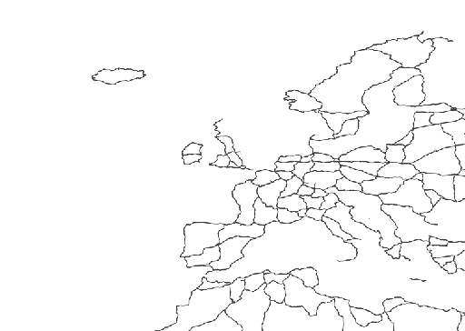
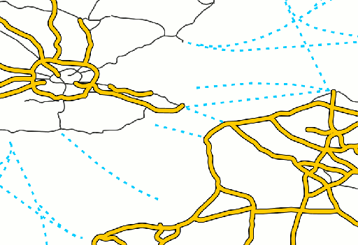
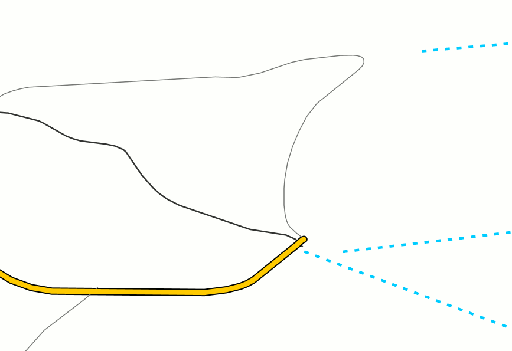

.. _cartography.mbstyle.tutorial.line:

Styling a line layer
====================

The roads layer is a line layer, and therefore we use a `line layer <https://www.mapbox.com/mapbox-gl-js/style-spec/#layers-line>`_ to display it.

Creating a new style
--------------------

#. Navigate to the GeoServer Styles list. Click the ``Add a new style`` option.

   Name this new style ``mbline`` and set the format to ``MBStyle``.

   Under the ``Generate a default style`` option, select ``Line`` and click the ``Generate`` link to create a default line style.

   Click the ``Apply`` button, then navigate to the ``Layer Preview`` tab and select the ``roads`` layer to preview the style.

   .. figure:: img/line_default.png

      Default line style

   .. note:: Your default color may vary.

#. The style will look something like this:

   .. code-block:: json

      {
          "version": 8,
          "layers": [
              {
                  "type": "line",
                  "paint": {
                      "line-color": "#333333",
                  }
              }
          ],
      }

Name and id
-----------

The style can be given a ``name`` parameter, and layers within the style can be given an ``id`` parameter. ``name`` is the name of the style, and may be displayed. ``id`` is a machine reference to the layer, and should be unique. Also add a ``source-layer`` parameter, which provides a reference to the layer this style should be applied to.

.. note:: When viewing the style in the Layer Preview tab, ensure the ``Preview as style group`` option is checked, to ensure that ``source-layer`` is used to determine the layer(s) to render the style on.

#. Modify the name and id elements in the default style:

   .. code-block:: yaml
      :emphasize-lines: 3, 6-7

      {
          "version": 8,
          "name": roads,
          "layers": [
              {
                  "id": "roads"
                  "source-layer": "roads",
                  "type": "line",
                  "paint": {
                      "line-color": "#333333",
                  }
              }
          ],
      }

#. We can immediately see that there are far more roads than we need on this layer. Fortunately, the road data contains a scalerank attribute to help determine the importance of different roads. Add a `filter <https://www.mapbox.com/mapbox-gl-js/style-spec/#types-filter>`_ to only show roads with scalerank < 4. Then our style looks like:

   .. code-block:: json
      :emphasize-lines: 8

      {
          "version": 8,
          "name": "roads",
          "layers": [
              {
                  "id": "big",
                  "source-layer": "roads",
                  "filter": ["<", "scalerank", 4],
                  "type": "line",
                  "paint": {
                      "line-color": "#333333",
                  }
              }
          ],
      }

Setting scale
-------------

If we zoom in, we want to see all the roads, not just those included in our filter. The ``minzoom`` and ``maxzoom`` properties can be used to show or hide layers depending on the zoom level. In order to determine what roads to show, we will again use the ``scalerank`` attribute of the data to add the following rules:

* If zoom is greater than 6, show features with ``scalerank < 4``
* If zoom is between 6 and 8, show features with ``scalerank < 8``
* If zoom is less than 8, show all features

.. note:: MBStyle uses Web Mercator zoom levels instead of scale for determining scale-based restrictions.

   Zoom level 0 corresponds to a scale of approximately 559,082,000, with each subsequent zoom level having half the scale value. Since zoom levels are discrete (0, 1, 2, etc.) and scale levels are continuous, there are a range of scale levels which correspond to a given zoom level.

   Also be aware of the inverse relationship between scale and zoom; as the zoom level increases, the scale decreases.

#. Add a zoom function to the existing (``big``) rule, and add the other two rules (``medium`` and ``small``):

   .. code-block:: json
      :emphasize-lines: 9, 16-37

      {
          "version": 8,
          "name": "roads",
          "layers": [
              {
                  "id": "big",
                  "source-layer": "roads",
                  "filter": ["<", "scalerank", 4],
                  "maxzoom": 6,
                  "type": "line",
                  "paint": {
                      "line-color": "#333333",
                      "line-width": 1
                  }
              },
              {
                  "id": "medium",
                  "source-layer": "roads",
                  "filter": ["<", "scalerank", 8],
                  "minzoom": 6,
                  "maxzoom": 8,
                  "type": "line",
                  "paint": {
                      "line-color": "#333333",
                      "line-width": 1
                  }
              },
              {
                  "id": "small",
                  "source-layer": "roads",
                  "minzoom": 8,
                  "type": "line",
                  "paint": {
                      "line-color": "#777777",
                      "line-width": 0.5
                  }
              }
          ],
      }

Differentiating features
------------------------

On the smaller scales, we want some differentiation between roads based on the feature's type. We will use the ``featurecla`` attribute for this:

#. Add a new layer for roads that have attribute ``featurecla = 'Ferry'``, and draw these roads with a blue line. Put this rule third in the list of four:

   .. code-block:: json
      :emphasize-lines: 28-36

      {
          "version": 8,
          "name": "roads",
          "layers": [
              {
                  "id": "big",
                  "source-layer": "roads",
                  "filter": ["<", "scalerank", 4],
                  "maxzoom": 6,
                  "type": "line",
                  "paint": {
                      "line-color": "#333333",
                      "line-width": 1
                  }
              },
              {
                  "id": "medium",
                  "source-layer": "roads",
                  "filter": ["<", "scalerank", 8],
                  "minzoom": 6,
                  "maxzoom": 8,
                  "type": "line",
                  "paint": {
                      "line-color": "#333333",
                      "line-width": 1
                  }
              },
              {
                  "id": "ferry",
                  "source-layer": "roads",
                  "filter": ["==", "featurecla", "Ferry"],
                  "minzoom": 6,
                  "type": "line",
                  "paint": {
                      "line-color": "#00CCFF"
                  }
              },
              {
                  "id": "small",
                  "source-layer": "roads",
                  "minzoom": 8,
                  "type": "line",
                  "paint": {
                      "line-color": "#777777",
                      "line-width": 0.5
                  }
              }
          ],
      }

#. Further modify this rule to use a dashed line. Add the following ``line-width`` and ``line-dasharray`` lines:

   .. code-block:: json
      :emphasize-lines: 7-8

      {
          "id": "ferry",
          "source-layer": "roads",
          "filter": ["==", "featurecla", "Ferry"],
          "minzoom": 6,
          "type": "line",
          "paint": {
              "line-color": "#00CCFF",
              "line-width": 2,
              "line-dasharray": [4, 6]
          }
      }

#. After adding the ferry rule, this is the view when zoomed in:

   .. figure:: img/line_ferry.png

      Ferry rule and other styles

Adding road casing
------------------

The ``line-gap-width`` property can be used to draw a line casing.

#. Add a new layer to draw expressways (``${expressway = 1}``) using 6 pixel black lines with a gap of 4 pixels. This will be our outline:

   .. code-block:: json

      {
          "id": "expressway",
          "source-layer": "roads",
          "filter": ["==", "expressway", 1],
          "minzoom": 6,
          "type": "line",
          "paint": {
              "line-color": "#000000",
              "line-width": 6,
              "line-gap-width": 4,
              "line-cap": "round"
          }
      }

#. Below this rule, add another new layer to draw expressways using 4 pixel orange lines with round ends:

   .. code-block:: json

      {
          "id": "inner",
          "source-layer": "roads",
          "filter": ["==", "expressway", 1],
          "minzoom": 6,
          "type": "line",
          "paint": {
              "line-color": "#FFCC00",
              "line-width": 4,
              "line-cap": "round"
          }
      }

#. After adding the ferries and expressways layers, this is the view when zoomed in:

   .. figure:: img/line_intermediate.png

      Road casing and other styles

#. Now that we have these rules for special types of "roads", we want to make sure our ``medium`` layer does not also draw lines for these special roads. We can add a filter to the rule to exclude these from the layer (``!=`` means "not equal to"):

   .. code-block:: json
      :emphasize-lines: 4

      {
          "id": "medium",
          "source-layer": "roads",
          "filter": ["all", ["<", "scalerank", 8], ["!=", "expressway", 1], ["!=", "featurecla", "Ferry"]],
          "minzoom": 6,
          "type": "line",
          "paint": {
              "line-color": "#333333",
              "line-width": 1
          }
      }

#. Add a similar filter to the ``small`` layer.

Final style
-----------

After all these changes, the final style should look like this:

.. literalinclude:: files/mbtut_line.json
   :language: json

The resulting map shows different levels of road detail at different zoom levels:

   Completed Roads layer (zoomed out)

   Completed Roads layer (intermediate zoom)

   Completed Roads layer (zoomed in)

.. note:: :download:`Download the final line style <files/mbtut_line.json>`

Continue on to :ref:`cartography.mbstyle.tutorial.polygon`.
