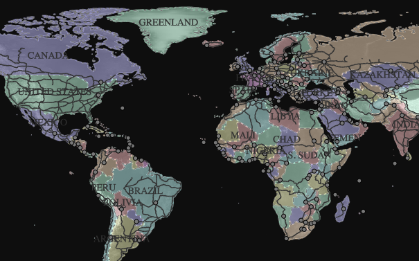
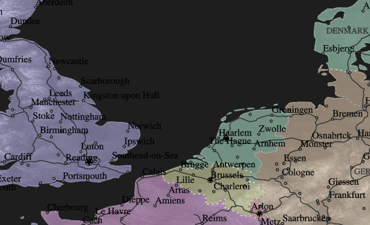
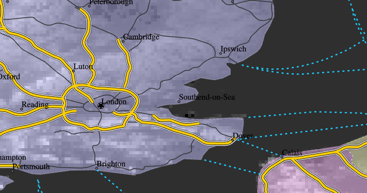

.. _cartography.mbstyle.tutorial.map:

Composing a map
===============

Now that we have a set of styled layers, we can bring them together as a map.

MBStyle supports styling multiple layers with a single style document. Copy the layers of each of the previous styles into a new MBStyle named ``mbtut_all``. The style will look like:

.. code-block:: json

    {
        "version": 8,
        "name": "places",
        "sprite": "http://localhost:8080/geoserver/styles/sprites",
        "layers": [
            {
                "id": "dem",
                "source-layer": "DEM",
                "type": "raster",
                "paint": {
                    "raster-opacity": 1,
                    "raster-contrast": 0.5,
                    "raster-brighness-max": 0.25
                }
            },
            {
                "type": "fill",
                "source-layer": "countries",
                "id": "countries-fill",
                "paint": {
                    "fill-color": {
                        "property": "mapcolor7",
                        "type": "categorical",
                        "stops": [
                            [1, "#FFC3C3"],
                            [2, "#FFE3C3"],
                            [3, "#FFFFC3"],
                            [4, "#C3FFE3"],
                            [5, "#C3FFFF"],
                            [6, "#C3C3FF"],
                            [7, "#FFC3FF"]
                        ]
                    },
                    "fill-opacity": 0.5
                }
            },
            {
                "type": "line",
                "id": "countries-line",
                "source-layer": "countries",
                "paint": {
                    "line-color": "#777777",
                    "line-width": 0.5,
                    "line-dasharray": [4, 4]
                }
            },
            {
                "type": "symbol",
                "id": "countries-symbol",
                "source-layer": "countries",
                "layout": {
                    "text-field": "{name}",
                    "text-transform": "uppercase",
                    "text-size": 14,
                    "text-font": ["Padauk"],
                    "text-max-width": 100
                },
                "paint": {
                    "text-color": "#333333"
                }
            },
            {
                "id": "big",
                "source-layer": "roads",
                "filter": ["<", "scalerank", 4],
                "maxzoom": 6,
                "type": "line",
                "paint": {
                    "line-color": "#333333",
                    "line-width": 1
                }
            },
            {
                "id": "medium",
                "source-layer": "roads",
                "filter": ["all", ["<", "scalerank", 8], ["!=", "expressway", 1], ["!=", "featurecla", "Ferry"]],
                "minzoom": 6,
                "maxzoom": 8,
                "type": "line",
                "paint": {
                    "line-color": "#333333",
                    "line-width": 1
                }
            },
            {
                "id": "ferry",
                "source-layer": "roads",
                "filter": ["==", "featurecla", "Ferry"],
                "minzoom": 6,
                "type": "line",
                "paint": {
                    "line-color": "#00CCFF",
                    "line-width": 2,
                    "line-dasharray": [4, 6]
                }
            },
            {
                "id": "expressway",
                "source-layer": "roads",
                "filter": ["==", "expressway", 1],
                "minzoom": 6,
                "type": "line",
                "paint": {
                    "line-color": "#000000",
                    "line-width": 6,
                    "line-gap-width": 4,
                    "line-cap": "round"
                }
            },
            {
                "id": "inner",
                "source-layer": "roads",
                "filter": ["==", "expressway", 1],
                "minzoom": 6,
                "type": "line",
                "paint": {
                    "line-color": "#FFCC00",
                    "line-width": 4,
                    "line-cap": "round"
                }
            },
            {
                "id": "small",
                "source-layer": "roads",
                "filter": ["all", ["!=", "expressway", 1], ["!=", "featurecla", "Ferry"]],
                "minzoom": 8,
                "type": "line",
                "paint": {
                    "line-color": "#777777",
                    "line-width": 0.5
                }
            },
            {
                "id": "capitals-circle",
                "source-layer": "places",
                "maxzoom": 2,
                "filter": ["==", "ADM0CAP", 1],
                "type": "circle",
                "paint": {
                    "circle-color": "#777777",
                    "circle-stroke-color": "#000000",
                    "circle-radius": 3,
                    "circle-stroke-width": 1
                }
            },
            {
                "id": "capitals-star",
                "source-layer": "places",
                "minzoom": 2,
                "filter": ["==", "ADM0CAP", 1],
                "type": "symbol",
                "layout": {
                    "icon-image": "capital",
                    "icon-size": {
                        "property": "POP_MAX",
                        "type": "exponential",
                        "stops": [
                            [0, 0.3],
                            [40000000, 0.8]
                        ]
                    }
                }
            },
            {
                "id": "capitals-label",
                "source-layer": "places",
                "minzoom": 3,
                "filter": ["==", "ADM0CAP", 1],
                "type": "symbol",
                "layout": {
                    "text-field": "{NAME}",
                    "text-font": ["PT Serif"],
                    "text-anchor": "bottom-left",
                    "text-offset": [3,2],
                }
            },
            {
                "id": "places-circle",
                "source-layer": "places",
                "minzoom": 2,
                "filter": ["!=", "ADM0CAP", 1],
                "type": "circle",
                "paint": {
                    "circle-color": "#777777",
                    "circle-stroke-color": "#000000",
                    "circle-radius": {
                        "property": "POP_MAX",
                        "type": "exponential",
                        "stops": [
                            [0, 2],
                            [1562500, 5]
                        ]
                    },
                    "circle-stroke-width": 1
                }
            },
            {
                "id": "places-label",
                "source-layer": "places",
                "minzoom": 4,
                "filter": ["!=", "ADM0CAP", 1],
                "type": "symbol",
                "layout": {
                    "text-field": "{NAME}",
                    "text-font": ["PT Serif"],
                    "text-anchor": "bottom-left",
                    "text-offset": [3,2]
                }
            }
        ]
    }

Normally, styles are associated with a layer and rendered together with that layer. In order to expose this multi-layer style, create a new layer group in geoserver named ``tutorial``. Under the layer list of this layer group, click ``Add Style group`` and select the ``mbtut_all`` style. You can now preview the map from the GeoServer layer preview.

This will produce a map that looks like the following at various zoom levels:

   Map at world scale

   Map at region scale

   Map at city scale

Client-side styling
-------------------

You can also use this GeoServer MBStyle with client-side applications which support MapBox Styles, such as OpenLayers and MapBox.
To do so:

#. Publish the ``tutorial`` layer group as ``application/x-protobuf;type=mapbox-vector``:

   i. Navigate to the ``Tile Layers`` page.

      .. figure:: img/tilelayerslink.png

         Tile Layers

      Click ``tutorial`` in the list of layers.

   ii. By default the tile formats are image/jpeg and image/png. Check the boxes for the following vector tile formats:

      * application/json;type=geojson
      * application/json;type=topojson
      * application/x-protobuf;type=mapbox-vector

      .. figure:: img/vectortiles_tileformats.png

         Vector tiles tile formats

   iii. Click Save.

   iv. Our layer group is now ready to be served.

#. Add a vector and a raster ``"sources"`` parameter to the top-level of your style (change the GeoServer URL as appropriate):

   .. code-block:: json

      {
          "tutorial": {
              "type": "vector",
              "tiles": [
                "http://localhost:8080/geoserver/gwc/service/wmts?REQUEST=GetTile&SERVICE=WMTS&VERSION=1.0.0&LAYER=tutorial&STYLE=&TILEMATRIX=EPSG:900913:{z}&TILEMATRIXSET=EPSG:900913&FORMAT=application/x-protobuf;type=mapbox-vector&TILECOL={x}&TILEROW={y}"
              ],
              "minZoom": 0,
              "maxZoom": 14
          },
          "tutorial-dem": {
            "type": "raster",
            "tiles": [
              "http://localhost:8080/geoserver/gwc/service/wmts?REQUEST=GetTile&SERVICE=WMTS&VERSION=1.0.0&LAYER=tutorial:DEM&STYLE=&TILEMATRIX=EPSG:900913:{z}&TILEMATRIXSET=EPSG:900913&FORMAT=image/png&TILECOL={x}&TILEROW={y}"
            ],
            "minZoom": 0,
            "maxZoom": 14
          }
      }

#. Add ``"source": "tutorial"`` to each vector layer in the style and ``"source": "tutorial-dem"`` to the one raster layer. The final style will look like:

   .. literalinclude:: files/mbtut_all.json
      :language: json

#. Then, you can use this style in any front-end application which supports MapBox Styles and can access your GeoServer. The style is available from ``http://localhost:8080/geoserver/styles/mbtut_all.json``.

.. note:: :download:`Download the final map style <files/mbtut_all.json>`
