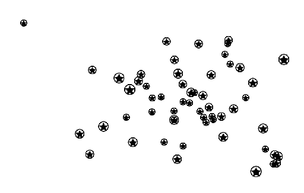
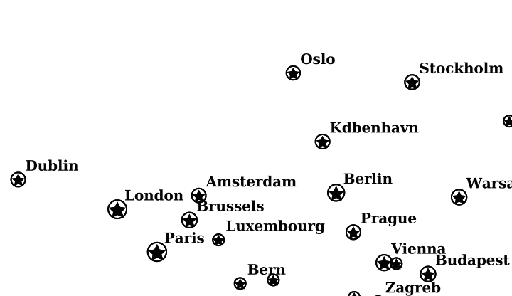
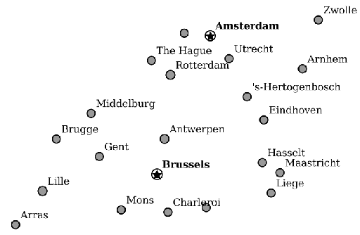

.. _cartography.mbstyle.tutorial.point:

Styling a point layer
=====================

The populated places layer is a point layer, so we will be using `circle layers <https://www.mapbox.com/mapbox-gl-js/style-spec/#layers-circle>`_ and `symbol layers <https://www.mapbox.com/mapbox-gl-js/style-spec/#layers-symbol>`_.

Creating a new style
--------------------

#. Navigate to the GeoServer Styles list. Click the ``Add a new style`` option.

   Name this new style ``mbpoint`` and set the format to ``MBStyle``.

   Under the ``Generate a default style`` option, select ``Point`` and click the ``Generate`` link to create a default point style.

   Click the ``Apply`` button, then navigate to the ``Layer Preview`` tab and select the ``places`` layer to preview the style.

   .. figure:: img/mbpoint_default.png

      Default point style

   .. note:: Your default color may vary.

#. The style will look something like this:

   .. code-block:: json

      {
        "version": 8,
        "layers": [
            {
                "type": "circle",
                "paint": {
                    "circle-color": "#333333",
                }
            }
        ]
      }

Name and id
-----------

The style can be given a ``name`` parameter, and layers within the style can be given an ``id`` parameter. ``name`` is the name of the style, and may be displayed. ``id`` is a machine reference to the layer, and should be unique. Also add a ``source-layer`` parameter, which provides a reference to the layer this style should be applied to.

.. note:: When viewing the style in the Layer Preview tab, ensure the ``Preview as style group`` option is checked, to ensure that ``source-layer`` is used to determine the layer(s) to render the style on.

#. Modify the name and id elements in the default style:

   .. code-block::json
      :emphasize-lines: 3, 6-7, 9-12

      {
        "version": 8,
        "name": "places",
        "layers": [
            {
                "id": "places"
                "source-layer": "places",
                "type": "circle",
                "paint": {
                    "circle-color": "#777777",
                    "circle-stroke-color": "#000000",
                    "circle-radius": 3,
                    "circle-stroke-width": 1
                }
            }
        ]
      }

Adding filters and labels
-------------------------

#. There are a lot of points in this data set, and we don't want to draw all of them. Use the ``ADM0CAP`` attribute and a filter to show only points that correspond to capital cities (``ADM0CAP = 1``):

   .. code-block:: json
      :emphasize-lines: 3

      {
        "version": 8,
        "name": "capitals",
        "layers": [
            {
                "id": "places",
                "source-layer": "places",
                "filter": ["==", "ADM0CAP", 1],
                "type": "circle",
                "paint": {
                    "circle-color": "#777777",
                    "circle-stroke-color": "#000000",
                    "circle-radius": 3,
                    "circle-stroke-width": 1
                }
            }
        ]
      }

#. Add a symbol layer referencing the ``NAME`` attribute to display the names of the cities:

   .. code-block:: json
      :emphasize-lines: 17-26

      {
        "version": 8,
        "name": "capitals",
        "layers": [
            {
                "id": "places",
                "source-layer": "places",
                "filter": ["==", "ADM0CAP", 1],
                "type": "circle",
                "paint": {
                    "circle-color": "#777777",
                    "circle-stroke-color": "#000000",
                    "circle-radius": 3,
                    "circle-stroke-width": 1

                }
            },
            {
                "id": "capitals-label",
                "source-layer": "places",
                "filter": ["==", "ADM0CAP", 1],
                "type": "symbol",
                "layout": {
                    "text-field": "{NAME}",
                    "text-font": ["PT Serif"],
                    "text-anchor": "bottom-left",
                    "text-offset": [3,2]
                }
            }
        ]
      }

#. We now have a reasonably sized set of labeled points.

   .. figure:: img/mbpoint_simple_label.png

      Capital cities

Refining the style
------------------

Now, lets do some styling. The circle layer only allows for circular points, so we use a `symbol layer <https://www.mapbox.com/mapbox-gl-js/style-spec/#layers-symbol>`_. In order to display symbols, we also need to define a spritesheet.

A spritesheet consists of a png file containing a number of icons, plus a json file defining the name and bounds of each icon. Download :download:`sprites.png <files/sprites.png>` and :download:`sprites.json <files/sprites.json>` and copy them into the styles folder of your geoserver data directory.

We can now define a top-level ``sprites`` parameter with the URL to the spritesheet. This allows us to refer to these sprites in our style.

#. Modify the existing symbol layer with the following:

   .. code-block:: json
      :emphasize-lines: 4,15-17

      {
        "version": 8,
        "name": "places",
        "sprite": "http://localhost:8080/geoserver/styles/sprites"
        "layers": [
            {
                "id": "capitals",
                "source-layer": "places",
                "filter": ["==", "ADM0CAP", 1],
                "type": "symbol",
                "layout": {
                    "text-field": "{NAME}",
                    "text-font": ["PT Serif"],
                    "text-anchor": "bottom-left",
                    "text-offset": [3,4],
                    "icon-image": "capital",
                    "icon-size": 0.4
                }
            }
        ]
      }

   This draws the ``capital`` icon (a black star bounded by a circle) 7 pixels in height.

   .. figure:: img/point_style_label.png

      Capital cities with labels

#. Since this data set contains population attributes, we can scale the size of the points based on population. Use an exponention function on the ``POP_MAX`` property for the ``icon-size`` parameter to get a relative scale without too much variation in point size:

   .. code-block:: json
      :emphasize-lines: 17-24

      {
        "version": 8,
        "name": "places",
        "sprite": "http://localhost:8080/geoserver/styles/sprites"
        "layers": [
            {
                "id": "capitals",
                "source-layer": "places",
                "filter": ["==", "ADM0CAP", 1],
                "type": "symbol",
                "layout": {
                    "text-field": "{NAME}",
                    "text-font": ["PT Serif"],
                    "text-anchor": "bottom-left",
                    "text-offset": [3,4],
                    "icon-image": "capital",
                    "icon-size": {
                        "property": "POP_MAX",
                        "type": "exponential",
                        "stops": [
                            [0, 0.3],
                            [40000000, 0.8]
                        ]
                    }
                }
            }
        ]
      }

   .. figure:: img/point_size_label.png

      Variable symbol sizes

Adding scale
------------

To improve the display further, we can add scale rules.

#. Split the single rule into three rules:

   * A 3 pixel black circle for the features when zoomed out above zoom level 2.
   * The star/circle combo as done in the previous section when zoomed in past zoom level 2.
   * The labels only when zoomed in past zoom level 3.

   This results in the following style:

   .. code-block:: json
      :emphasize-lines: 6-48

      {
        "version": 8,
        "name": "places",
        "sprite": "http://localhost:8080/geoserver/styles/sprites"
        "layers": [
            {
                "id": "capitals-circle",
                "source-layer": "places",
                "maxzoom": 2,
                "filter": ["==", "ADM0CAP", 1],
                "type": "circle",
                "paint": {
                    "circle-color": "#777777",
                    "circle-stroke-color": "#000000",
                    "circle-radius": 3,
                    "circle-stroke-width": 1
                }
            },
            {
                "id": "capitals-star",
                "source-layer": "places",
                "minzoom": 2,
                "filter": ["==", "ADM0CAP", 1],
                "type": "symbol",
                "layout": {
                    "icon-image": "capital",
                    "icon-size": {
                        "property": "POP_MAX",
                        "type": "exponential",
                        "stops": [
                            [0, 0.3],
                            [40000000, 0.8]
                        ]
                    }
                }
            },
            {
                "id": "capitals-label",
                "source-layer": "places",
                "minzoom": 3,
                "filter": ["==", "ADM0CAP", 1],
                "type": "symbol",
                "layout": {
                    "text-field": "{NAME}",
                    "text-font": ["PT Serif"],
                    "text-anchor": "bottom-left",
                    "text-offset": [3,2]
                }
            }
        ]
      }

#. We can show all the cities that are currently hidden when we zoom in further. We can do this by negating the filter used for capitals. As with the capital cities, we will selectively show labels depending on the scale. To do this: add these two rules to the bottom of the style:

   .. code-block:: json

      {
          "id": "places-circle",
          "source-layer": "places",
          "minzoom": 5,
          "filter": ["!=", "ADM0CAP", 1],
          "type": "circle",
          "paint": {
              "circle-color": "#777777",
              "circle-stroke-color": "#000000",
              "circle-radius": {
                  "property": "POP_MAX",
                  "type": "exponential",
                  "stops": [
                      [0, 2],
                      [1562500, 5]
                  ]
              },
              "circle-stroke-width": 1
          }
      }

   .. code-block:: json

      {
          "id": "places-label",
          "source-layer": "places",
          "minzoom": 6,
          "filter": ["!=", "ADM0CAP", 1],
          "type": "symbol",
          "layout": {
              "text-field": "{NAME}",
              "text-font": ["PT Serif"],
              "text-anchor": "bottom-left",
              "text-offset": [3,2]
          }
      }

Final style
-----------

The full style is now:

.. literalinclude:: files/mbtut_point.json
   :language: json

After these modifications, we have a much nicer display at different zoom levels:

   Cities (zoomed out)

   Cities (intermediate zoom)

   Cities (zoomed in)

.. note:: :download:`Download the final point style <files/mbtut_point.json>`

Continue on to :ref:`cartography.mbstyle.tutorial.raster`.
