.. _dataadmin.pgAdvanced.de9im:

Dimensionally Extended 9-Intersection model
===========================================

The "`Dimensionally Extended 9-Intersection Model <http://en.wikipedia.org/wiki/DE-9IM>`_" (DE9IM) provides a framework for modelling the interaction of two spatial objects.

Every spatial object is characterized by the following spatial attributes:

 * An interior
 * A boundary
 * An exterior

For polygons, these attributes are as follows:

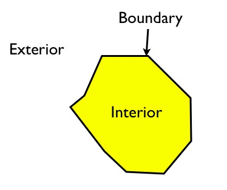

   Polygon interior, boundary, and exterior

The interior is bounded by the rings, the boundary is represented by the rings themselves, and the exterior is everything else beyond the boundary.

For linear features, the interior, boundary, and exterior attributes are less obvious.

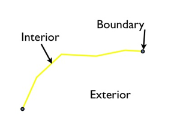

   Line interior and boundary

The interior is the part of the line bounded by the ends, the boundary is represented by the ends of the linear feature, and the exterior is everything that is neither interior nor boundary.

For points, the interior is the point, the boundary is an empty set, and the exterior is everything that is not the point.

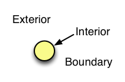

   Point interior

Using these definitions of interior, boundary, and exterior attributes, the relationships between any pair of spatial features can be characterized using the dimensionality of the nine possible intersections between the interiors, boundaries, and exteriors.

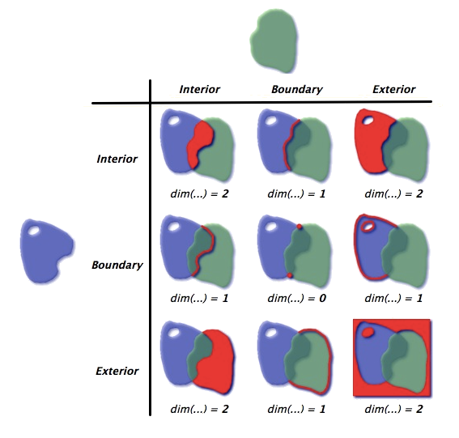

   Modelling object interactions

For the polygons in the example above, the intersection of the interiors is a two-dimensional area, so that portion of the matrix is completed with a **2**. If the boundaries intersect along a line, that portion of the matrix is completed with a **1**. When the boundaries only intersect at points, which are zero-dimensional, that portion of the matrix is completed with a **0**. When there is no intersection between components, the matrix is filled out with an **F**.

In this next example, a linestring intersects a polygon:

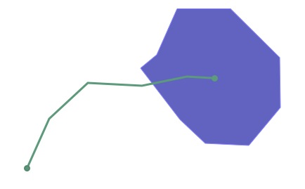

  Linestring intersecting a polygon

The DE9IM matrix for the interaction is represented as follows:

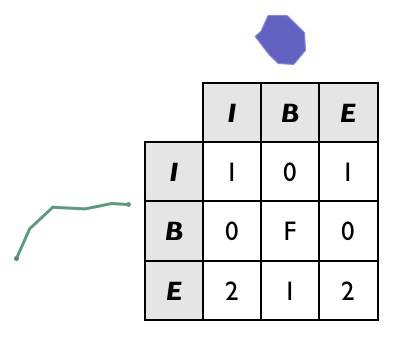

  DE9IM model for the intersection

Note that the boundaries of the two objects don't intersect at all (the end point of the line interacts with the interior of the polygon, not the boundary, and vice versa), so the B/B (boundary/boundary) cell is completed with an **F**.

DE9IM model in PostGIS
----------------------

In PostGIS, the :command:`ST_Relate` function will compile a DE9IM matrix and return a string representing the DE9IM relationship between the two input geometries.

The previous example can be simplified using a simple box and line, with the same spatial relationship as the polygon and linestring:

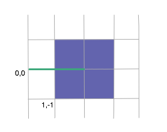

   Simplified linestring intersecting a polygon

With the simplified line and polygon, the line and polygon can be converted into short well-known text versions, and the DE9IM information generated in SQL as follows:

.. code-block:: sql

  SELECT ST_Relate(
           'LINESTRING(0 0, 2 0)',
           'POLYGON((1 -1, 1 1, 3 1, 3 -1, 1 -1))'
         );

The answer, **1010F0212**, is the same answer calculated above, only this time the result is returned as a nine-character string, with the first row, second row, and third row of the table appended together.

.. code-block:: console

  101
  0F0
  212

DE9IM matrices may be used in a query to find geometries with specific relationships to another geometry. For example:

.. code-block:: sql

  CREATE TABLE lakes ( id serial primary key, geom geometry );
  CREATE TABLE docks ( id serial primary key, good boolean, geom geometry );

  INSERT INTO lakes ( geom )
    VALUES ( 'POLYGON ((100 200, 140 230, 180 310, 280 310, 390 270, 400 210, 320 140, 215 141, 150 170, 100 200))');

  INSERT INTO docks ( geom, good )
    VALUES
	  ('LINESTRING (170 290, 205 272)',true),
	  ('LINESTRING (120 215, 176 197)',true),
	  ('LINESTRING (290 260, 340 250)',false),
	  ('LINESTRING (350 300, 400 320)',false),
	  ('LINESTRING (370 230, 420 240)',false),
	  ('LINESTRING (370 180, 390 160)',false);

The example data comprises two objects, **Lakes** and **Docks**. For this example, docks must be inside lakes and must touch the boundary of their containing lake at only one end.

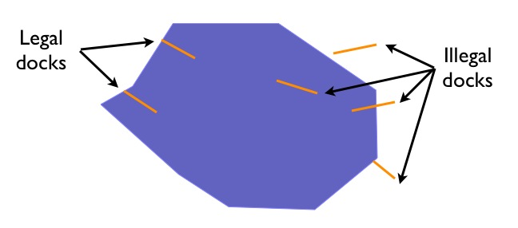

   Lakes and docks

Legal docks, docks that obey the data quality rules, have the following characteristics:

 * Interiors have a linear (one-dimensional) intersection with the lake interior
 * Boundaries have a point (zero-dimensional) intersection with the lake interior
 * Boundaries **also** have a point (zero-dimensional) intersection with the lake boundary
 * Interiors have no intersection (F) with the lake exterior

The resulting DE9IM matrix is:

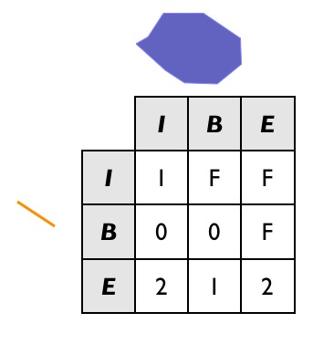

   Lakes and dock DE9IM model

To find all the legal docks, identify the docks that intersect lakes (a super-set of **potential** candidates used as the join key), and then find all the docks in that set which have the legal relate pattern.

.. code-block:: sql

  SELECT docks.*
  FROM docks JOIN lakes ON ST_Intersects(docks.geom, lakes.geom)
  WHERE ST_Relate(docks.geom, lakes.geom, '1FF00F212');

This identifies two valid docks.

.. todo:: add code block here

Note the use of the three-parameter version of :command:`ST_Relate`, which returns *true* if the pattern matches or *false* if it does not. For a fully defined pattern like this one, the three-parameter version is not required and a string equality operator could have been used.

However, for less rigorous pattern searches, the three-parameter allows substitution characters in the pattern string:

 * "*" —Any value in this cell is acceptable
 * "T"—Any non-false value (0, 1 or 2) is acceptable

So for example, one dock not included in the example illustration is a dock with a two-dimensional intersection with the lake boundary.

.. code-block:: sql

  INSERT INTO docks ( geom, good )
    VALUES ('LINESTRING (140 230, 150 250, 210 230)',true);

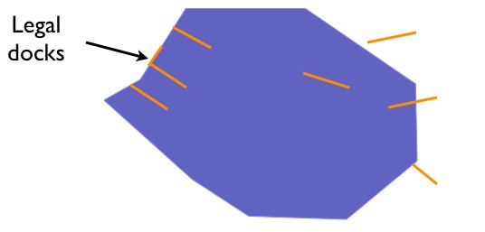

   Dock with two-dimensional intersection

To include this case in the set of "legal" docks, change the relate pattern in the query. In particular, the intersection of the dock interior and lake boundary can now be either **1** (the new case) or **F** (the original case). To identify this case, use the "*" catchall in the pattern.

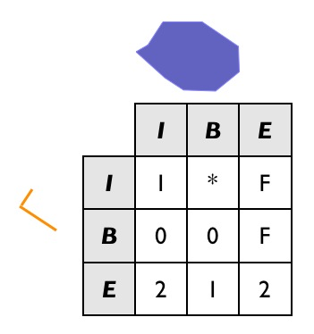

   Using the catchall pattern

The resulting SQL is as follows:

.. code-block:: sql

  SELECT docks.*
  FROM docks JOIN lakes ON ST_Intersects(docks.geom, lakes.geom)
  WHERE ST_Relate(docks.geom, lakes.geom, '1*F00F212');

This will identify all three valid docks.

.. todo:: add code block

Data quality testing
--------------------

`TIGER <http://www.census.gov/geo/maps-data/data/tiger.html>`_ (Topologically Integrated Geographic Encoding and Referencing) census data is quality controlled according to strict data model rules. For example, no census block should overlap any other census block.

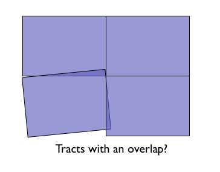

  Overlapping census blocks

The following SQL command will test for any overlaps. The matrix value ('2********') represents an overlap of two interiors.

.. code-block:: sql

  SELECT a.gid, b.gid
  FROM nyc_census_blocks a, nyc_census_blocks b
  WHERE ST_Intersects(a.the_geom, b.the_geom)
    AND ST_Relate(a.the_geom, b.the_geom, '2********')
    AND a.gid != b.gid
  LIMIT 10;

This returns **0**, confirming the data is clean and no overlaps were detected.

Similarly, the TIGER data model also requires all roads data to be end-noded, which means intersections only occur at the ends of each street, not at the mid-points.

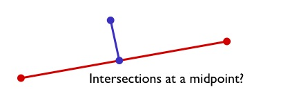

   Road intersections

To test for this data model error, search for streets that intersect, using a join operation, but where the intersection between the boundaries is not zero-dimensional (the end points don't touch).

.. code-block:: sql

  SELECT a.gid, b.gid
  FROM nyc_streets a, nyc_streets b
  WHERE ST_Intersects(a.the_geom, b.the_geom)
    AND NOT ST_Relate(a.the_geom, b.the_geom, '****0****')
    AND a.gid != b.gid
  LIMIT 10;

If the result indicates the end points do not intersect, the data is not end-noded and violates the census data model rules.
