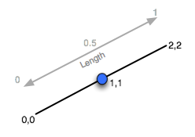
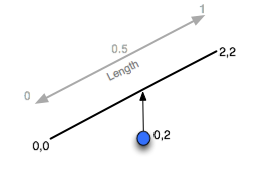
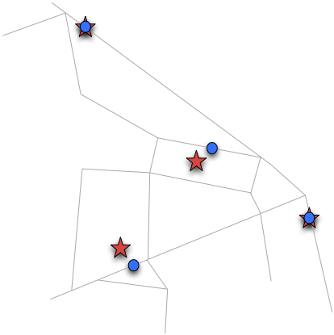

.. _dataadmin.pgAdvanced.linear_referencing:

Linear referencing
==================

Linear referencing allows you to identify the locations of features using a relative measure along a linear feature. Some linear referencing examples include:

  * Highway assets—Referenced by a unit of measurement (miles, kilometers, and so on) along a highway network
  * Road maintenance operations—Referenced as occurring along a road network between a pair of measurements
  * Aquatic inventories—Fish presence is recorded as existing between a pair of upstream measurements on a stream network
  * Hydrologic characterizations (reaches) of streams—Recorded with a *from* and *to* measurement on a stream network

.. figure:: ./img/lrs2.png

   Linear referencing of road infrastructure

One of the main benefits of linear referencing is dependent spatial observations (the derived relative measurements) don't need to be recorded separately from the base observations (the actual feature measurements). Any updates to features in the base observation layer will result in automatic updates to the dependent observations.

.. note:: The term *event table* is used here to refer to the non-spatial tables that will be created.

Creating linear references
--------------------------

To reference an existing point table to a linear network, use the :command:`ST_Line_Locate_Point` function. This function accepts a line and point, and returns a value representing the proportion along the line the point is located. In the following example, a point is located half-way along a line.

.. code-block:: sql

  SELECT ST_Line_Locate_Point('LINESTRING(0 0, 2 2)', 'POINT(1 1)');

   Locating a point along a line feature

The answer returned is 0.5—the distance along the line feature the point was located. If the point is not on the line, the result is determined by projecting to the closest location on the line.

.. code-block:: sql

  SELECT ST_Line_Locate_Point('LINESTRING(0 0, 2 2)', 'POINT(0 2)');

Again, the answer returned is 0.5.

   Locating a point near a line feature

To convert a **nyc_subway_stations** table into an *event table* relative to the streets, use the function :command:`ST_Line_Locate_Point`. Create a new event table and identify a candidate set of streets that could be the closest to the subway stations. Order the streets by the ``id`` and ``distance`` attributes.

.. code-block:: sql

  CREATE TABLE nyc_subway_station_events AS
  WITH ordered_nearest AS (
  SELECT
    ST_GeometryN(streets.the_geom,1) AS streets_geom,
    streets.gid AS streets_gid,
    subways.the_geom AS subways_geom,
    subways.gid AS subways_gid,
    ST_Distance(streets.the_geom, subways.the_geom) AS distance
  FROM nyc_streets streets
    JOIN nyc_subway_stations subways
    ON ST_DWithin(streets.the_geom, subways.the_geom, 200)
  ORDER BY subways_gid, distance ASC
  );

Use the PostgreSQL :command:`DISTINCT ON` feature to identify the nearest street for each unique street id. Pass the nearest street to :command:`ST_Line_Locate_Point` along with its candidate subway station to calculate the measure.

.. code-block:: sql

  SELECT
    DISTINCT ON (subways_gid)
    subways_gid,
    streets_gid,
    ST_Line_Locate_Point(streets_geom, subways_geom) AS measure,
    distance
  FROM ordered_nearest;

To support visualization application software that require access to the results, add a primary key.

.. code-block:: sql

  ALTER TABLE nyc_subway_station_events ADD PRIMARY KEY (subways_gid);

To reverse the process and go from a measurement to a point, use the :command:`ST_Line_Interpolate_Point` function. For example, to locate a point along a line, execute the following:

.. code-block:: sql

  SELECT ST_AsText(ST_Line_Interpolate_Point('LINESTRING(0 0, 2 2)', 0.5));

The answer returned this time is the location of the point.

.. code-block:: console

   POINT(1 1)

You can also join the **nyc_subway_station_events** table back to the **nyc_streets** table and use the **measure** attribute to generate the spatial event points, without referencing the original **nyc_subway_stations** table.  The following example illustrates how to create a view that turns events back into spatial objects.

.. code-block:: sql

  CREATE OR REPLACE VIEW nyc_subway_stations_lrs AS
  SELECT
    events.subways_gid,
    ST_Line_Interpolate_Point(ST_GeometryN(streets.the_geom, 1), events.measure)AS geom,
    events.streets_gid
  FROM nyc_subway_station_events events
  JOIN nyc_streets streets
  ON (streets.gid = events.streets_gid);

Viewing the original (red star) and event (blue circle) points with the streets, you can see how the events are snapped directly to the closest street lines.

   Spatial objects and events

.. note:: Using these PostGIS functions to snap points to linear features provides a useful tool for applications that work with GPS tracks or other inputs that are expected to reference a linear network. For further information on the available functions, please refer to the `PostGIS reference documentation <http://postgis.org/>`_.
