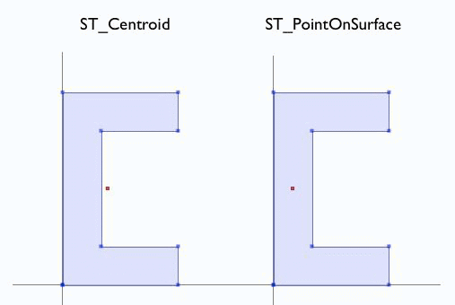
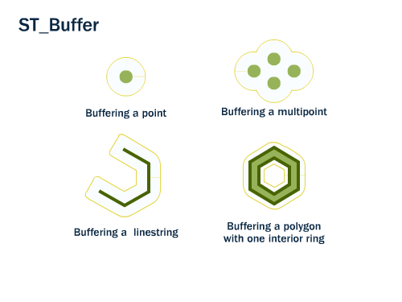
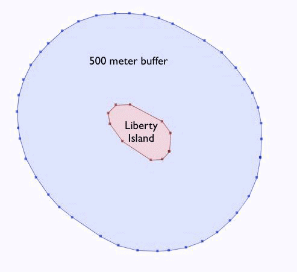
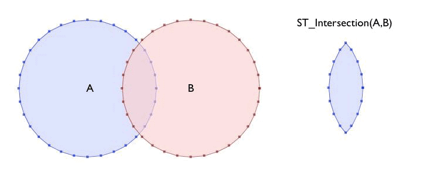
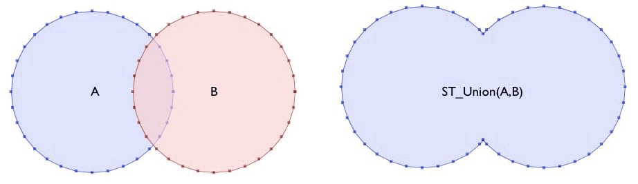
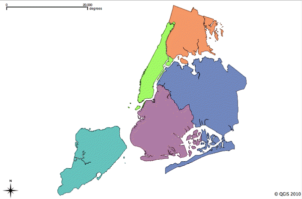

.. _dataadmin.pgBasics.generation:

Geometry construction
=====================

Many PostGIS functions work with geometries *as they are* to perform some interrogation or analysis. For example:
 
* :command:`ST_Length`, :command:`ST_Area`—Analyses of the objects
* :command:`ST_AsText`, :command:`ST_AsGML`—Serializations of the objects
* :command:`ST_RingN`—Parts of the object
* :command:`ST_Contains`, :command:`ST_Intersects`-True/false tests

In addition, PostGIS also provides a number of *geometry constructing functions* that take geometries as inputs and output new geometries. 

Centroid and PointOnSurface
---------------------------

A common requirement when composing a spatial query is to replace a polygon feature with a point representation of the feature. This is useful for spatial joins because using ``ST_Intersects`` on two polygon layers often results in double-counting—a polygon on a boundary will intersect an object on both sides. Replacing the polygon with a point forces it to be on one side or the other, not both. PostGIS provides the following two functions to return a point at the center of an input geometry:

* :command:`ST_Centroid(geometry)`—Returns a point that is at the center of mass of the input geometry 

  .. note:: Although this simple calculation is very fast, be aware the returned point is not necessarily inside the feature itself. If the input feature has a convexity (imagine the letter 'C') the returned centroid might not be in the interior of the feature.

* :command:`ST_PointOnSurface(geometry)`—Returns a point that is guaranteed to be inside the input geometry

  .. note:: This operation is computationally more expensive than the :command:`ST_Centroid` operation.
 

   *ST_Centroid and ST_PointOnSurface*

Buffer
------

Creating a buffer, or area of specified distance, around a particular feature is a common task in many GIS workflows. :command:`ST_Buffer(geometry,distance)` accepts a buffer distance and geometry type and outputs a polygon with a boundary the buffer distance away from the input geometry. 

   *ST_Buffer*

For example, if the US Park Service wanted to enforce a marine traffic zone around Liberty Island in New York harbor, they could delineate the zone by generating a 500 meter buffer polygon around the island.

.. code-block:: sql

  CREATE TABLE liberty_island_zone AS
  SELECT ST_Buffer(the_geom,500) AS the_geom 
  FROM nyc_census_blocks 
  WHERE blkid = '360610001009000';

  SELECT Populate_Geometry_Columns(); 
  

   *Positive buffer*

The :command:`ST_Buffer` function also accepts negative distances and builds inscribed polygons within polygonal inputs. Input lines and points will generate an empty return.

.. figure:: img/generation_buffer_neg.png

   *Negative buffer*

Intersection and Union
----------------------

Intersection is another common GIS operation, which creates a new coverage by calculating the intersection of two superimposed polygons. The :command:`ST_Intersection(geometry A, geometry B)` function returns the spatial area, line, or point that both input geometries have in common. If the geometries are disjoint, the function returns an empty geometry.

.. code-block:: sql

  SELECT ST_AsText(ST_Intersection(
    ST_Buffer('POINT(0 0)', 2),
    ST_Buffer('POINT(3 0)', 2)
  ));

   *ST_Intersection*

The :command:`ST_Union` does the reverse; it takes input geometries and removes common lines. There are two forms of the :command:`ST_Union` function: 

* :command:`ST_Union(geometry, geometry)`—A two-argument version that takes in two geometries and returns the merged union. For example, the two-circle example from the previous section looks like the following when the intersection is replaced with a union.
 
.. code-block:: sql

     SELECT ST_AsText(ST_Union(
       ST_Buffer('POINT(0 0)', 2),
       ST_Buffer('POINT(3 0)', 2)
     ));
  

  *ST_Union*

* :command:`ST_Union([geometry])`—An aggregate version that takes in a set of geometries and returns the merged geometry for the entire group. :command:`ST_Union` can be used with the :command:`GROUP BY` SQL statement to create merged subsets of basic geometries.

Census geography provides a good example of :command:`ST_Union` aggregation, with  larger geographies constructed from smaller ones. Census tracts map can be created by merging the blocks that form each tract. Alternatively, merging blocks that fall within each county can produce a county map.

To carry out the merge, note that the unique key ``blkid`` actually embeds information about the higher level geographies. The following example illustrates the parts of the key for Liberty Island in New York county:

::

  360610001009000 = 36 061 00100 9000
  
  36     = State of New York
  061    = New York County (Manhattan)
  000100 = Census Tract
  9      = Census Block Group
  000    = Census Block
  
A county map can be produced by merging all geometries that share the same first 5 digits of their ``blkid``.

.. code-block:: sql

  CREATE TABLE nyc_census_counties AS
  SELECT 
    ST_Union(the_geom) AS the_geom, 
    SubStr(blkid,1,5) AS countyid
  FROM nyc_census_blocks
  GROUP BY countyid;

  SELECT Populate_Geometry_Columns();
  

   *Union applied to census blocks to create county polygons*

An area test will confirm the union operation did not lose any geometry. First, calculate the area of each individual census block, and sum those areas grouping by census county id.

.. code-block:: sql

  SELECT SubStr(blkid,1,5) AS countyid, Sum(ST_Area(the_geom)) AS area
  FROM nyc_census_blocks 
  GROUP BY countyid;

::

  countyid |       area       
 ----------+------------------
  36005    | 109807439.720947
  36047    | 184906575.839355
  36061    | 58973521.6225586
  36081    | 283764734.207275
  36085    | 149806077.958252

Finally, calculating the area of each of the new county polygons from the county table should return the same answer:

.. code-block:: sql

  SELECT countyid, ST_Area(the_geom) AS area
  FROM nyc_census_counties;

::

  countyid |       area       
 ----------+------------------
  36005    | 109807439.720947
  36047    | 184906575.839355
  36061    | 58973521.6225586
  36081    | 283764734.207275
  36085    | 149806077.958252

For more information about geometry functions in PostGIS, please refer to `PostGIS Reference <../../postgis/postgis/html/reference.html>`_.       
