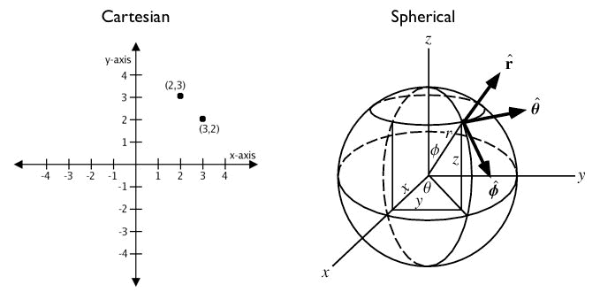
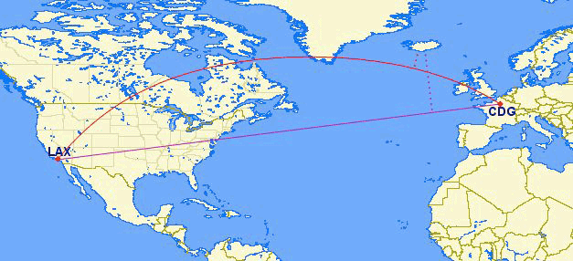
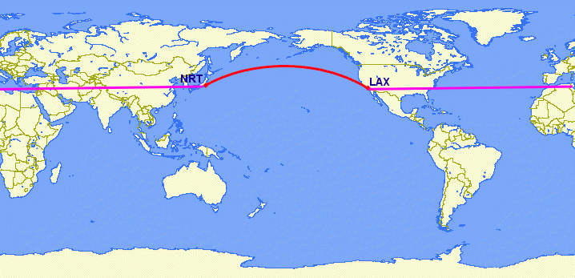

.. _dataadmin.pgBasics.geography:

Geography data type
===================

Many spatial datasets are available in a geographic, or "latitude/longitude", coordinate system. However, unlike coordinates in Mercator, UTM, or State Plane, **geographic coordinates are not Cartesian** and they do not represent a linear distance from an origin as plotted on a 2-D plane. These **spherical coordinates** describe the angular distance between the equator and the poles. In spherical coordinates a point is specified by the distance from the origin (the radius), the angle of rotation from the initial meridian plane, and the angle from the polar axis (analogous to a vector from the origin through the North Pole).

   *Cartesian versus Spherical coordinates*

Geographic coordinates may be treated as approximate Cartesian coordinates for the purpose of performing spatial calculations. However, measurements of distance, length and area are invalid. Since spherical coordinates measure **angular** distance, the units are in "degrees." In addition, the approximate results of index searches and TRUE/FALSE tests like intersects and contains may be incorrect. The "distance" between points increases near the north and south poles or the international dateline.

For example, below are the coordinates of Los Angeles and Paris.

* Los Angeles: ``POINT(-118.4079 33.9434)``
* Paris: ``POINT(2.3490 48.8533)``
 
The following example calculates the distance between Los Angeles and Paris using the PostGIS Cartesian :command:`ST_Distance(geometry, geometry)`. The SRID of 4326 identifies a geographic spatial reference system, with units of measurement expressed in degrees.

.. code-block:: sql

  SELECT ST_Distance(
    ST_GeometryFromText('POINT(-118.4079 33.9434)', 4326), -- Los Angeles (LAX)
    ST_GeometryFromText('POINT(2.5559 49.0083)', 4326)     -- Paris (CDG)
    );

::

  121.898285970107

However, on a sphere the size of one "degree square" is varies, becoming smaller as you move away from the equator. The meridians (vertical lines) on the globe get closer to each other towards the poles. So, a distance of 121 degrees means little in terms of distance on the ground.

To calculate a meaningful distance, geographic coordinates must be treated as true spherical coordinates rather than approximate Cartesian coordinates. The distances between points must be measured as true paths over a sphere—a portion of a great circle. 

PostGIS provides this functionality through the ``geography`` data type.

.. note::

  Different spatial databases have different approaches for "handling geographics". 
  
  * Oracle attempts to transparently perform geographic calculations when the SRID is geographic. 
  * SQL Server uses two spatial types, "STGeometry" for Cartesian data and "STGeography" for geographics. 
  * Informix Spatial is a pure Cartesian extension to Informix, while Informix Geodetic is a pure geographic extension. 
  * Similar to SQL Server, PostGIS uses two types, "geometry" and "geography".
  
Repeating the measurement of the distance from Los Angeles and Paris using the ``geography`` instead of ``geometry`` data type, returns a very different result. Instead of :command:`ST_GeometryFromText(text)`, the next example uses :command:`ST_GeographyFromText(text)`.

.. code-block:: sql

  SELECT ST_Distance(
    ST_GeographyFromText('POINT(-118.4079 33.9434)'), -- Los Angeles (LAX)
    ST_GeographyFromText('POINT(2.5559 49.0083)')     -- Paris (CDG)
    );

::

  9124665.26917268

As *all* return values from ``geography`` based calculations are in meters, the result is 9124 km. 

The requirement to support non-point geometries becomes very clear when answering question such as "How close will a flight from Los Angeles to Paris come to Iceland?" 

   *Los Angeles (LAX) to Paris (CDG)*

Working with geographic coordinates on a Cartesian plane (the purple line) produces an incorrect result.  Using great circle routes (the red lines) on the other hand, produces the right answer. By converting the LAX-CDG flight path into a line string, and calculating the distance to a point in Iceland using ``geography``, the correct answer (in meters) is returned.

.. code-block:: sql

  SELECT ST_Distance(
    ST_GeographyFromText('LINESTRING(-118.4079 33.9434, 2.5559 49.0083)'), -- LAX-CDG
    ST_GeographyFromText('POINT(-21.8628 64.1286)')                        -- Iceland  
  );

::

  531773.757079116
  
The closest an aircraft will get to Iceland, on the LAX-CDG flight path, is approximately 532 km.
  
The Cartesian approach to handling geographic coordinates is inappropriate for dealing with for features that cross the international dateline. The shortest great-circle route from Los Angeles to Tokyo crosses the Pacific Ocean, a distance of approximately 8834 km. The shortest Cartesian route crosses the Atlantic and Indian Oceans, a distance of 258 degrees.

   *Los Angeles (LAX) to Tokyo (NRT)*

.. code-block:: sql

   SELECT ST_Distance(
     ST_GeometryFromText('Point(-118.4079 33.9434)'),  -- LAX
     ST_GeometryFromText('Point(139.733 35.567)'))     -- NRT (Tokyo/Narita)
       AS geometry_distance, 
   ST_Distance(
     ST_GeographyFromText('Point(-118.4079 33.9434)'), -- LAX
     ST_GeographyFromText('Point(139.733 35.567)'))    -- NRT (Tokyo/Narita) 
       AS geography_distance; 
    
::

   geometry_distance | geography_distance 
  -------------------+--------------------
    258.146005837336 |   8833954.76996256

Working with the geography data type
------------------------------------

To load geometry data into a geography table, the geometry must be projected into EPSG:4326 (longitude/latitude), and then converted, or cast, into geography. The :command:`ST_Transform(geometry,srid)` function converts coordinates to geographics and the :command:`Geography(geometry)` function casts them from geometry to geography.

.. code-block:: sql

  CREATE TABLE nyc_subway_stations_geog AS
  SELECT 
    Geography(ST_Transform(the_geom,4326)) AS geog, 
    name, 
    routes
  FROM nyc_subway_stations;
   
Building a spatial index on a geography table is identical to building an index for geometry:

.. code-block:: sql

   CREATE INDEX nyc_subway_stations_geog_gix 
     ON nyc_subway_stations_geog USING GIST (geog);

The geography index will correctly handle queries that cover the poles or the international date-line, where as the geometry index will not.

There are only a small number of native functions for the geography type:
 
* :command:`ST_AsText(geography)`—Returns ``text``
* :command:`ST_GeographyFromText(text)`—Returns ``geography``
* :command:`ST_AsBinary(geography)`—Returns ``bytea``
* :command:`ST_GeogFromWKB(bytea)`—Returns ``geography``
* :command:`ST_AsSVG(geography)`—Returns ``text``
* :command:`ST_AsGML(geography)`—Returns ``text``
* :command:`ST_AsKML(geography)`—Returns ``text``
* :command:`ST_AsGeoJson(geography)`—Returns ``text``
* :command:`ST_Distance(geography, geography)`—Returns ``double``
* :command:`ST_DWithin(geography, geography, float8)`—Returns ``boolean``
* :command:`ST_Area(geography)`—Returns ``double``
* :command:`ST_Length(geography)`—Returns ``double``
* :command:`ST_Covers(geography, geography)`—Returns ``boolean``
* :command:`ST_CoveredBy(geography, geography)`—Returns ``boolean``
* :command:`ST_Intersects(geography, geography)`—Returns ``boolean``
* :command:`ST_Buffer(geography, float8)`—Returns ``geography``
* :command:`ST_Intersection(geography, geography)`—Returns ``geography``

.. note::

   The buffer and intersection functions are work in conjunction with a cast to geometry, and are not carried out natively in spherical coordinates. As a result, they may fail to return correct results for objects with very large extents that cannot be cleanly converted to a planar representation. 

   For example, the :command:`ST_Buffer(geography,distance)` function transforms the geography object into a "best" projection, buffers it, and then transforms it back to geographics. If there is no "best" projection (the object is too large), the operation can fail or return a malformed buffer.

Creating a geography table
--------------------------
 
The :term:`SQL` for creating a new table with a geography column is similar to creating a table with a geometry column. The following example will create a new geography table for point data:

.. code-block:: sql

  CREATE TABLE airports (
    code VARCHAR(3),
    geog GEOGRAPHY(Point)
  );
  
  INSERT INTO airports VALUES ('LAX', 'POINT(-118.4079 33.9434)');
  INSERT INTO airports VALUES ('CDG', 'POINT(2.5559 49.0083)');
  INSERT INTO airports VALUES ('REK', 'POINT(-21.8628 64.1286)');

On completion, all geography fields are automatically registered in the ``geography_columns`` view.

.. code-block:: sql

  SELECT * FROM geography_columns;
  
::

           f_table_name         | f_geography_column | srid |   type   
 -------------------------------+--------------------+------+----------
  nyc_subway_stations_geography | geog               |    0 | Geometry
  airports                      | geog               | 4326 | Point

.. note :: 

   The ``geography_columns`` view is based on the PostGIS system catalogs, providing current 
   metadata for all geography columns present in the database. The attributes of the ``geography_columns`` view are:

   * ``f_table_catalog``, ``f_table_schema``, ``f_table_name``—Fully qualified name of the spatial table  
   * ``f_geography_name``—Name of the geography column  
   * ``coord_dimension``—Dimension of the geography (2-, 3- or 4-dimensions) 
   * ``srid``—Spatial reference identifier in the ``spatial_ref_sys`` table  
   * ``type``—Type of geography (such as ``point`` or ``linestring``)

Casting to geometry
-------------------

While the basic functions for geography types can handle many use cases, there may be occasions when you need access to other functions only supported by the geometry type. To support this, you can convert objects back and forth from geography to geometry.

The PostgreSQL syntax convention for casting is to append ``::typename`` to the end of the value you wish to cast. So, ``2::text`` will convert a numeric two to a text string '2'. Similarly, ``'POINT(0 0)'::geometry`` will convert the text representation of point into a geometry point.

As the :command:`ST_X(point)` function only supports the geometry type, to read the X coordinate from a geography object append ``::geometry`` to the geography values.

.. code-block:: sql

  SELECT code, ST_X(geog::geometry) AS longitude FROM airports;

::

  code | longitude 
 ------+-----------
  LAX  | -118.4079 
  CDG  |    2.5559
  REK  |  -21.8628

By appending ``::geometry`` to the geography value, the object is converted to a geometry with an SRID of 4326 and as a result, supports all the geometry functions.

.. note::
    As the object is now a geometry, the coordinates will be interpreted as Cartesian coordinates, not spherical ones.
 
 
When not to use geography
-------------------------

Although geographic coordinates (latitude/longitude) are universally accepted, it may not always be appropriate to use them for a number of reasons, including:

* There are fewer functions available that directly support the geography type.
* The calculations on a sphere are computationally more expensive than Cartesian calculations. For example, the Cartesian formula for distance (Pythagoras) involves one call to sqrt(). The spherical formula for distance (Haversine) involves two sqrt() calls, an arctan() call, four sin() calls and two cos() calls. Spherical calculations involve many trigonometric functions, which are costly to process. 
 
If your data is geographically compact (contained within a state, county or city), use the ``geometry`` type with a Cartesian projection that is appropriate for your data. 

If you need to measure distance with a dataset that is geographically dispersed (for example, with a global extent), use the ``geography`` data type. The advantages of the ``geography`` type will offset some of the performance issues. On the other hand, casting to ``geometry`` can offset most functional limitations.

For more information about geometry functions in PostGIS, please see the `PostGIS Reference <../../postgis/postgis/html/reference.html>`_
