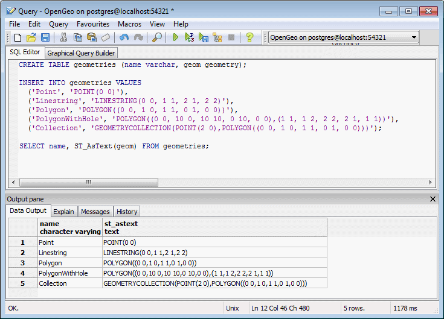
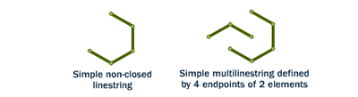
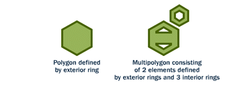
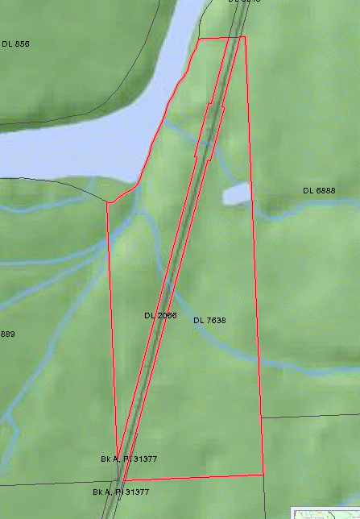

.. _dataadmin.pgBasics.geometries:

Geometries 
==========

This section describes geometry objects in a PostGIS database, and some of the functions and operators that are available to work with them.

Representing real world objects
-------------------------------

The Simple Features for SQL (``SFSQL``) specification, the original guiding standard for PostGIS development, defines how a real world object is represented. By taking a continuous shape and digitizing it at a fixed resolution, a passable representation of the object is produced. However, as SFSQL only handled 2-dimensional representations, PostGIS extended that to include 3-dimensional and 4-dimensional representations. More recently the SQL-Multimedia Part 3 (``SQL/MM``) specification has officially defined their own representation. 

Sample table
------------

To provide some sample data for illustration, the following example will create a table (**geometries**) and populate it with five different geometry objects–a point, a line, a polygon, a polygon with a hole, and a collection. 

.. note:: You can either use `psql <http://www.postgresql.org/docs/9.1/static/app-psql.html>`_ or the `pgAdmin <http://www.pgadmin.org/>`_ tool to create the table.

.. code-block:: sql

   CREATE TABLE geometries (name varchar, geom geometry);

   INSERT INTO geometries VALUES
     ('Point', 'POINT(0 0)'),
     ('Linestring', 'LINESTRING(0 0, 1 1, 2 1, 2 2)'),
     ('Polygon', 'POLYGON((0 0, 1 0, 1 1, 0 1, 0 0))'),
     ('PolygonWithHole', 'POLYGON((0 0, 10 0, 10 10, 0 10, 0 0),(1 1, 1 2, 2 2, 2 1, 1 1))'),
     ('Collection', 'GEOMETRYCOLLECTION(POINT(2 0),POLYGON((0 0, 1 0, 1 1, 0 1, 0 0)))');

    SELECT name, ST_AsText(geom) FROM geometries;

   *Creating some sample geometry in pgAdmin*

Information about each geometry object is available using PostGIS functions that read the geometry metadata. For example:

* :command:`ST_GeometryType(geometry)`—Returns the type of geometry
* :command:`ST_NDims(geometry)`—Returns the number of dimensions 
* :command:`ST_SRID(geometry)`—Returns the spatial reference identifier 

.. code-block:: sql

  SELECT name, ST_GeometryType(geom), ST_NDims(geom), ST_SRID(geom)
    FROM geometries;

returns the following::

       name       |    st_geometrytype    | st_ndims | st_srid 
 -----------------+-----------------------+----------+---------
  Point           | ST_Point              |        2 |      -1
  Polygon         | ST_Polygon            |        2 |      -1
  PolygonWithHole | ST_Polygon            |        2 |      -1
  Collection      | ST_GeometryCollection |        2 |      -1
  Linestring      | ST_LineString         |        2 |      -1

Points
~~~~~~

   *Different types of points*

A spatial **point** corresponds to a single location, defined by a single coordinate (including either 2-, 3- or 4-dimensions).  

.. code-block:: sql

  SELECT ST_AsText(geom) 
    FROM geometries
    WHERE name = 'Point';

.. code-block:: sql

  POINT(0 0)

Points are used to represent objects when the exact details, such as shape and size, are not important at the target scale. For example, cities on a map of the world are best depicted as points, while a map of a single state might represent cities as polygons.

Some of the specific spatial functions for working with points include:

* :command:`ST_X(geometry)`—Returns the X ordinate
* :command:`ST_Y(geometry)`—Returns the Y ordinate

To return the ordinate values of a point, execute the following SQL query:

.. code-block:: sql

  SELECT ST_X(geom), ST_Y(geom)
    FROM geometries
    WHERE name = 'Point';

.. code-block:: sql

  0     0     

To return the geometry of a point (stored in the :command:`ST_AsText` column), execute:

.. code-block:: sql

  SELECT name, ST_AsText(geom)
    FROM geometries
    LIMIT 1;

.. code-block:: sql
 
  Point  Point (0 0 )   

Linestrings
~~~~~~~~~~~

   *Different types of lines*

A **linestring**, in the form of an ordered series of two or more points, represents a path between locations. Most linear features, such as roads and rivers, are typically represented  as linestrings. A linestring is said to be **closed** if it starts and ends on the same point. It is said to be **simple** if it does not cross or touch itself (except at its endpoints if it is closed). A linestring can be both **closed** and **simple**. A single real world street may consist of many linestrings, each representing a segment of road with different attributes.

The following SQL query will return the geometry associated with one linestring (again, stored in the ``ST_AsText`` column).

.. code-block:: sql

  SELECT ST_AsText(geom) 
    FROM geometries
    WHERE name = 'Linestring';
  
.. code-block:: sql

  LINESTRING(0 0, 1 1, 2 1, 2 2)

Some of the specific spatial functions for working with linestrings include:

* :command:`ST_Length(geometry)`—Returns the length of the linestring
* :command:`ST_StartPoint(geometry)`—Returns the first coordinate as a point
* :command:`ST_EndPoint(geometry)`—Returns the last coordinate as a point
* :command:`ST_NPoints(geometry)`—Returns the number of coordinates in the linestring

To determine the length of a linestring, execute the following:

.. code-block:: sql

  SELECT ST_Length(geom) 
    FROM geometries
    WHERE name = 'Linestring';

.. code-block:: sql

  3.41421356237309

Polygons
~~~~~~~~

   *Different kinds of polygons*

A polygon is a representation of an area. The outer boundary of the polygon is defined by a *ring*—a linestring that is both closed and simple. Holes within the polygon are also defined by rings.

Polygons generally represent objects whose size and shape are important. City limits, parks, building footprints or bodies of water are all commonly depicted as polygons when the scale is sufficiently large to see their area. Roads and rivers can sometimes be represented as polygons.

The following SQL query will return the geometry associated with one polygon (in the :command:`ST_AsText` column).

.. code-block:: sql

  SELECT ST_AsText(geom) 
    FROM geometries
    WHERE name LIKE 'Polygon%';

.. note::

 In SQL the ``%`` symbol is used as a wildcard for pattern matching, along with the :command:`LIKE` operator.

.. code-block:: sql

 POLYGON((0 0, 1 0, 1 1, 0 1, 0 0))
 POLYGON((0 0, 10 0, 10 10, 0 10, 0 0),(1 1, 1 2, 2 2, 2 1, 1 1))

The first polygon has only one ring. The second one has an interior "hole". Although many graphics applications can work with polygons, GIS systems are relatively unique in allowing polygons to explicitly have holes.

.. figure:: img/geometries_polygonhole.png

   *Two polygons, one with a hole*

Some of the specific spatial functions for working with polygons include:

* :command:`ST_Area(geometry)`—Returns the area of the polygons
* :command:`ST_NRings(geometry)`—returns the number of rings (usually 1, more if there are holes)
* :command:`ST_ExteriorRing(geometry)`—Returns the outer ring as a linestring
* :command:`ST_InteriorRingN(geometry,n)`—Returns a specified interior ring as a linestring
* :command:`ST_Perimeter(geometry)`—Returns the length of all rings

To calculate the area of a polygon, use the :command:`ST_Area()` function:

.. code-block:: sql

  SELECT name, ST_Area(geom) 
    FROM geometries
    WHERE name LIKE 'Polygon%';

.. code-block:: sql

  Polygon            1
  PolygonWithHole    99

.. note:: 
 The polygon with a hole has an area that is the area of the outer shell (a 10x10 square) minus the area of the hole (a 1x1 square).

Collections
~~~~~~~~~~~

Collections group multiple simple geometries into sets and provide a framework for  modeling real world objects as spatial objects. 

There are four collection types: 

* **MultiPoint**—Collection of points
* **MultiLineString**—Collection of linestrings
* **MultiPolygon**—Collection of polygons
* **GeometryCollection**—Heterogeneous collection of any geometry (including other collections)

Collections provide a solution for modeling situations such as a parcel of land that is split by a right-of-way. In this case, a **MultiPolygon**, with a section of the land parcel on either side of the right-of-way, would be required.

   *Polygon collection*

The example collection in the **geometries** table contains a polygon and a point:

.. code-block:: sql

  SELECT name, ST_AsText(geom) 
    FROM geometries
    WHERE name = 'Collection';

.. code-block:: sql

  GEOMETRYCOLLECTION(POINT(2 0),POLYGON((0 0, 1 0, 1 1, 0 1, 0 0)))

.. figure:: img/geometries_geometrycollection.png

   *Geometry collection*

Some of the specific spatial functions for working with collections include:

* :command:`ST_NumGeometries(geometry)`—Returns the number of parts in the collection
* :command:`ST_GeometryN(geometry,n)`—Returns the specified part
* :command:`ST_Area(geometry)`—Returns the total area of all polygonal parts
* :command:`ST_Length(geometry)`—Returns the total length of all linear parts

Geometry input and output
-------------------------

Within the database, geometries are stored in a format only used only by PostGIS. To allow external programs to insert and retrieve "correct" geometries, they must be converted into a format these other programs can understand. Fortunately, PostGIS supports a large number of *emitters* and *consumers* for processing different geometry formats:

* Well-known text (``WKT``)
 
  * :command:`ST_GeomFromText(text)`—Returns ``geometry``
  * :command:`ST_AsText(geometry)`—Returns ``text``
  * :command:`ST_AsEWKT(geometry)`—Returns ``text``
   
* Well-known binary (``WKB``)
 
  * :command:`ST_GeomFromWKB(bytea)`—Returns ``geometry``
  * :command:`ST_AsBinary(geometry)`—Returns ``bytea``
  * :command:`ST_AsEWKB(geometry)`—Returns ``bytea``
   
* Geographic Mark-up Language (``GML``)
 
  * :command:`ST_GeomFromGML(text)`—Returns ``geometry``
  * :command:`ST_AsGML(geometry)`—Returns ``text``
   
* Keyhole Mark-up Language (``KML``)
 
  * :command:`ST_GeomFromKML(text)`—Returns ``geometry``
  * :command:`ST_AsKML(geometry)`—Returns ``text``
   
* ``GeoJSON``

  * :command:`ST_AsGeoJSON(geometry)`—Returns ``text``
   
* Scalable Vector Graphics (``SVG``)
 
  * :command:`ST_AsSVG(geometry)`—Returns ``text``
 
The most common use of a geometry constructor is to turn a text representation of a geometry into an internal representation:

.. code-block:: sql

   SELECT ST_GeomFromText('POINT(583571 4506714)',26918);
 
In addition to a text parameter with a geometry representation, the example above also includes a numeric parameter providing the ``SRID`` of the geometry.
 
The following SQL query provides an example of ``WKB`` representation. The function :command:`encode()` is required to convert the binary output into an ASCII form for printing. 

.. note:: Any of the following commands may be typed into the pgAdmin **Query** tool and executed by pressing **F5** or clicking **Execute**.

.. code-block:: sql

  SELECT encode(
    ST_AsBinary(ST_GeometryFromText('LINESTRING(0 0 0,1 0 0,1 1 2)')), 
    'hex');

This will generate the following output:

.. code-block:: console

   01020000000300000000000000000000000000000000000000000000000000f03f0000000000000000000000000000f03f000000000000f03f

While WKT is useful for human readability, WKB should be used for most operations, such as viewing data in a GIS application, transferring data to a web service, or processing data remotely. 

In addition to emitters for the various forms—WKT, WKB, GML, KML, JSON, SVG—PostGIS also has consumers for four—WKT, WKB, GML, KML. Most applications use the WKT or WKB geometry creation functions, but the others work too. The following example consumes GML format geometry and outputs JSON format:

.. code-block:: sql

  SELECT ST_AsGeoJSON(ST_GeomFromGML('<gml:Point><gml:coordinates>1,1</gml:coordinates></gml:Point>'));

This generates the following output::

  "{"type":"Point","coordinates":[1,1]}"

For more information about geometry functions in PostGIS, please refer to the `PostGIS Reference <../../postgis/postgis/html/reference.html>`_
