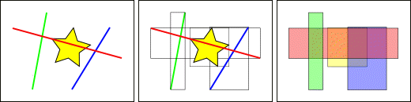
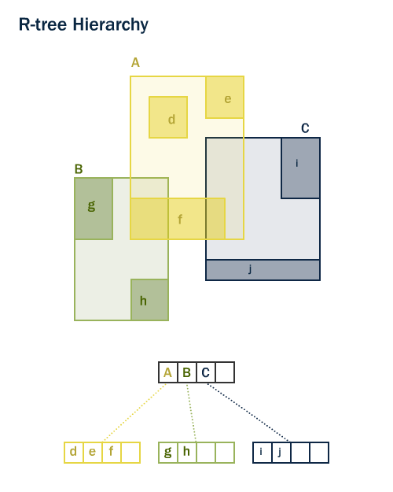

.. _dataadmin.pgBasics.indexes:

Spatial indexes
===============

A spatial index is one of the three key components of a spatial database. Without indexing, any search for a feature would require a *sequential scan* of every record in the database. Similarly, comparing whole tables with each other can be computationally expensive. Joining two tables of 10,000 records but each table without indexes would require 100,000,000 comparisons. With indexes on both, the processing cost could be as low as 20,000 comparisons. 

Indexing speeds up searching by organizing the data into a search tree that is quickly traversed to find a particular record. This can save a great deal of processing time for complex queries.

When data is loaded into a PostGIS database using the shape loader a spatial index, called  ``<TABLENAME>_the_geom_gist``, is automatically created. Spatial indexes can also be created manually using SQL:

.. code-block:: sql

  CREATE INDEX <INDEXNAME> ON <TABLENAME> USING GIST (<GEOMETRYCOLUMN>);

.. note:: The ``USING GIST`` clause tells PostgreSQL to use the generic index structure (GiST) when building the index. If you omit it, you will get a non-spatial index, which is not what you want.

How spatial indexes work
------------------------

Non-spatial database indexes create a hierarchical tree based on the values of the column being indexed. As spatial indexes are unable to index the geometric features themselves, the bounding boxes of the features are indexed instead.

   *Comparing bounding boxes*

In the figure above **one** line, the red line, intersects the yellow star. However, **two** bounding boxes of features, the red and blue ones, intersect the yellow box.

Identifying the lines that intersect the yellow star involves a two-phase approach.

#. Answer the question "what boxes intersect the yellow box?" using the index (which is very fast)
#. Do an exact calculation of "what lines intersect the yellow star" but **only for those features returned by the first test** 

For a large table, this two-phase approach of evaluating the approximate index first, then carrying out an exact test can significantly reduce the number of calculations necessary to answer a query.

Both PostGIS and Oracle Spatial share the same *R-Tree* spatial index structure. R-Trees break up data into rectangles, sub-rectangles, sub-sub rectangles, and so on. It is a self-tuning index structure that automatically handles variable data density and object size.

   *R-tree Hierarchy for geometries*

Index-only queries
------------------

Most of the commonly used functions in PostGIS, for example :command:`ST_Contains`, :command:`ST_Intersects`, and :command:`ST_DWithin`, include an index filter automatically. However some functions, such as :command:`ST_Relate`, do not include an index filter.

To execute a bounding-box search using the index and no filtering, use the ``&&`` operator. This operator is interpreted as "bounding boxes overlap or touch" in much the same way that the ``=`` operator is interpreted as "values are the same".

For example: 

.. code-block:: sql

  SELECT Sum(popn_total) 
  FROM nyc_neighborhoods neighborhoods
  JOIN nyc_census_blocks blocks
  ON neighborhoods.the_geom && blocks.the_geom
  WHERE neighborhoods.name = 'West Village';
  
::

  50325
  
To execute the same query using the more precise ``ST_Intersects`` function, use:

.. code-block:: sql

  SELECT Sum(popn_total) 
  FROM nyc_neighborhoods neighborhoods
  JOIN nyc_census_blocks blocks
  ON ST_Intersects(neighborhoods.the_geom, blocks.the_geom)
  WHERE neighborhoods.name = 'West Village';
  
::

  27141

The first query, using ``&&``, identified every block that intersected the neighborhood's bounding box. The second query, using :command:`St_Intersects`, only identified those blocks that intersected the neighborhood itself.

Analyzing
---------

It is not always faster to do an index search. If the search is going to return every record in the table, traversing the index tree to get each record is slower than just reading the whole table from the start.

The PostgreSQL query planner chooses when to use, or not to use, indexes to evaluate a query. To assess the most appropriate option (reading a small part of the table versus reading a large portion of the table), PostgreSQL maintains statistics about the distribution of data in each indexed table column. 

By default, PostgreSQL will automatically gather statistics on a regular basis. However, if you significantly alter the content of your table within a short period of time, the statistics may not be up-to-date. To ensure your statistics match your table contents, run the :command:`ANALYZE` command after bulk data load and delete operations on your table. This will force an update of the statistics for all your indexed columns.

The :command:`ANALYZE` command instructs PostgreSQL to traverse the selected table and update its internal statistics for query plan estimation. 

.. code-block:: sql

   ANALYZE nyc_census_blocks;
   
Vacuuming
---------

Simply creating an index is not enough to allow PostgreSQL to use the index effectively. The :command:`VACUUM` command instructs PostgreSQL to reclaim any unused space in the table pages after any update or delete operations. VACUUMing must be performed whenever a new index is created or after a large number of UPDATEs, INSERTs or DELETEs are performed on a table. 

Vacuuming is so critical for the efficient running of the database that PostgreSQL provides an ``autovacuum`` option, which is enabled by default. ``autovacuum`` both VACUUMs (recovers space) and ANALYZEs (updates statistics) on your tables at intervals determined by the level of activity. While this is essential for highly transactional databases, it is not advisable to wait for an autovacuum run after adding indexes or bulk-loading data. If a large batch update is performed, you should manually run :command:`VACUUM`.

Vacuuming and analyzing the database can be performed separately as required. Issuing the :command:`VACUUM` command will not update the database statistics. Similarly, issuing an :command:`ANALYZE` command will not recover unused space. Both commands can be run against the entire database, a single table, or a single column. 

.. code-block:: sql

   VACUUM ANALYZE nyc_census_blocks;

