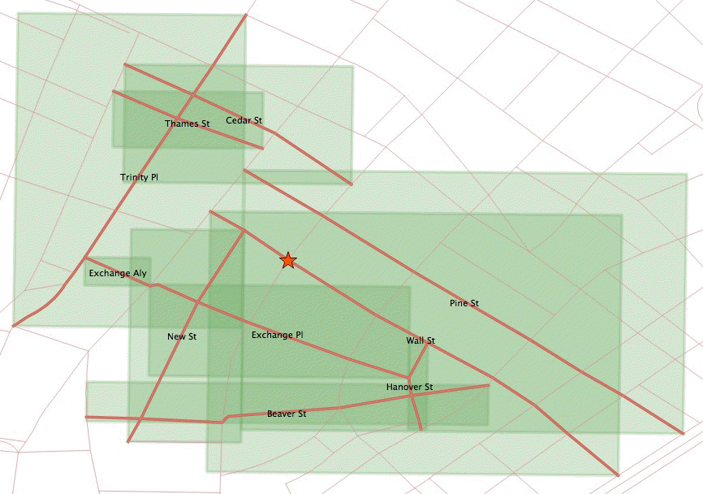
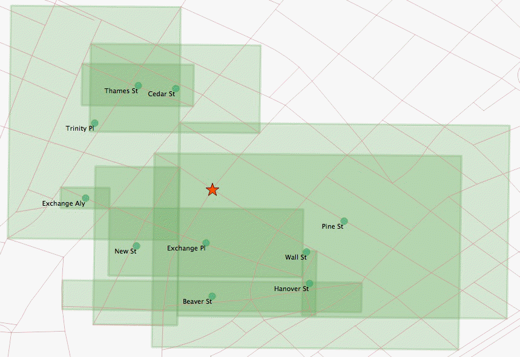
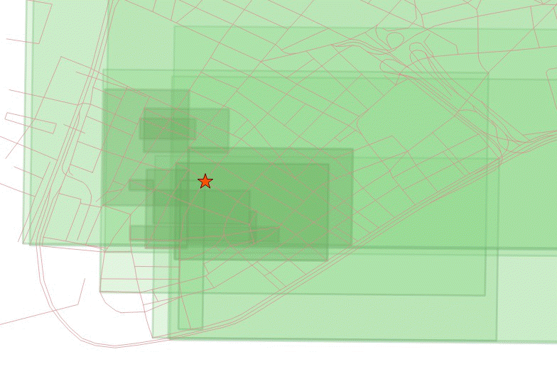

.. _dataadmin.pgBasics.indx_knn:

Nearest neighbor searches
=========================

A common spatial query is "what is the nearest <candidate feature> to <query feature>?"
Unlike a distance search, these *nearest neighbor* searches don't have any restrictions on how far away candidate geometries can be, just as long as they are the *nearest*. 

This presents a problem for traditional index-assisted queries that require a search box, and a measurement value to build the box. The simple way to carry out a nearest neighbor query is to order the candidate table by distance from the query geometry, and then identify which candidate geometry is the closest.

.. code-block:: sql

  -- Closest street to Broad Street station is Wall St
  SELECT streets.gid, streets.name 
  FROM 
    nyc_streets streets, 
    nyc_subway_stations subways
  WHERE subways.name = 'Broad St'
  ORDER BY ST_Distance(streets.the_geom, subways.the_geom) ASC
  LIMIT 1;

Unfortunately this approach forces the database to calculate the distance between the query geometry and *every* feature in the table of candidate features, then sort them all. For a large table of candidate features, this will incur considerable processing costs.

One option for improving performance is to add an index constraint to the search. This would require a search box around the query geometry. 

.. code-block:: sql

  -- Closest street to Broad Street station is Wall St
  SELECT streets.gid, streets.name 
  FROM 
    nyc_streets streets, 
    nyc_subway_stations subways
  WHERE subways.name = 'Broad St'
  AND streets.the_geom && ST_Expand(subways.the_geom, 200) -- Search box: 200m
  ORDER BY ST_Distance(streets.the_geom, subways.the_geom) ASC
  LIMIT 1;

However, even with this approach there are limitations. The arbitrary search box imposes an artificial restriction on the search. The nearest neighbor may be further than 200m away but it is still the nearest.

Index-based KNN
---------------

"KNN" stands for "K nearest neighbors", where "K" represents the number of neighbors you are searching for.

KNN is an index-based nearest neighbor search. By traversing the index, the search will find the nearest candidate geometries without using any arbitrary search radius. As a result, the technique is also suitable for very large tables with highly variable data densities.

.. note:: The KNN feature is only available on PostGIS 2.0 with PostgreSQL 9.1 or greater.

The KNN search works by evaluating distances between bounding boxes inside the PostGIS R-Tree index. As the index is built using the bounding boxes of geometries, the distances between any geometries that are not points will be inexact—the distance returned for line and polygon geometry searches is actually the distance between the bounding boxes of geometries, not the geometries themselves.

The syntax of the index-based KNN query places a special index-based distance operator in the ORDER BY clause of the query. There are two index-based distance operators: **<->** for the distance between box centers and **<#>** for the distance between box edges.

One side of the index-based distance operator must be a literal geometry value. You could either  use a subquery that returns as single geometry or include a :term:`WKT` geometry instead.

.. code-block:: sql

  -- Closest 10 streets to Broad Street station are ?
  SELECT 
    streets.gid, 
    streets.name
  FROM 
    nyc_streets streets
  ORDER BY 
    streets.the_geom <-> 
    (SELECT the_geom FROM nyc_subway_stations WHERE name = 'Broad St')
  LIMIT 10;

  -- Same query using a geometry EWKT literal

  SELECT ST_AsEWKT(the_geom)
  FROM nyc_subway_stations 
  WHERE name = 'Broad St';
  -- SRID=26918;POINT(583571 4506714)

  SELECT 
    streets.gid, 
    streets.name,
    ST_Distance(
      streets.the_geom, 
      'SRID=26918;POINT(583571.905921312 4506714.34119218)'::geometry
      ) AS distance
  FROM 
    nyc_streets streets
  ORDER BY 
    streets.the_geom <-> 
    'SRID=26918;POINT(583571.905921312 4506714.34119218)'::geometry
  LIMIT 10;

The results of the second query illustrate how odd the index-based query on non-point geometries can appear at first glance. Wall Street is third in the list, even though the absolute distance from the station to the street is 0.714 meters.

::

    gid  |     name     |     distance      
  -------+--------------+-------------------
   17360 | Exchange Pl  |    101.6241843136
   17350 | New St       |  63.9499165490674
   17385 | Wall St      | 0.714202224374917
   17332 | Exchange Aly |  159.618545539243
   17402 | Pine St      |  75.8461038368021
   17347 | Cedar St     |  133.009278387597
   17335 | Beaver St    |  221.988864601724
   17314 | Trinity Pl   |  205.942231743204
   17515 | Hanover St   |  198.414568622805
   17345 | Thames St    |  167.802276238319

As all the calculations are based on bounding boxes, the bounding box of the station point is just the point itself so there is no approximation there. However the bounding boxes of the streets aren't the same as the street line geometries. The bounding boxes of the top ten closest streets are:

   *Top ten bounding boxes*

The station falls right on the Wall Street line, and within the Wall Street box. However, this index ordering is controlled by the **<->** operator, which calculates distance between box centers.

   *Bounding box centers*

The center of the Wall Street box is further from the station than the centers of the Exchange Place and New Street boxes.

Even with the **<#>** operator (distance between box edges), the answer would still be incorrect.

.. code-block:: sql

  -- Closest 10 streets to Broad Street station are ?
  SELECT 
    streets.gid, 
    streets.name
  FROM 
    nyc_streets streets
  ORDER BY 
    streets.the_geom <#> 
    'SRID=26918;POINT(583571.905921312 4506714.34119218)'::geometry
  LIMIT 10;

::

    gid  |                               name                               
  -------+------------------------------------------------------------------
   19088 | FDR Dr
   17315 | Broadway
   19087 | FDR Dr
   17402 | Pine St
   17385 | Wall St
   17357 | South St
   17308 | Pearl St
   17235 | West Side Highway; West St; West Side Highway; West Side Highway
   17230 | 
   17390 | Broad St

There are a number of large street features with large bounding boxes that **also** overlap the station and yield a box distance of zero. 

    
   *Overlapping bounding boxes*

The best approach for identifying nearest neighbors to include the top 100 (for example) possible results in a subquery, calculate the true distance for all of them, and identify the nearest neighbor from that result set.

.. code-block:: sql

  -- "Closest" 100 streets to Broad Street station are?
  WITH closest_candidates AS (
    SELECT 
      streets.gid, 
      streets.name,
      streets.the_geom
    FROM 
      nyc_streets streets
    ORDER BY 
      streets.the_geom <-> 
      'SRID=26918;POINT(583571.905921312 4506714.34119218)'::geometry
    LIMIT 100
  )
  SELECT gid, name
  FROM closest_candidates
  ORDER BY 
    ST_Distance(
      the_geom,
      'SRID=26918;POINT(583571.905921312 4506714.34119218)'::geometry
      )
  LIMIT 1;

.. note:: You could use a smaller number for the top results if your data is more homogeneous in distribution.

If you are querying a point table, as the boxes are identical to the points, you can use the index-sorted result directly and dispense with the subquery.

.. code-block:: sql

  -- The 10 nearest stations to Broad St station
  SELECT gid, name
  FROM nyc_subway_stations
  ORDER BY the_geom <-> 'SRID=26918;POINT(583571.905921312 4506714.34119218)'::geometry
  LIMIT 10;
  
