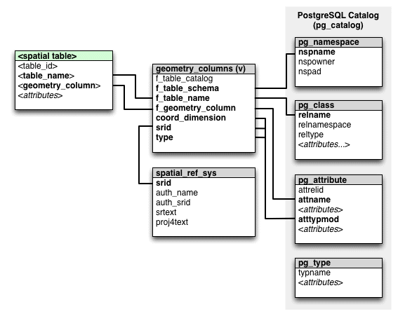
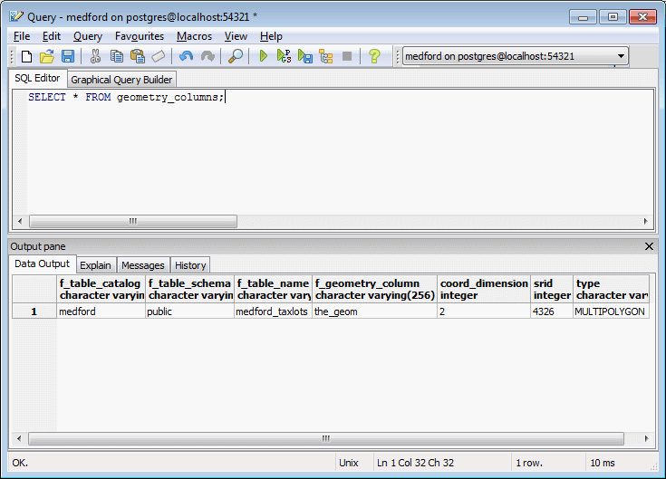

.. _dataadmin.pgBasics.metatables:

OpenGIS metadata 
================

In compliance with the OpenGIS Simple Features for SQL (SFSQL) specification, PostGIS stores and manages metadata for all geometry columns present in a database. As a result, client applications are not required to inspect individual spatial tables and their geometries to perform display, projection, or analytical queries.

The metadata is managed by the *postgres* user account and stored in the following PostgreSQL schema objects:

* ``spatial_ref_sys``—Table recording spatial reference systems 
* ``geometry_columns``—Read-only view listing spatial (or feature) tables, geometry columns and geometry types present in the database
* ``geography_columns``—Read-only view listing spatial (or feature) tables, geography columns and geography types present in the database

   *Spatial metadata schema relationships*

As PostGIS uses a view based on the system catalogs rather than a table to record geometry column metadata, the view is always current, updated automatically when a new spatial table is created. 

.. note:: PostGIS 1.X managed metadata in tables, not views, and used a number of the system utility functions, such as ``populate_geometry_columns()``. In PostGIS 2.X running these utility functions is no longer required.

To query the ``geometry_columns`` view, execute the following SQL command:

.. code-block:: sql

   SELECT * FROM geometry_columns;

   *geometry_columns view*

The attributes of the ``geometry_columns`` view are:

* ``f_table_catalog``, ``f_table_schema``, ``f_table_name``—Fully qualified name of the spatial table  
* ``f_geometry_column``—Name of the geometry column (for spatial tables with multiple geometry columns, there will be one record for each column)  
* ``coord_dimension``—Dimension of the geometry (2-, 3- or 4-dimensions) 
* ``srid``—Spatial reference identifier in the ``spatial_ref_sys`` table  
* ``type``—Type of geometry (such as ``point`` or ``linestring``)

Typmods
-------

PostGIS 2.0+ also adds support for type modifiers, or *typmods*, on geometry objects. Typmods provide a method of specifying additional information for a column definition. For example:

.. code-block:: sql

    CREATE TABLE test (
      description VARCHAR(255)
    )

The typmod in this case is the number *255*, indicating the maximum length of values in the *description* field. By applying a typmod to a geometry column, you can specify the geometry type, dimensionality and spatial reference identifier. To create a new spatial table ``geotbl`` with a geometry column of type *point*, dimensionality *Z*, and a spatial reference identifier of *4326*, the following typmod definition is required:

.. code-block:: sql

    CREATE TABLE geotbl (
      geom GEOMETRY(PointZ, 4326)
    )

Updating spatial tables
-----------------------
 
Updating spatial tables in previous versions of PostGIS, such as changing the spatial reference or geometry type, was a multi-step process—dropping constraints, updating the table, updating the geometry_columns table and re-applying the constraints. With version 2.0+, this can be accomplished with a single ``ALTER TABLE`` command. The following example will simultaneously alter the dimensionality and projection of the data as well as the associated table constraints: 

.. code-block:: sql

    ALTER TABLE geotabl
      ALTER COLUMN geom
      SET DATA TYPE geometry(Point,26910)
      USING ST_Transform(ST_Force_2D(geom, 26910))

The ``geometry_columns`` view is updated automatically to reflect the changes.

Manually registering geometry columns
-------------------------------------

There may still be occasions when you are required to manually register a geometry column, such as when working with SQL views or bulk data inserts. With PostGIS 2.0+ if the definition of a geometry column is typmod-based, the view or table creation process will automatically register the column correctly, so no further action is required. However, if a geometry column in an existing view is constraint-based, it will not be registered correctly.

For example, if a view is defined as follows:

.. code-block:: sql

   CREATE VIEW public.vw_mytable AS
     SELECT gid, ST_Transform(geom, 3395) AS geom, f_name
     FROM public.mytable;

Querying the ``geometry_columns`` view will confirm the incorrect registration of the geometry column:

.. code-block:: sql

   SELECT f_table_name, f_geometry_column, srid, type 
 	   FROM geometry_columns 
     WHERE f_table_name = 'public.vw_mytable';

::

   f_table_name | f_geometry_column | srid | type     
   -------------+-------------------+------+----------
    vw_mytable  | geom              | 0    | GEOMETRY   
   -------------+-------------------+------+----------

To register the geometry column with PostGIS 2.0+, you must convert, or cast, the geometry to be typmod-based:

.. code-block:: sql

   DROP VIEW public.vw_mytable;
   CREATE VIEW public.vw_mytable AS
	   SELECT gid, ST_Transform(geom,3395)::geometry(Geometry, 3395) AS geom, f_name
	   FROM public.mytable;

If the geometry type is known to be a 2D polygon, the view could be redefined as:

.. code-block:: sql

   DROP VIEW public.vw_mytable;
   CREATE VIEW public.vw_mytable AS
     SELECT gid, ST_Transform(geom,3395)::geometry(Polygon, 3395) AS geom, f_name
     FROM public.mytable;

Querying the ``geometry_columns`` view again will report the update.

.. code-block:: sql

   SELECT f_table_name, f_geometry_column, srid, type 
     FROM geometry_columns 
     WHERE f_table_name = 'public.vw_mytable';

::

   f_table_name | f_geometry_column | srid  | type     
   -------------+-------------------+-------+----------
    vw_mytable  | geom              | 3395  | GEOMETRY   
   -------------+-------------------+-------+----------

The geometry column is now correctly registered.

If you wish to add a geometry column to an existing table, the function ``AddGeometryColumn()`` now uses a typmod by default to define the column, rather than constraints.

``AddGeometryColumn()`` accepts the following parameters::

  AddGeometryColumn(varchar table_name, varchar column_name, integer srid, varchar type, integer dimension, boolean use_typmod=true);

.. code-block:: sql

   SELECT AddGeometryColumn('my_table', 'geom', 4326, 'POINT', 2);

To add a point using constraint-based behavior, set the ``use_typemod`` value to be ``false``.

.. code-block:: sql

   SELECT AddGeometryColumn('my_table', 'geom', 4326, 'POINT', 2, false);

.. note:: ``AddGeometryColumn()`` no longer updates the ``geometry_columns`` view as the view reads directly from the system catalogs.

