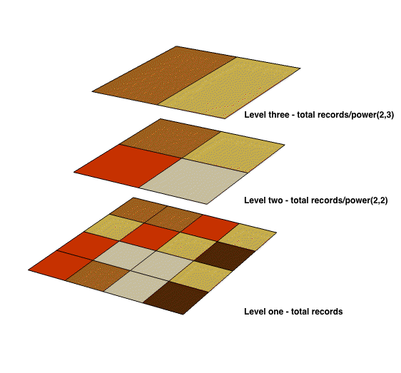
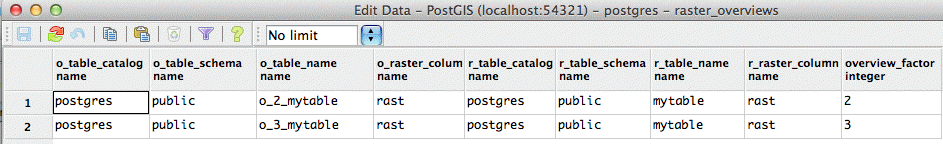

.. _dataadmin.pgBasics.rasters:

Raster data
===========

In PostGIS raster data is modelled as large collections of small chunks of data. This means raster data can be manipulated and analyzed in much the same way as vector data. 

.. note:: At PostGIS 2.0, raster support in PostGIS is provided primarily to support analysis, not visualization.

Joining raster and vector data
------------------------------

Integrated raster and vector analysis is a powerful additional tool for data analysts. In the following example, a raster elevation dataset is joined to vector land use dataset to highlight areas unsuitable for certain types of agriculture.

.. code-block:: sql

   CREATE TABLE steep_logging AS
   WITH 
   counts AS (
    SELECT 
      btm.gid, 
      ST_SummaryStats(ST_Clip(rast, geom)) AS stats
    FROM slope, btm 
    WHERE 
      ST_Intersects(geom, ST_ConvexHull(rast)) 
    AND 
      btm.plu_label = 'Recently Logged';

.. ToDo:: Add Raster Summary Statistics http://postgis.refractions.net/documentation/manual-2.0/RT_ST_SummaryStats.html example

There are many functions in PostGIS for handling raster data, for example :command:`ST_AsRaster()`, :command:`ST_MakeEmptyRaster()`, :command:`ST_AsTIFF()`. For a full list of functions, refer to `Raster Reference <http://postgis.refractions.net/docs/RT_reference.html>`_. 

Raster_columns view
-------------------

The ``raster_columns`` database view catalogs all the table columns in your PostGIS database that are of type *raster*. As the view takes advantage the constraints on the base tables, the information in the catalog is always current and consistent with the state of the database.

.. note:: If you didn't create your raster table using ``raster2pgsql``, or forgot to specify the -C flag (apply raster constraints) during the load operation, you can still apply those constraints with ``AddRasterConstraints()`` to ensure the relevant information about your raster data is registered correctly.

The attributes of the ``raster_columns`` view are:

* ``r_table_catalog``, ``r_table_schema``, ``r_table_name``—Fully qualified name of the raster table  
* ``r_raster_column``—Name of the raster column   
* ``srid``—Spatial reference identifier in the ``spatial_ref_sys`` table 
* ``scale_x``, ``scale_y``—Scaling between geometric spatial coordinates and pixel
* ``blocksize_x``—Width (number of pixels across) of each raster tile
* ``blocksize_y``—Width (number of pixels down) of each raster tile
* ``same_alignment``—Boolean value indicating if all tiles have the same alignment
* ``regular_blocking``—True/False constraint indicating if tiles overlap, are of the same alignment, pixel size and so on
* ``num_bands``—Number of bands per tile in the raster data
* ``pixel_types``—Array defining pixel type for each band
* ``nodata_values``—Array denoting the ``nodata_value`` for each band
* ``out_db``—Indicates if the raster data is maintained outside the database (for example in GeoTIFF files)
* ``extent``—Extent of all rows in your raster data

Raster overviews
----------------

A raster overview is a lower resolution version of a base raster table, used primarily to improve display performance for operations that do not require pixel level information. At each higher level of overview, the data is re-sampled to provide a representation of the data at a lower spatial resolution. 

Since there are fewer records to process in an overview, and each overview pixel covers a geographically larger extent, overview processing operations are generally faster. However, the results are not as accurate as the results derived from the higher resolution base raster table.

If the  ``-l`` option is included with the raster data loader tool ``raster2pgsql``, an overview will be computed and created for each image loaded. To create more than one overview table per base raster table, separate each overview level with a comma (,). For example:

.. code-block:: console
  
   raster2pgsql -s 4236 -I -C -l 2,3  -M *.tif -F -t 100x100 public.demelevation | psql -d gisdb -h localhost -p 5432
 

.. note:: Each overview tile generated by ``raster2pgsql`` has the same number of pixels as its parent, but is of a lower resolution where each overview pixel represents (Power(2,overview_factor) pixels of the original).

Overview table names follow the convention ``o_<overview_level>_<raster_table_name>``. For example:

.. code-block:: console

  o_2_myRastTable

Level one overviews always represent the original raster data. Level two overviews will represent each tile in the raster object with four times fewer pixels. For example, if you have a folder of 5000x5000 pixel image files that you chose to chunk 125x125, each image file your base raster table will have (5000*5000)/(125*125) = 1600 records. Your level two overview will have 1600/Power(2,2) = 400 rows, your level three overview will 1600/Power(2,3) = 200 rows, and so on.

.. note:: If the pixels in your raster data aren't divisible by the size of your tiles, some scrap tiles (tiles not completely filled) will remain. 

   *Reduced resolution raster overviews*

Raster_overviews catalog
------------------------

The ``raster_overviews`` database view catalogs the raster columns used to create raster overviews. The attributes of the ``raster_overviews`` view are:

* ``o_table_catalog``, ``o_table_schema`` , ``o_table_name``—Fully qualified name of the raster overview table   
* ``o_raster_column``—Name of the raster column in the overview table  
* ``r_table_catalog``, ``r_table_schema``, ``r_table_name``—Fully qualified name of the base raster table  
* ``r_raster_column``—Name of the raster column in the base raster table  

   *raster_overviews view*

The information in ``raster_overviews`` does not duplicate the information in ``raster_columns``. If you require information about an overview table recorded in ``raster_columns``, join the ``raster_overviews`` and ``raster_columns`` views. For example:

.. code-block:: sql

   SELECT o.o_table_name, c.r_table_name, c.r_raster_column, c.srid, c.blocksize_x, 
     c.blocksize_y, c.num_bands
   FROM raster_overviews o, raster_columns c
   WHERE o.o_table_name = 'o_3_mytable' AND o.o_table_name = c.r_table_name;

.. code-block:: console

    o_table_name  | r_table_name    | srid | blocksize_x | blocksize_y | num_bands 
   ---------------+-----------------+------+-------------+-------------+-----------
    o_3_mytable   | o_3_mytable     | 4326 | 1155        |  1106       | 3         
   ---------------+-----------------+------+-------------+-------------+-----------  

.. note:: The performance of raster data analysis is sensitive to tile sizes, so you may need to experiment with the optimum tile size settings for your data. 

