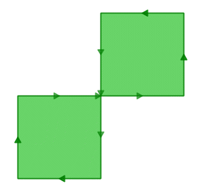
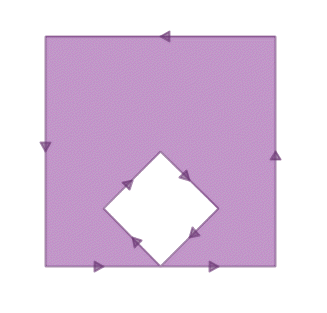

.. _dataadmin.pgBasics.validity:

Validity
========

A valid geometry is essential for polygons since they define bounded areas and require a consistent structure. Lines and points, on the other hand, are simple contructs and cannot be invalid.

The following validity rules have been adopted by the OGC SFSQL standard, and as such are implemented by PostGIS:

* Polygon rings must close
* Rings that define holes should be inside rings that define exterior boundaries
* Rings must not self-intersect—they may neither touch nor cross one another
* Rings must not touch other rings except at a point

.. Note:: The last two rules are arbitrary. There are other ways to define polygons that are equally self-consistent. 

These rules are important because algorithms for geometry calculations depend on a consistent structure in the input geometries. Although it is possible to build algorithms that have no structural prerequisites, a structure-free approach often results in slow processing times since the first step is to analyze the inputs and impose a structure.

To illustrate why structure matters, the following output represents an invalid polygon.

.. code-block:: console

  POLYGON((0 0, 0 1, 2 1, 2 2, 1 2, 1 0, 0 0));
  
The reason it is invalid is highlighted in the following diagram:

   *Figure-eight polygon*

Although the display routine appears to render the polygon as a single area, the outer ring is a figure-eight, with a self-intersection in the middle. This results in two one-unit squares and a total area that is the sum of the two squares.

Applying the :command:`ST_Area` function confirms the polygon's invalid status. 

.. code-block:: sql

  SELECT ST_Area(ST_GeometryFromText('POLYGON((0 0, 0 1, 1 1, 2 1, 2 2, 1 2, 1 1, 1 0, 0 0))'));
  
::

    st_area 
   ---------
          0

The algorithm that calculates area assumes that rings do not self-intersect. A valid ring will always have the area that is bounded (the interior) on one side of the bounding line. It doesn't matter which side, just as long as it is on *one* side. 

However, in the figure-eight example the bounded area is to the right of the line for one square and to the left for the other. This results in the area calculated for each square being canceled out; one is reported as 1, the other as -1, so a total "zero area" is returned.

Detecting validity
------------------

For a quick test of validity the function :command:`ST_IsValid(geometry)` will return a true/false answer.

Using the figure-eight polygon as an example, the output would be:

.. code-block:: sql

   SELECT ST_IsValid(ST_GeometryFromText('POLYGON((0 0, 0 1, 1 1, 2 1, 2 2, 1 2, 1 1, 1 0, 0 0))'));

:: 

  f

The result is false. This confirms the feature is invalid, but doesn't explain why. The :command:`ST_IsValidReason(geometry)` function will provide further information as to why it is invalid.

.. code-block:: sql

  SELECT ST_IsValidReason(ST_GeometryFromText('POLYGON((0 0, 0 1, 1 1, 2 1, 2 2, 1 2, 1 1, 1 0, 0 0))'));

::

  Self-intersection[1 1]

In addition to the explanation as to why the geometry is invalid (self-intersection), the location of the invalidity (coordinate (1 1)) is also returned.

The :command:`ST_IsValid` function can also be used to test entire tables.

.. code-block:: sql

  SELECT name, boroname, ST_IsValidReason(the_geom)
  FROM nyc_neighborhoods
  WHERE NOT ST_IsValid(the_geom);

::

           name           |   boroname    |                     st_isvalidreason                      
 -------------------------+---------------+------------------------------------------------------
  Howard Beach            | Queens        | Self-intersection[597264.083368305 4499924.54228856]
  Corona                  | Queens        | Self-intersection[595483.058764138 4513817.95350787]
  Steinway                | Queens        | Self-intersection[593545.572199759 4514735.20870587]
  Red Hook                | Brooklyn      | Self-intersection[584306.820375986 4502360.51774956]

Repairing invalidity
--------------------

Most common invalidities can be repaired using the :command:`ST_MakeValid(geometry)` function.
For example, running :command:`ST_MakeValid(geometry)` on the figure-eight polygon:

.. code-block:: sql

  SELECT ST_AsText(
           ST_MakeValid(
             ST_GeometryFromText(
               'POLYGON((0 0, 0 1, 1 1, 2 1, 2 2, 1 2, 1 1, 1 0, 0 0))'
             )
           )
         );

::

  MULTIPOLYGON(((0 0,0 1,1 1,1 0,0 0)),((1 1,1 2,2 2,2 1,1 1)))
  
The repair routine correctly reformats the figure-eight as a multi-polygon with a polygon for each lobe of the figure-eight.

The function :command:`ST_MakeValid(geometry)` is not a cleaning routine as such, but it is a very strict validity repairer. The following polygon is an ordinary square, but with one unit "hair" (a zero width corridor) extruding from it. 

:: 

  POLYGON((0 0, 0 1, 1 1, 1 2, 1 1, 1 0, 0 0))

However, the repair routine returns **all** the components of the input. It doesn't delete geometry, just rearranges it into valid representations:

.. code-block:: sql

  SELECT ST_AsText(ST_MakeValid('POLYGON((0 0, 0 1, 1 1, 1 2, 1 1, 1 0, 0 0))'));
  

.. code-block:: console

                                 st_astext                                 
  ----------------------------------------------------------------------
  GEOMETRYCOLLECTION(POLYGON((0 0,0 1,1 1,1 0,0 0)),LINESTRING(1 1,1 2))

The function :command:`ST_Buffer(geometry,radius)` can also be used to clean invalid geometries by using a zero radius. For example:

.. code-block:: sql

  SELECT ST_AsText(ST_Buffer('POLYGON((0 0, 0 1, 1 1, 1 2, 1 1, 1 0, 0 0))'::geometry, 0));
  

.. code-block:: console

             st_astext            
  ------------------------------
  POLYGON((0 0,0 1,1 1,1 0,0 0))

.. note:: The buffer function is not guaranteed to repair all geometries and it does not work on as many input cases as the :command:`ST_MakeValid` function.

The "banana polygon" (or "inverted shell") is a single ring that encloses an area but bends around to touch itself, leaving a "hole" which is not actually a hole.

.. code-block:: console

  POLYGON((0 0, 2 0, 1 1, 2 2, 3 1, 2 0, 4 0, 4 4, 0 4, 0 0))
  

Running :command:`ST_MakeValid(geometry)` on the polygon returns a valid ``OGC`` polygon, consisting of an outer and inner ring that touch at one point.

.. code-block:: sql

  SELECT ST_AsText(
           ST_MakeValid(
             ST_GeometryFromText('POLYGON((0 0, 2 0, 1 1, 2 2, 3 1, 2 0, 4 0, 4 4, 0 4, 0 0))')
           )
         );

::

  POLYGON((2 0,0 0,0 4,4 4,4 0,2 0),(2 0,3 1,2 2,1 1,2 0))

.. note::

  The "banana polygon" is an example where the ``OGC`` topology model for valid geometry and the model adopted by Esri differ. The Esri model considers rings that touch to be invalid, and prefers the "banana" form for this type of shape. The OGC model is the reverse. 
  
