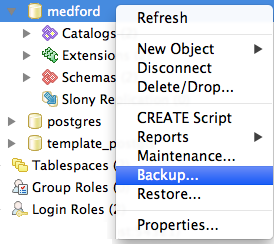
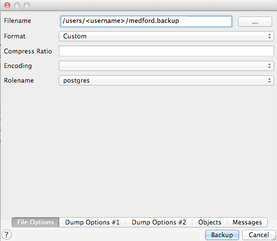
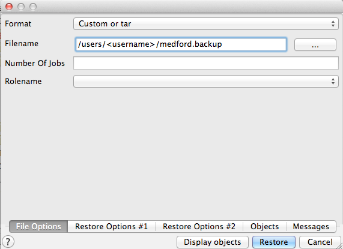
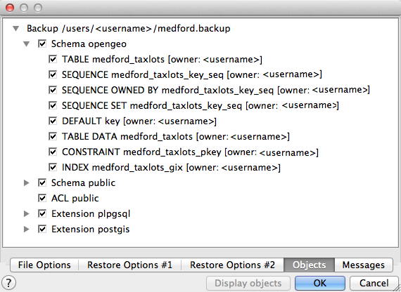
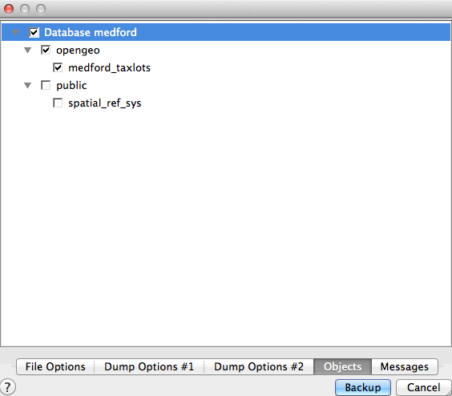
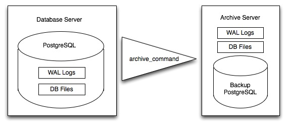

.. _dataadmin.pgDBAdmin.backup:

PostgreSQL backup and restore
=============================

There are a number of options for backing up a PostgreSQL database. Choosing the most appropriate option depends on how you are using the database. For relatively static databases with few updates, the :command:`pg_dump` and :command:`pg_restore` tools allow you to take periodic snapshots of the data whenever required. If your data changes frequently, using an online backup facility will allow you continuously archive updates to a secure location.

Online backup is the basis for replication and stand-by systems for `high availability <http://www.postgresql.org/docs/current/static/high-availability.html>`_, particularly PostgreSQL version 9.0 or greater.

Structuring your data
---------------------

It is good practice to always store your production data in separate :ref:`dataadmin.pgDBAdmin.schemas` and we recommend you adopt this approach for managing your data in a PostgreSQL database. This is important for two reasons:

 * Backing up and restoring data structured in separate schemas is simpler than compiling lists of tables to be backed up individually.
 * Keeping data tables out of the *public* schema makes it easier to upgrade your system.

Basic backup and restore
------------------------

Backing up a full database is a straightforward operation using the pg_dump_ tool, a command-line tool which makes it easy to automate the process with scripting. It is also available with a graphical user interface (GUI) from the pgAdmin database management application.

To start a back up, right-click the database you want to back up in the pgAdmin :guilabel:`Object browser` and click :guilabel:`Backup`.

   Backing up a database in pgAdmin

Provide a name for the backup file, choose the backup format, and configure the other backup options as required.

  
    Configuring the backup options

There are four backup formats to choose from: 

 * :guilabel:`Custom`—Outputs a custom format (compressed by default) suitable for input to :command:`pg_restore`
 * :guilabel:`Tar`—Uses a UNIX archive format to hold components of the dump in separate files. Using the tar format allows the pg_restore_ utility to selectively restore parts of the dump.
 * :guilabel:`Plain`—Outputs a plain-text SQL script file. This is the simplest format and in many ways the most flexible, since it can be edited and then loaded back into a database.
 * :guilabel:`Directory`—Outputs a directory-format archive similar to the :guilabel:`Tar` format, but compresses the internal components individually allowing them to be selectively restored without decompressing the entire archive.

.. note:: For further information on all the available options, click the *Help* |pgHelp| button at the bottom left hand corner of the backup dialog box.

The same backup operation can also be run from the command line as follows:

.. code-block:: console

   pg_dump --file=medford.backup --format=c --port=54321 --username=postgres medford

As this backup file is in :guilabel:`Custom` format, you can view the contents of the file using the :command:`pg_restore` command to list the backup manifest. To view the contents of a backup file, right-click the database you want to restore in the pgAdmin :guilabel:`Object browser` and click :guilabel:`Restore`. Select the backup file and click :guilabel:`Display objects` in the pgAdmin restore dialog box.

 
   Restoring a backup file in pgAdmin

Expand the :guilabel:`Backup` item to display a list of database objects that are included in the backup file.

    Listing the backup file manifest

.. note::

  PostgreSQL 9.1+ includes an "EXTENSION" feature that allows add-on packages like PostGIS to be installed as registered system components and therefore excluded from :command:`pg_dump` output. PostGIS 2.0 and higher supports installations using this extension system.

You can also list the same manifest from the command line using the :command:`pg_restore` tool:

.. code-block:: console

  pg_restore --list medford.backup

 ;
 ; Archive created at Mon Dec  3 12:39:29 2012
 ;    dbname: medford
 ;    TOC Entries: 23
 ;    Compression: -1
 ;    Dump Version: 1.12-0
 ;    Format: CUSTOM
 ;    Integer: 4 bytes
 ;    Offset: 8 bytes
 ;    Dumped from database version: 9.1.4
 ;    Dumped by pg_dump version: 9.1.4
 ;
 ;
 ; Selected TOC Entries:
 ;
 3207; 1262 18626 DATABASE - medford <username>
 7; 2615 18627 SCHEMA - opengeo <username>
 5; 2615 2200 SCHEMA - public postgres
 3208; 0 0 COMMENT - SCHEMA public postgres
 3209; 0 0 ACL - public postgres
 177; 3079 11907 EXTENSION - plpgsql 
 3210; 0 0 COMMENT - EXTENSION plpgsql 
 178; 3079 16385 EXTENSION - postgis 
 3211; 0 0 COMMENT - EXTENSION postgis 
 176; 1259 18632 TABLE opengeo medford_taxlots <username>
 175; 1259 18630 SEQUENCE opengeo medford_taxlots_key_seq <username>
 3212; 0 0 SEQUENCE OWNED BY opengeo medford_taxlots_key_seq <username>
 3213; 0 0 SEQUENCE SET opengeo medford_taxlots_key_seq <username>
 3197; 2604 18635 DEFAULT opengeo key <username>
 3204; 0 18632 TABLE DATA opengeo medford_taxlots <username>
 3195; 0 16625 TABLE DATA public spatial_ref_sys postgres
 3203; 2606 18643 CONSTRAINT opengeo medford_taxlots_pkey <username>
 3201; 1259 18644 INDEX opengeo medford_taxlots_gix <username>
 3192; 2618 17042 RULE public geometry_columns_delete postgres
 3190; 2618 17040 RULE public geometry_columns_insert postgres 
 3191; 2618 17041 RULE public geometry_columns_update postgres

With a full database backup, all schemas are included the dump file, so the entire database can be restored to a blank database. You can also limit the backup operation to back up individual schemas and tables. In the pgAdmin backup dialog box, click :guilabel:`Objects` and choose the schema(s) and table(s) you want to back up.

    Selecting a schema to back up

If you want to use the :command:`pg_dump` tool at the command line, include the ``--schema`` and ``--table`` flags to back up specific schemas and tables:

.. code-block:: console

  pg_dump --port=54321 -format=c --schema=opengeo --table=medford_taxlots --file=opengeo.backup

  pg_restore --list opengeo.backup

 ;
 ; Archive created at Mon Dec  3 14:06:36 2012
 ;     dbname: medford
 ;     TOC Entries: 11
 ;     Compression: -1
 ;     Dump Version: 1.12-0
 ;     Format: CUSTOM
 ;     Integer: 4 bytes
 ;     Offset: 8 bytes
 ;     Dumped from database version: 9.1.4
 ;     Dumped by pg_dump version: 9.1.4
 ;
 ;
 ; Selected TOC Entries:
 ;
 7; 2615 18627 SCHEMA - opengeo <username>
 176; 1259 18632 TABLE opengeo medford_taxlots <username>
 175; 1259 18630 SEQUENCE opengeo medford_taxlots_key_seq <username>
 3174; 0 0 SEQUENCE OWNED BY opengeo medford_taxlots_key_seq <username>
 3175; 0 0 SEQUENCE SET opengeo medford_taxlots_key_seq <username>
 3164; 2604 18635 DEFAULT opengeo key <username>
 3171; 0 18632 TABLE DATA opengeo medford_taxlots <username>
 3170; 2606 18643 CONSTRAINT opengeo medford_taxlots_pkey <username>
 3168; 1259 18644 INDEX opengeo medford_taxlots_gix <username>

To back up all the tables in a schema, simply provide the name of the schema.

Backing up users
~~~~~~~~~~~~~~~~

The :command:`pg_dump` tool operates on one database (or schema or table as required) at a time. However, information about users is not stored in any one database. To back up your user information, use the pg_dumpall_ tool, with the ``--globals-only`` flag. 

.. code-block:: console

  pg_dumpall --globals-only --port 54321

You can also use :command:`pg_dumpall` in its default mode to back up an entire database cluster, but be aware that you will end up backing up the PostGIS function signatures, so the dump will have to be restored against an identical software installation, and it can't be used as part of an upgrade process.

.. todo:: check with Paul - is this still true?

Online backup and restore
-------------------------

Online backup and restore allows an administrator to keep an up-to-date set of backup files without the overhead of repeatedly dumping the entire database. If the database is updated frequently, an online backup strategy might be preferable to a basic backup routine.

.. note::

  To find out more about online backup, refer to the relevant sections of the PostgreSQL manual on `continuous archiving and point-in-time recovery <http://www.postgresql.org/docs/current/static/continuous-archiving.html>`_.

How online backup works
~~~~~~~~~~~~~~~~~~~~~~~

Rather than continually write to the main data tables, PostgreSQL stores changes initially in *write-ahead logs* (WAL). These logs are a complete record of all changes made to a database. Online backup involves taking a copy of the database main data table, then taking a copy of each WAL that is generated from that point onwards. 

   Online backup

When it is time to recover to a new database, the system starts on the main data copy, then replays all the WAL file entries into the database. The end result is a restored database in the same state as the original at the time when the last WAL was received.

As WAL files are being written anyway, and transferring copies to an archive server is computationally cheap, online backup is an effective and efficient means of maintaining an up-to-date backup of a system without having to rely on regular full or partial basic backups.

Archiving the WAL files
~~~~~~~~~~~~~~~~~~~~~~~

The first thing to do when setting up online backup is to create an archiving method. PostgreSQL archiving methods are flexible and easy to configure as the PostgreSQL server simply calls a script specified in the ``archive_command`` configuration parameter. That means archiving can be as simple as copying the file to a network-mounted drive, and as complex as encrypting and emailing the files to the remote archive. 

Any process you can automate through scripting you can use to archive the files. To enable archiving, edit the :file:`postgresql.conf` file, and turn on WAL archiving:

.. todo:: check this - where to enable?

.. code-block:: console

  wal_level = archive
  archive_mode = on

And then setting the ``archive_command`` to copy our archive files to a safe location (changing the destination paths as appropriate):

.. code-block:: console 

  # Unix
  archive_command = 'test ! -f /archivedir/%f && cp %p /archivedir/%f' 
  
  # Windows
  archive_command = 'copy "%p" "C:\\archivedir\\%f"' 

The UNIX command includes an initial test to ensure that the files aren't already there so they won't be over-written unintentionally. It is also important that the command returns a non-zero status if the copy process fails.

Once the changes are made, re-start PostgreSQL to activate archiving.

Taking the base backup
~~~~~~~~~~~~~~~~~~~~~~

Once the archiving process has been enabled, take a base backup. This will provide the benchmark state of the database. 

#. Put the database into backup mode.

    .. code-block:: sql

       SELECT pg_start_backup('/archivedir/basebackup.tgz');

   This doesn't do anything to alter the operation of queries or data updates, it simply forces a checkpoint and writes a label file indicating when the backup was taken. For the label, using the path to the backup file is a good practice, as it helps you track where the backup was stored.

#. Copy the database to an archive location:

    .. code-block:: console
 
       # Unix
       tar cvfz /archivedir/basebackup.tgz ${PGDATA}

.. todo:: get the windows version

       # Windows
   

#. Finally, issue the following command to tell the database the backup process is complete.

   .. code-block:: sql

      SELECT pg_stop_backup();

.. note:: All these steps can be scripted for regular base backups.

Restoring from the archive
~~~~~~~~~~~~~~~~~~~~~~~~~~

The following steps are taking from the PostgreSQL manual on `continuous archiving and point-in-time recovery <http://www.postgresql.org/docs/current/static/continuous-archiving.html>`_.

 #. Stop the PostgreSQL server if it's running.

 #. If you have available space, copy the whole cluster data directory and any tablespaces to a temporary location. This precautionary step requires enough free space on your system to hold two copies of your existing database. If you do not have enough space, you should at least save the contents of the cluster's ``pg_xlog`` subdirectory, as it may contain logs which were not archived before the system went down.

 #. Remove all existing files and subdirectories under the cluster data directory and under the root directories of any tablespaces you are using.

 #. Restore the database files from your file system backup. Be sure that they are restored with the correct ownership (the database system user, not the system root or administrator user) and with the correct permissions. If you are using tablespaces, you should verify that the symbolic links in the ``pg_tblspc`` folder were correctly restored.

 #. Remove any files present in the ``pg_xlog`` folder (these came from the file system backup and are therefore probably obsolete rather than current). If you didn't archive ``pg_xlog`` at all, then recreate it with the correct permissions. If you were using a symbolic link before, ensure you re-create the link to replicate the configuration.

 #. If you have unarchived WAL segment files you saved in step 2, copy them into ``pg_xlog``. It is preferable to copy them rather than move them, so you still have the unmodified files if problems occur.

 #. Create a recovery command file :file:`recovery.conf` in the cluster data directory. You may also want to temporarily modify he :file:`pg_hba.conf` file to prevent users from connecting to the database until you are sure the recovery was successful.

 #. Start the PostgeSQL server. The server will go into recovery mode and read through the archived WAL files it needs. If the recovery be interrupted for any reason, the server can simply be restarted and it will continue the recovery process. On completion of the process, the server will rename :file:`recovery.conf` to :file:`recovery.done` (to prevent accidentally re-entering recovery mode later) and then commence normal database operations.

 #. Inspect the contents of the database to ensure you have recovered to the required state. If all is as expected,  restore the :file:`pg_hba.conf` to enable database connections. If the database is not in the required state, repeat the restore process.

Links
-----

 * `pg_dump <http://www.postgresql.org/docs/current/static/app-pgdump.html>`_
 * `pg_dumpall <http://www.postgresql.org/docs/current/static/app-pg-dumpall.html>`_
 * `pg_restore <http://www.postgresql.org/docs/current/static/app-pgrestore.html>`_
 * `PostgreSQL High Availability <http://www.postgresql.org/docs/current/static/high-availability.html>`_
 * `PostgreSQL High Availability Continuous Archiving and PITR <http://www.postgresql.org/docs/current/static/continuous-archiving.html>`_

.. _pg_dump: http://www.postgresql.org/docs/current/static/app-pgdump.html
.. _pg_dumpall: http://www.postgresql.org/docs/current/static/app-pg-dumpall.html
.. _pg_restore: http://www.postgresql.org/docs/current/static/app-pgrestore.html
