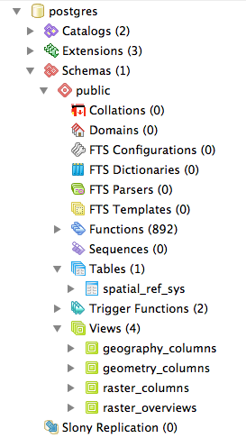

.. _dataadmin.pgDBAdmin.schemas:

PostgreSQL schemas
==================

Production databases will inevitably have a large number of tables and views. Managing numerous database objects in one schema can quickly become unwieldy. Fortunately, PostgreSQL_ supports the concept of a "_Schema".

Schemas are like folders for managing tables, views, functions, sequences and other relations. Every database contains at least one schema—the ``public`` schema.  

  Database schema in PostgreSQL

Inside that schema, the default installation of PostGIS creates the ``geometry_columns``, ``geography_columns`` and ``spatial_ref_sys`` metadata objects, as well as all the types and functions used by PostGIS. All PostGIS users need access to the public schema.

Why use schemas?
----------------

The main advantages in using schemas include:

 * Data managed in a schema is easier to apply bulk actions to. 

    * It's easier to back up data in a separate schema, so volatile data can have a different backup schedule from non-volatile data. 
    * It's easier to restore data that's in a separate schema so application-oriented schemas can be independently restored and backed up for tracking and recovery.
    * It's easier to manage different application version when the application data is in its own schema—a new version of software can work from a table structure in a new schema. Upgrading to the new version of the application involves a simple change to the schema name.

 * Users can be restricted to only have access to single schemas. This means you can isolate analytical and test tables from production tables.

From a production perspective, keeping your application data separate in schemas improves data management. From a user perspective, restricting access to specific schemas avoids accidental or unauthorized access to certain data .

Creating a data schema
----------------------

To create a new schema in a database to manage census data, execute the following:

.. code-block:: sql

  CREATE SCHEMA census;

To add an existing table to the new schema, execute the following:

.. code-block:: sql

  ALTER TABLE nyc_census_blocks SET SCHEMA census;

.. note:: If you're using pgAdmin, you may have to refresh your view to see the new schema and the table you've just added. 

You can access tables inside schemas in two ways: 

 * Using the ``schema.table`` notation

   .. code-block:: sql

    SELECT * FROM census.nyc_census_blocks LIMIT 1;
 
 * Adding the schema to your ``search_path``. You can set the ``search_path`` at run time using the ``SET`` command as follows:

   .. code-block:: sql

    SET search_path = census, public;

Manipulating the ``search_path`` is an easy way to provide access to tables in multiple schemas without having to qualify the table name each time they are referenced. This ensures that all references to relations and functions are searched in both the ``census`` and the ``public`` schemas. 

.. note:: All the PostGIS functions and types are maintained in the ``public`` schema so be careful not to exclude that from the search path.

To avoid having to set the search path every time you connect to the database, you can set it permanently for a user with the following command:

.. code-block:: sql

  ALTER USER postgres SET search_path = census, public;

The postgres user will now always have the ``census`` schema in their search path.

Creating a user schema
----------------------

Many SQL-based analytical operations require access to temporary tables for visualization or interim results.
Spatial SQL-based operations require additional CREATE privileges. 

By default, every role in an Oracle database has an associated schema. This is a good data management practice to adopt for PostgreSQL users too, and it is easy to replicate using PostgreSQL roles, schemas, and search paths.

To create a new user with table creation privileges (see :ref:`dataadmin.pgDBAdmin.security` for information about the ``postgis_writer`` role), and then create a schema with that user as the authorization execute the following:

.. code-block:: sql

  CREATE USER myuser WITH ROLE postgis_writer;

  CREATE SCHEMA myuser AUTHORIZATION myuser;

Now the user exists and can create spatial tables. The user's named schema has been created and the user has been assigned as the owner of the schema.

To see the default ``search_path`` for PostgreSQL users, execute the following command:

.. code-block:: sql

  show search_path;

:: 

    search_path   
  ----------------
   "$user",public
  

The user's search path lists the user schema first, so any new tables are automatically created in that schema. In addition, queries will automatically search that schema first as well. The user's default work area has now been set up, providing a degree of isolation from other schemas in the database.

.. _Schema: http://www.postgresql.org/docs/current/static/ddl-schemas.html
.. _PostgreSQL: http://www.postgresql.org/
