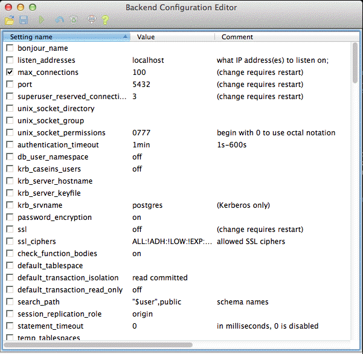
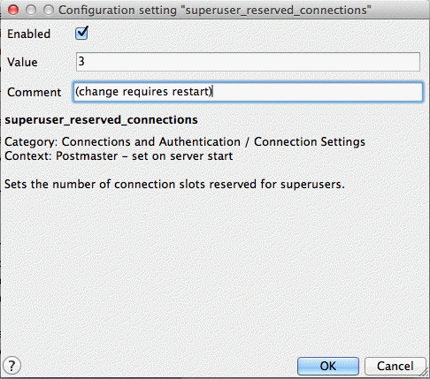
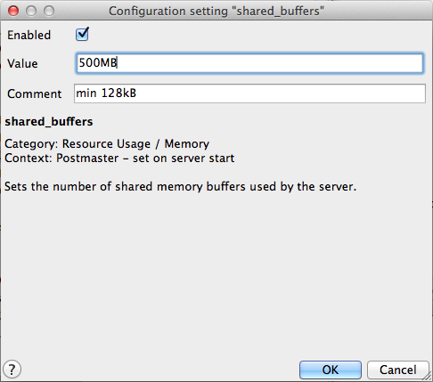
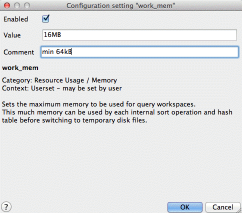
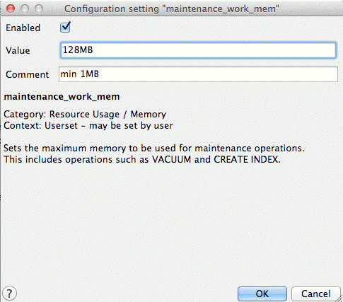
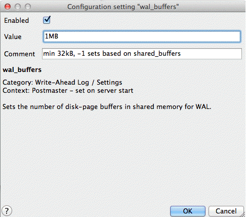
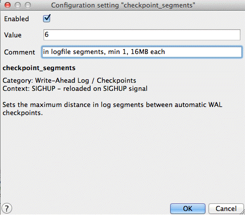
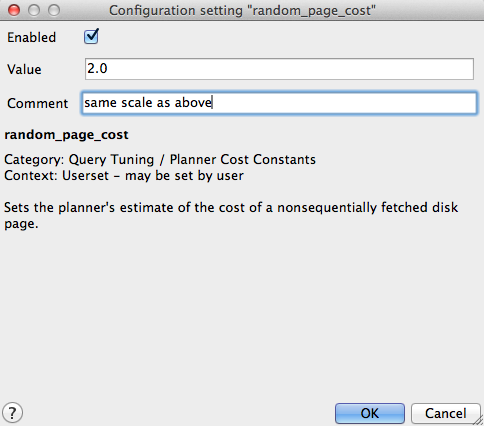
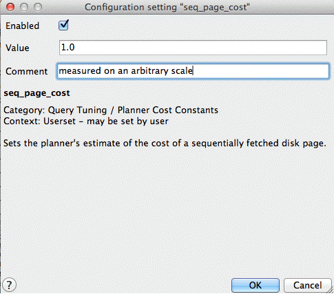

.. _dataadmin.pgDBAdmin.tuning:

Tuning PostgreSQL for spatial
=============================

PostgreSQL is a versatile database system, capable of operating efficiently in low-resource and multi-application environments. To ensure that efficient operation in different environments, the default configuration settings are conservative and generally unsuitable for a high-performance production database. This is further compounded by the typical usage profile of a geospatial database, with fewer, larger records being accessed compared to a non-geospatial database.

postgresql.conf
---------------

The database configuration parameters are available to edit (using a text editor) in the :file:`postgresql.conf` file.

An easy way to edit this configuration file is to use the pgAdmin :guilabel:`Backend Configuration Editor`. On the pgAdmin main menu, click :guilabel:`File` and click :guilabel:`Open postgresql.conf`. In the :guilabel:`Open configuration file` dialog box navigate to the data directory folder and select the configuration file to open it in the :guilabel:`Backend Configuration Editor`.

  pgAdmin Backend Configuration Editor

.. note:: Modifications to the :file:`postgresql.conf` file will not take effect until the server is restarted.

The following sections describe some of the configuration parameters that should be adjusted for a production-ready geospatial database. For each section, find the appropriate parameter in the :guilabel:`Setting name` column and double-click the entry to edit it in the :guilabel:`Configuration setting` dialog box. Change the :guilabel:`Value` to the recommended setting described below, select the :guilabel:`Enabled` check box, and click :guilabel:`OK`.

   Changing the configuration settings

.. note:: The values provided here are suggestions only. We recommend you test the changes to determine the optimal configuration for your particular environment.

shared_buffers
--------------

The :command:`shared_buffers` parameter sets the amount of memory the database server uses for shared memory buffers (shared amongst the back-end processes). The default values are typically inadequate for production databases.

   - Default value—Usually 32MB

   - Recommended value—75% of database memory (500MB)

  shared_buffers parameter

work_mem
--------

The :command:`work_mem` parameter defines the amount of memory that internal sorting operations and hash tables can consume before the database switches to on-disk files. As complex queries may have several sort or hash operations running in parallel, and each connected session may be executing a query, you must consider how many connections will be supported and the complexity of expected queries before increasing this value.

The benefit of increasing this setting is in the processing of these operations, including ORDER BY, and DISTINCT clauses, merge and hash joins, hash-based aggregation and hash-based processing of subqueries, which can usually be accomplished without incurring disk writes.

  - Default value—1MB

  - Recommended value—16MB

    work_mem parameter

maintenance_work_mem
--------------------

The :command:`maintenance_work_mem` parameter defines the amount of memory used for maintenance operations, including vacuuming, index and foreign key creation. As these operations are not performed regularly, the default value may be acceptable. Alternatively, this parameter can be increased for a single session before the execution of a number of :command:`CREATE INDEX` or :command:`VACUUM` commands as follows.

  .. code-block:: sql

    SET maintenance_work_mem TO '128MB';
    VACUUM ANALYZE;
    SET maintenance_work_mem TO '16MB';

  - Default value—16MB

  - Recommended value—128MB

   maintenance_work_mem parameter

wal_buffers
-----------

The :command:`wal_buffers` parameter sets the amount of memory used for write-ahead log (WAL) data.  Write-ahead logs provide a high-performance mechanism for insuring data-integrity. During each change command, the effects of the changes are written first to the WAL files and then flushed to disk. Only once the WAL files have been flushed will the changes be written to the data files themselves. This allows the data files to be written to disk in an optimal and asynchronous manner while ensuring that, in the event of a crash, all data changes can be recovered from the WAL.

The size of this buffer only needs to accommodate WAL data for a single typical transaction. While the default value is often sufficient for most data, geospatial data tends to be much larger. We recommend you increase the size of this parameter.

  - Default value—64kB

  - Recommended value—1MB

   wal_buffers parameter

checkpoint_segments
-------------------

The :command:`checkpoint_segments` parameter sets the maximum number of log file segments (typically 16MB) that can be filled between automatic WAL checkpoints. A WAL checkpoint is a point in the sequence of WAL transactions at which it is guaranteed that the data files have been updated with all information before the checkpoint. At this time all dirty data pages are flushed to disk and a checkpoint record is written to the log file. This allows the crash recovery process to find the latest checkpoint record and apply all following log segments to complete the data recovery.

As the checkpoint process requires the flushing of all dirty data pages to disk, it creates a significant I/O load. Since geospatial data is large enough to unbalance non-geospatial optimizations, increasing this value will prevent excessive checkpoints. However, an increase may also cause the server to restart more slowly in the event of a crash.

  - Default value—3

  - Recommended value—6

   checkpoint_segments parameter

random_page_cost
----------------

The :command:`random_page_cost` parameter is a unit-less value that represents the cost of a random page access from disk. This value is relative to a number of other cost parameters including sequential page access, and cpu operation costs. The default is generally conservative but the value can be set on a per-session basis using the command ``SET random_page_cost TO 2.0``.

  - Default value—4.0

  - Recommended value—2.0

   random_page_cost parameter

seq_page_cost
-------------

The :command:`seq_page_cost` parameter controls the cost of a sequential page access. This value does not generally require adjustment but the difference between this value and :command:`random_page_cost` has a significant impact the choices made by the query planner. This parameter can also be set on a per-session basis.

  - Default value—1.0

  - Recommended value—1.0

  seq_page_cost parameter
