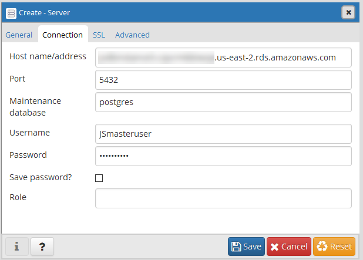

.. _dataadmin.pgGettingStarted.pgadmin:

Connecting to the PostgreSQL database with pgAdmin
==================================================

There are a number of front-end tools available for connecting to, and working with, the PostgreSQL database. Among the most popular are `psql <http://www.postgresql.org/docs/9.6/static/app-psql.html>`_, a command-line tool for querying the database, and the free and open source graphical tool `pgAdmin <http://www.pgadmin.org/>`_.

Any data querying and manipulation you can do with :command:`pgAdmin` can also be done at the command line with ``psql``.

.. note:: This section uses the client tool :command:`pgAdmin`. You need to `download and install pgAdmin <https://www.pgadmin.org/download/>`_ to use it.

Working with pgAdmin
--------------------

To connect to a PostgreSQL DB instance using pgAdmin

1. Install pgAdmin from http://www.pgadmin.org/. You can download and use pgAdmin without having a local instance of PostgreSQL on your client computer.

2. Launch the pgAdmin application on your client computer.

3. On the Dashboard tab, choose Add New Server.

4. In the Create - Server dialog box, type a name on the General tab to identify the server in pgAdmin.

5. On the Connection tab, type the following information from your DB instance:

  - For Host, type the endpoint, for example mypostgresql.c6c8dntfzzhgv0.us-east-2.rds.amazonaws.com.

  - For Port, type the assigned port.

  - For Username, type the user name that you entered when you created the DB instance.

  - For Password, type the password that you entered when you created the DB instance.

   Connection parameters

6. Choose Save.

7. To access a database in the pgAdmin browser, expand Servers, the DB instance, and Databases. Choose the DB instance's database name.

  Navigating the database

8. To open a panel where you can enter SQL commands, choose Tools, Query Tool.

Quick Tips
----------

To connect to the PostGIS server, double-click the PostGIS server item and provide the password when prompted.

To view the databases in this instance, expand the :menuselection:`Databases` item. Double-click one of the listed databases to reveal the contents in the :guilabel:`Object browser`.

When executing SQL queries, make sure you have the intended target database selected.  The SQL :guilabel:`Query` dialog box will confirm the current database selection.
