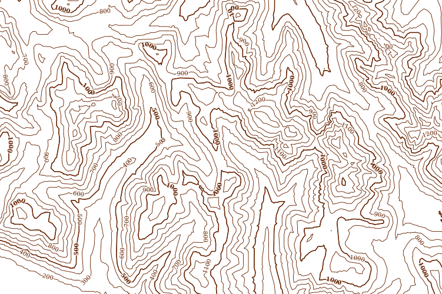

.. _processing.contour:

Creating a contour map with a WPS process
=========================================

This tutorial will show you how to create a contour map from a raster data layer. It will outline two different methods:

#. Creation of a static vector contour layer with a WPS process.

#. Creation of a dynamically generated contour style using :ref:`rendering transformations <cartography.rt>`. 

   A contour map

.. toctree::
   :maxdepth: 2

   setup
   static
   dynamic
