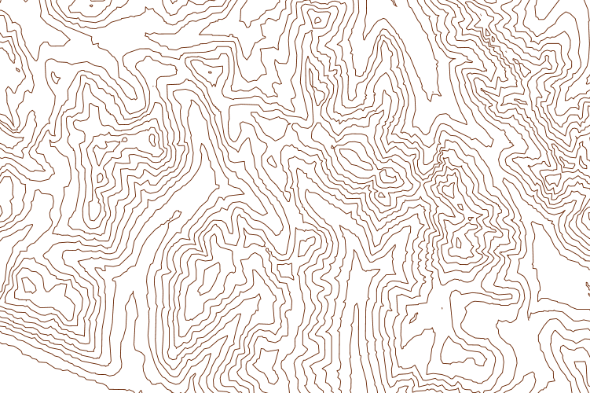
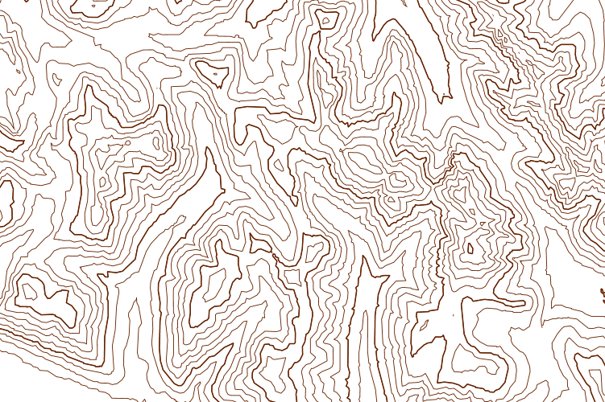
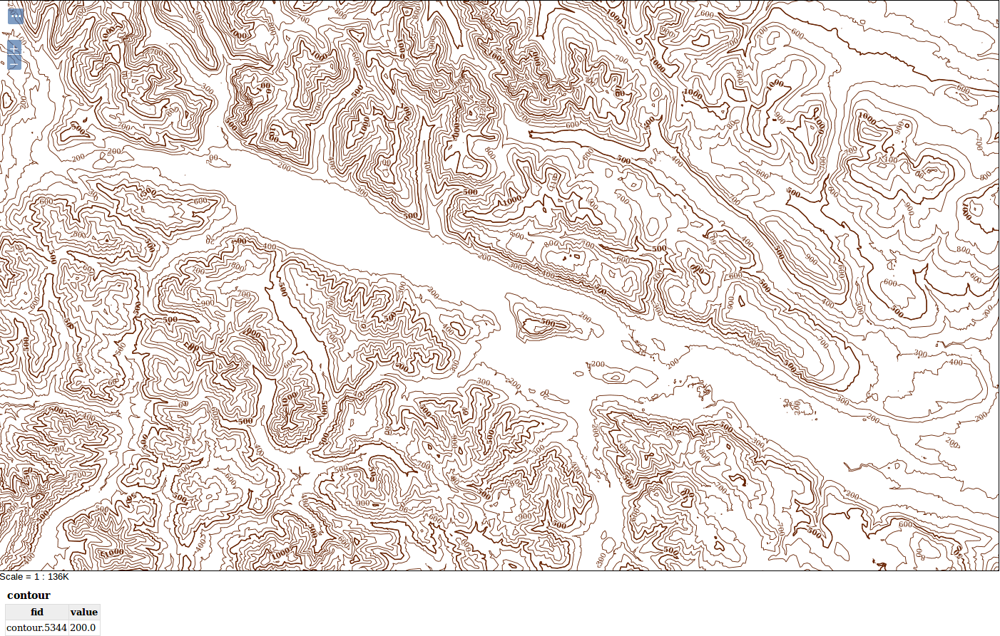

.. _processing.contour.static:

Creating a static contour map
=============================

Using the GeoServer WPS process **ras:Contour**, it is possible to generate a vector contour layer of a given raster layer.

Processing
----------

WPS processes can be run using a variety of different clients including graphical tools or even other WPS services.  This tutorial explains how to build a simple XML WPS request and invoke it using the curl command line HTTP client.

Basic structure
~~~~~~~~~~~~~~~

The process we will build chains together two primitive processes and a WCS GetCoverage request to get the DEM.  At the top level is a ``gs:Import`` process which takes the final result and stores it as a layer.  Without this, the response when the process completes would be the features generated.

.. literalinclude:: files/contour.xml
   :language: xml
   :lines: 2-9,70-

Inside that is a ``ras:Contour`` process which takes the raster and produces contour lines.

.. literalinclude:: files/contour.xml
   :language: xml
   :lines: 10-17,28-68
   :dedent: 10

Finally inside that is a WCS ``GetCoverage`` that requests the DEM.

.. literalinclude:: files/contour.xml
   :language: xml
   :lines: 18-27
   :dedent: 20

Getting the raster
~~~~~~~~~~~~~~~~~~

WPS can take inputs either directly from the request XML, or by making another OWS request.  Here the ``data`` input is filled with a WCS ``GetCoverage`` request for the ``foo:DEM-utm10`` layer.

.. literalinclude:: files/contour.xml
   :language: xml
   :lines: 18-19
   :dedent: 20

Then we give it the bounds to extract.  In this case a section of Southern Vancouver Island in NAD83(CSRS) / UTM zone 10N.

.. literalinclude:: files/contour.xml
   :language: xml
   :lines: 20-25
   :dedent: 20

Then the format to use.

.. literalinclude:: files/contour.xml
   :language: xml
   :lines: 26-27
   :dedent: 20

Generating the contours
~~~~~~~~~~~~~~~~~~~~~~~

The first process we run is `ras:Contour`

.. literalinclude:: files/contour.xml
   :language: xml
   :lines: 10-11
   :dedent: 10

The first parameter is the data, which references the WCS request we built.

.. literalinclude:: files/contour.xml
   :language: xml
   :lines: 12-31
   :dedent: 10

Note that the URL given is ``http://geoserver/wcs``  This special URL lets Stratus know it should handle the request internally rather than going through the network stack to request the data from itself.
    
The remaining parameters are literals with their values included in the request.

First the ``band`` of the raster to use.  In this case ``GRAY_INDEX`` is the default for single band rasters.

.. literalinclude:: files/contour.xml
   :language: xml
   :lines: 32-37
   :dedent: 10

Then the ``interval`` between bands.  We're using 100 m.

.. literalinclude:: files/contour.xml
   :language: xml
   :lines: 38-43
   :dedent: 10

Should the contours be simplified.  This improves performance at the cost of some accuracy.

.. literalinclude:: files/contour.xml
   :language: xml
   :lines: 44-49
   :dedent: 10

Do bezier smoothing to improve appearance.

.. literalinclude:: files/contour.xml
   :language: xml
   :lines: 50-55
   :dedent: 10

The region of interest.  In this case, a polygon representation of the bounds of the GetCoverage.

.. literalinclude:: files/contour.xml
   :language: xml
   :lines: 56-61
   :dedent: 10

Defining this process ends by specifying the format for the result.
 
.. literalinclude:: files/contour.xml
   :language: xml
   :lines: 56-61
   :dedent: 10

Storing the result
~~~~~~~~~~~~~~~~~~

If we ran the above process by itself, we would get an XML feature collection as a response.  We could take that and load it into GeoServer, but a faster way to accomplish that is to use the ``gs:Import`` process to take those features and create a new layer.  This will require a configured Data Store that permits creating new feature sets such as a PostGIS database for which GeoServer has permission to create tables.

We start out as before, but since this is the top level there's also an XML header and namespace definitions.

.. literalinclude:: files/contour.xml
   :language: xml
   :lines: 1-4

The contour process is fed in to the ``features`` input the same way the ``GetCoverage`` was fed into it.  Note that we are again using ``http://geoserver/``

.. literalinclude:: files/contour.xml
   :language: xml
   :lines: 5-72

      
We need to specify the workspace to store the new layer in.  If it is not provided, it the default workspace will be used.     
	   
.. literalinclude:: files/contour.xml
   :language: xml
   :lines: 73-78

	   
This is the data store that should store the result.  If it is not provided, it the default store for the workspace will be used.
	   
.. literalinclude:: files/contour.xml
   :language: xml
   :lines: 79-84

The name to use for the new layer.
	   
.. literalinclude:: files/contour.xml
   :language: xml
   :lines: 85-90

The SRS for the new layer.
	   
.. literalinclude:: files/contour.xml
   :language: xml
   :lines: 91-96
	
Finish with the response, which will be the name of the imported layer.
	   
.. literalinclude:: files/contour.xml
   :language: xml
   :lines: 97-

Running the proccess
~~~~~~~~~~~~~~~~~~~~

:download:`Download the full XML for this example <files/contour.xml>` and change the names, CRSes, and extents to fit your data.  Then issue the following command using ``curl``

.. code-block:: bash
		
    curl -u user:password -H 'Content-type: application/xml' -XPOST -d@'contour.xml' http://localhost:8080/geoserver/wps

Replace ``user:password`` with a user and password with apprpriate permissions to create a layer and ``localhost:8080`` with the hostname of your Stratus instance.

The response will be the name of the created layer.    

Styling
-------

Initial improvement
~~~~~~~~~~~~~~~~~~~

The default style created by GeoServer can be improved based on the :ref:`processing.contour.setup.design` of a topographic map.

First, the default display can be improved by setting up a rule with a thinner line.

   Map with a single style

As an SLD style it will look like this:

.. literalinclude:: files/contour.sld
   :language: xml
   :lines: 1-16,18-24,136-139

Differing widths
~~~~~~~~~~~~~~~~

Too many lines of equal width can make them hard to distinguish, so the next step is to add a rule that will display every fifth band (500 meters) as thicker (1px instead of 0.4px). You can determine if the value of the band is a multiple of 500 by using the ``IEEERemainder`` filter function.

.. note:: Read more about `filtering in GeoServer <../../geoserver/filter/>`_.

   Map style with two different band thicknesses

SLD:

.. literalinclude:: files/contour.sld
   :language: xml
   :lines: 25-47

Scale-based style
~~~~~~~~~~~~~~~~~

The differing thicknesses is an improvement, but when zoomed out there still will be too many thin lines rendered. So we will add a scale rule to the first rule to prevent the thin lines from showing up when the map is zoomed out too far.

.. figure:: img/style_zoomout.png

   Map style hiding thin bands when zoomed out

SLD:

.. literalinclude:: files/contour.sld
   :language: xml
   :lines: 14-24
   :emphasize-lines: 4

Labels
~~~~~~

A good topographic map should have labels for the bands. Since there are two rules for bands, two similar rules for labels will be created as well: one for the thin lines and one for the thick lines. The primary difference between the two rules will be the font weight: bold to match the thicker lines, normal weight to match the thinner lines. The bold labels will also be prioritized higher.

Add these rules to the bottom of the existing style created above:

For the thinner lines:

SLD:

.. literalinclude:: files/contour.sld
   :language: xml
   :lines: 48-85

Label rule for the thicker lines:

SLD:

.. literalinclude:: files/contour.sld
   :language: xml
   :lines: 86-135

Putting it all together looks like this:

.. figure:: img/style_complete.png

   Finished map style

:download:`Download the full SLD for this example <files/contour.sld>`

Viewing
-------

The layer can be viewed in the Layer Preview.

   Static contour map in the layer preview

.. note::

   The layer consists of vector linestrings so clicking on the preview to get feature information will show the elevations of any contours at the point where you click.
