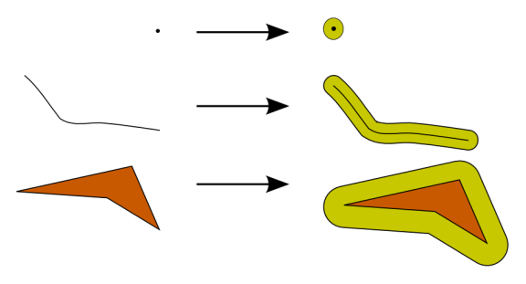
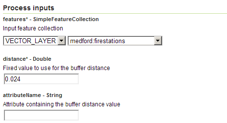
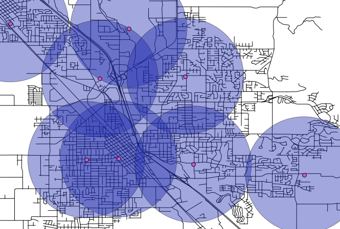

.. _processing.processes.vector.bufferfc:

BufferFeatureCollection
=======================

Description
-----------

The ``vec:BufferFeatureCollection`` process takes a feature collection and applies a buffer to each feature. The buffer distance can be a fixed value for all features, a variable value, with the values taken from an attribute in the feature collection, or it could be a combination of the two.

The resulting feature collection will always contain polygons regardless of the input.

   *vec:BufferFeatureCollection*

The attribute names and values of the output feature collection will match those of the input.

Inputs and outputs
------------------

``vec:BufferFeatureCollection`` accepts :ref:`processing.processes.formats.fcin` and returns :ref:`processing.processes.formats.fcout`.

Inputs
~~~~~~

.. tabularcolumns:: |p{3cm}|p{5cm}|p{4cm}|p{3cm}|
.. list-table::
   :header-rows: 1

   * - Name
     - Description
     - Type
     - Usage
   * - ``features``
     - Input feature collection
     - :ref:`SimpleFeatureCollection <processing.processes.formats.fcin>`
     - Required
   * - ``distance``
     - Fixed value buffer distance
     - Double
     - Required
   * - ``attributeName``
     - Attribute containing a variable buffer distance value
     - String
     - Required

Outputs
~~~~~~~

.. list-table::
   :header-rows: 1

   * - Name
     - Description
     - Type
   * - ``result``
     - Buffered feature collection
     - :ref:`SimpleFeatureCollection <processing.processes.formats.fcout>`

Usage notes
-----------

* The buffer distance is assumed to be in the units of the input feature collection.
* The buffer distance is also assumed to be a Cartesian distance, so unexpected output may occur with data in geographic coordinates.
* If you want to use the ``attributeName`` parameter to specify a buffer distance, set the required ``distance`` parameter to ``0``.
* Negative buffer distance values may be used for input polygons. This will result in output features being reduced by the buffer distance instead of expanded.

Examples
--------

Fire station coverage
~~~~~~~~~~~~~~~~~~~~~

Assuming that a fire station has an effective response radius of about 3 km, buffering the ``medford:firestations`` layer will determine the areas that may be covered by existing fire stations.

As the input feature collection uses geographic coordinates (EPSG:4326), the distance must be `converted to degrees <http://en.wikipedia.org/wiki/Longitude#Length_of_a_degree_of_longitude>`_. As the location of these features is approximately 42 degrees N, 3 km can be approximated as 0.024 degrees.

Input parameters:

* ``features``: ``medford:firestations``
* ``distance``: 0.024
* ``attributeName``: [blank]

:download:`Download complete XML request <xml/bufferfcexample.xml>`

   *vec:BufferFeatureCollection example parameters*

The resulting feature collection looks like this:

   *vec:BufferFeatureCollection example output*

.. todo:: It would be much better to work with a feature collection in another CRS...

Related processes
-----------------

* Buffer calculation is also available with the :ref:`vec:Transform <processing.processes.vector.transform>` process, using the ``buffer(geom, dist)`` function.
* The ``geo:buffer`` process will perform buffer calculation for geometries.
* The ``vec:PointBuffers`` process can be used to create multiple buffers around a single point.

.. - Polygons resulting from this process (if the buffer distance is positive) contain the area of the polygons being buffered. To get a polygon representing just the buffer area, without the area of the original polygon, use the ``vec:Overlay`` method to erase that inner area.

.. image: bufferanderase.png

.. todo:: this process is yet to be developed.

.. - Polygons resulting from buffering near features might overlap. Use the ``vec:Dissolve`` process to merge overlapping polygons if needed

.. todo:: this process is yet to be developed.

