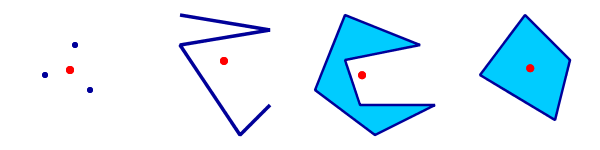

.. _processing.processes.vector.centroid:

Centroid
========

Description
-----------

The ``vec:Centroid`` process takes a feature collection and returns a point feature collection containing the centroids of the geometries of the input features. Feature attributes names and values remain unchanged.

The `centroid <http://en.wikipedia.org/wiki/Centroid>`_ of a geometry is defined for all geometry types (Point, Line and Polygon). It is equal to the geometric center of all points contained in the geometry.

.. note:: The centroid point does not necessarily lie within the geometry, for example the centroid of a C-shaped polygon lies outside the polygon.

   *vec:Centroid*

Centroids can provide a representative point for features. Typical use cases include distance analysis and label placement.

Inputs and outputs
------------------

``vec:Centroid`` accepts :ref:`processing.processes.formats.fcin` and returns :ref:`processing.processes.formats.fcout`.

Inputs
~~~~~~

.. tabularcolumns:: |p{2.5cm}|p{3.5cm}|p{3cm}|p{3cm}|
.. list-table::
   :header-rows: 1
   :widths: 25 35 20 20

   * - Name
     - Description
     - Type
     - Usage
   * - ``features``
     - Input features
     - FeatureCollection
     - Required

Outputs
~~~~~~~

.. list-table::
   :header-rows: 1

   * - Name
     - Description
     - Type
   * - ``result``
     - Centroids of input features
     - FeatureCollection

Usage notes
-----------

* If a feature collection consisting of point geometries is supplied, the output will be identical to the input.

Examples
--------

Finding the centroids of the polygons in the ``medford:zoning`` layer:

  - ``features``: ``medford:zoning``

  .. figure:: img/centroid-med.png

     *Centroids of medford:zoning polygons*

Related processes
-----------------

* Centroid calculation is also available with the `vec:Transform <processing.processes.vector.transform>`_ process, using the ``centroid(geom)`` function.
* If a point guaranteed to lie within the input geometry is required, use the ``interiorPoint(geom)`` function with the ``vec:Transform`` process.
