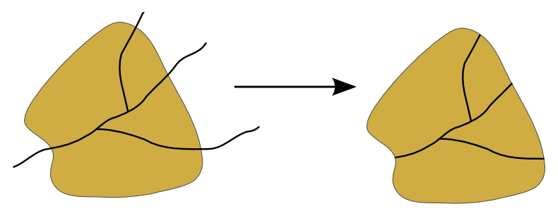
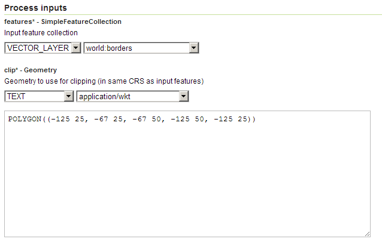
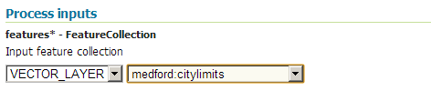
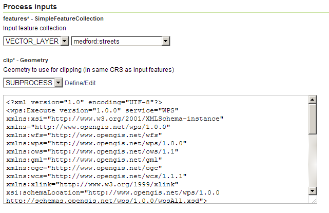
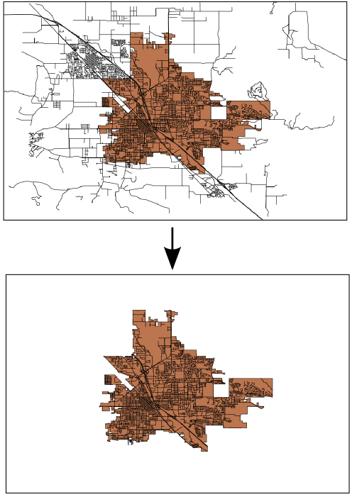

.. _processing.processes.vector.clip:

Clip
====

Description
-----------

The ``vec:Clip`` process will clip a feature collection by a given geometry, typically a polygon or multipolygon. Attributes names and values are not affected by this process, and will be passed to the output feature collection without modification.

All features that intersect with the clipping geometry will be returned with their geometries cropped in the output geometry. Any features that do not intersect with the clipping geometry will be eliminated from the output geometry.

   *vec:Clip*

Inputs and outputs
------------------

``vec:Clip`` accepts both :ref:`processing.processes.formats.fcin` and :ref:`processing.processes.formats.geomin`, and returns :ref:`processing.processes.formats.fcout`.

Inputs
~~~~~~

.. tabularcolumns:: |p{3cm}|p{5cm}|p{4cm}|p{3cm}|
.. list-table::
   :header-rows: 1

   * - Name
     - Description
     - Type
     - Usage
   * - ``features``
     - Input feature collection
     - :ref:`SimpleFeatureCollection <processing.processes.formats.fcin>`
     - Required
   * - ``clip``
     - Clipping geometry—Same CRS as input features
     - Geometry
     - Required

Outputs
~~~~~~~

.. list-table::
   :header-rows: 1

   * - Name
     - Description
     - Type
   * - ``result``
     - Clipped feature collection
     - :ref:`SimpleFeatureCollection <processing.processes.formats.fcout>`

Usage notes
-----------

* The clipping geometry must be in the same :term:`CRS` as the feature collection.
* Although not a common requirement, the clipping geometry could also be a point or line.

Examples
--------

Clipping by rectangle
~~~~~~~~~~~~~~~~~~~~~

The following example clips the ``world:borders`` feature collection to an rectangle that covers the continental part of the United States. The clipping geometry is manually entered as a WKT string.

Input parameters:

* ``features``: ``world:borders``
* ``clip``: ``POLYGON((-125 25, -67 25, -67 50, -125 50, -125 25))``

:download:`Download complete XML request <xml/clipexample.xml>`

   *vec:Clip example 1 parameters*

.. figure:: img/clipexample2.png

   *vec:Clip example 1 output*

Clipping by feature
~~~~~~~~~~~~~~~~~~~

The geometry used for the clipping operation can be obtained from another feature collection, instead of entered explicitly. The following example clips the feature collection ``medford:streets`` by the polygon contained in the feature collection ``medford:citylimits``. The result is a new feature collection that only contains street sections within the city limits.

Since the ``vec:Clip`` process takes a ``Geometry`` object as input and not a feature collection, the ``vec:CollectGeometries`` process is used to create a single geometry from the ``medford:citylimits`` feature collection.

.. todo:: link to vec:CollectGeometries.

.. note:: This is an example of a "chained" process, where the output of one process is used as the input of another process.

Input parameters for ``vec:CollectGeometries``:

* ``features``: ``medford:citylimits``

Input parameters for ``vec:Clip``:

* ``features``: ``medford:streets``
* ``clip``: output from ``vec:CollectGeometries`` process

:download:`Download complete chained XML request <xml/clipexample2.xml>`

   *vec:Clip example 2 parameters (part 1)*

   *vec:Clip example 2 parameters (part 2)*

   *vec:Clip example output*

Related processes
-----------------

* The :ref:`vec:IntersectionFeatureCollecion <processing.processes.vector.intersectionfc>` process performs a similar operation on the input geometries, except the attributes of the result are not directly copied over. Instead, a list of attributes from each of the input layers is provided as a configuration parameter.
* To crop one feature collection using another feature collection instead of a geometry, use the ``vec:CollectGeometries`` process to create a ``GeometryCollection`` object from the feature collection, and use that object as the ``clip`` (geometry) input for ``vec:Clip``.

