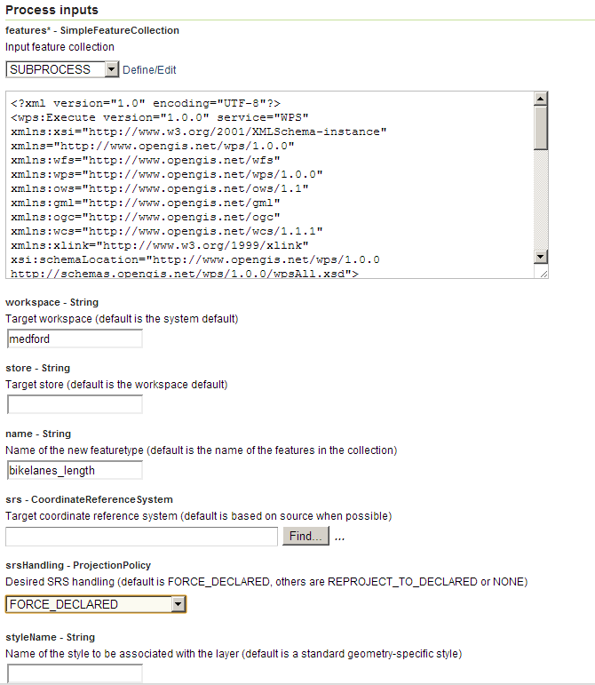
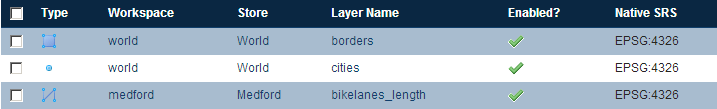

.. _processing.processes.vector.import:

Import
======

Description
-----------

.. todo:: Graphic needed.

The ``gs:Import`` process takes a feature collection and adds it to the GeoServer catalog as a layer, in effect acting as a simple data loader. The contents of the feature collection are unchanged.

Inputs and outputs
------------------

``gs:Import`` accepts :ref:`processing.processes.formats.fcin` and returns a string containing the fully qualified layer name (with workspace prefix) only.

Inputs
~~~~~~

.. tabularcolumns:: |p{2.5cm}|p{6cm}|p{4.5cm}|p{2cm}|
.. list-table::
   :header-rows: 1

   * - Name
     - Description
     - Type
     - Usage
   * - ``features``
     - Input feature collection
     - :ref:`SimpleFeatureCollection <processing.processes.formats.fcin>`
     - Required
   * - ``workspace``
     - Target workspace—Default is the system default
     - String
     - Optional
   * - ``store``
     - Target store—Default is the workspace default
     - String
     - Optional
   * - ``name``
     - Name of the new featuretype—Default is the name of the features in the collection
     - String
     - Optional
   * - ``srs``
     - Target coordinate reference system—Default is based on the source when possible
     - CoordinateReferenceSystem
     - Optional
   * - ``srsHandling``
     - Desired SRS handling—Options are FORCE_DECLARED (default), REPROJECT_TO_DECLARED or NONE
     - ProjectionPolicy
     - Optional
   * - ``styleName``
     - Name of the style to be associated with the layer—Default is standard geometry-specific style
     - String
     - Optional

Outputs
~~~~~~~

.. list-table::
   :header-rows: 1

   * - Name
     - Description
     - Type
   * - ``layerName``
     - Qualified name of the new layer (``workspace:layer``)
     - String

Usage notes
-----------

* Some of the GeoServer catalog parameters may be specified in addition to the feature collection. For example, the required workspace name, store name, :term:`CRS`, and CRS handling policy can be included as input. If these parameters are omitted, the server defaults will be used.

* The name of the layer can also be specified with the input, but if the name is omitted the layer name will be set to the name contained in the feature collection.

* The name of an existing style can be specified, but if the style is omitted a default style will be chosen based on the geometry in the feature collection.

Examples
--------

Importing result of process output
~~~~~~~~~~~~~~~~~~~~~~~~~~~~~~~~~~

The ``gs:Import`` process is useful for automatically incorporating results from other processes into the GeoServer catalog. The following example shows how the result of a transform operation (using the :ref:`vec:Transform <processing.processes.vector.transform>` process), is imported into GeoServer.

.. note:: This is an example of a "chained" process, where the output of a process is used as the input of another.

Input parameters for ``vec:Transform``:

* ``features``: ``medford:bikelanes``
* ``transform``: ``the_geom=the_geom; street_name=streetname; length = length(the_geom)``

Input parameters for ``gs:Import``:

* ``features``: output from ``vec:Transform``
* ``workspace``: ``medford``
* ``store``: [blank]
* ``name``: ``bikelanes_length``
* ``srs``: [blank]
* ``srsHandling``: ``FORCE_DECLARED``
* ``styleName``: [blank]

:download:`Download complete chained XML request <xml/importexample.xml>`

   *gs:Import example parameters*

The resulting feature collection is added to the corresponding datastore and published:

   *gs:Import example result*

