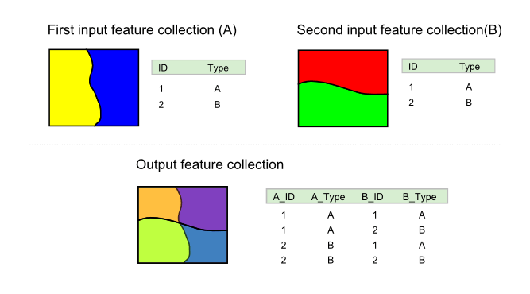
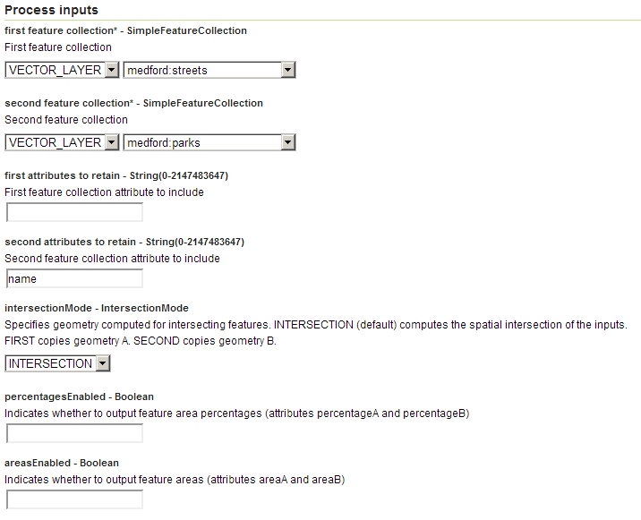
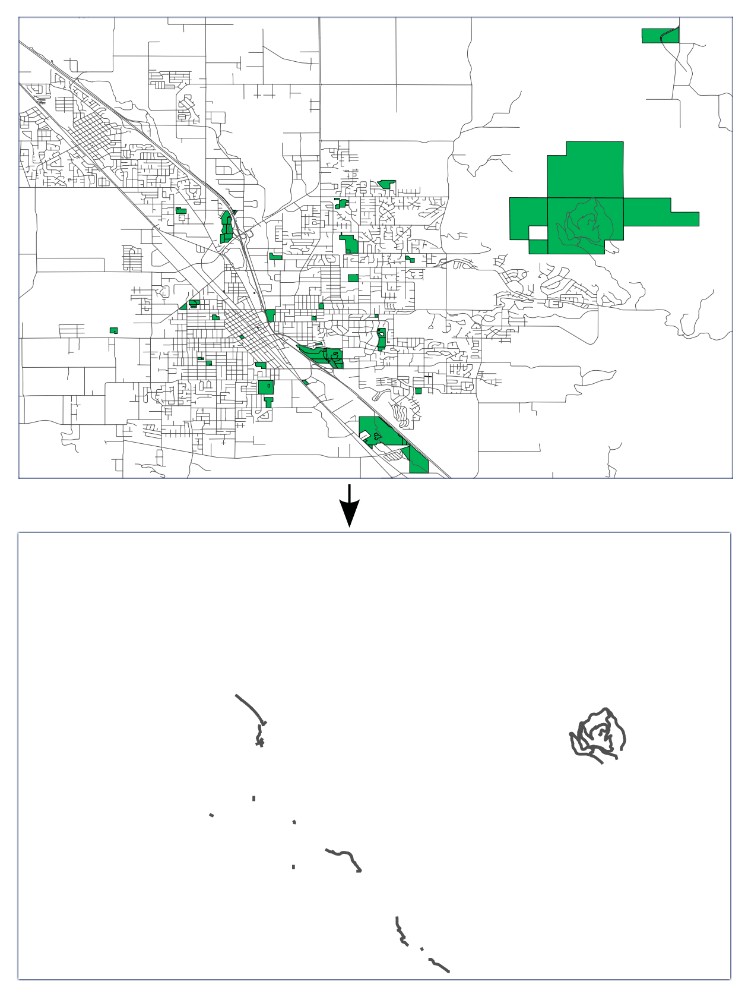
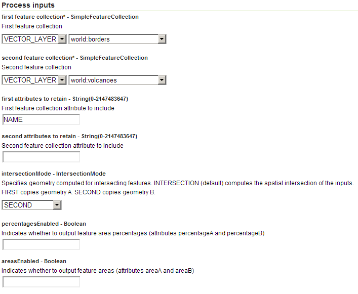

.. _processing.processes.vector.intersectionfc:

IntersectionFeatureCollection
=============================

Description
-----------

The ``vec:IntersectionFeatureCollection`` process intersects two feature collections using spatial intersection and attribute combination.

The geometries in the feature collections can be intersected (``intersectionMode``) by a spatial intersection (``INTERSECTION``) or the output can use the original geometries from either inputs (``FIRST`` or ``SECOND``) without any spatial processing.

The attributes of the output feature collection are determined by a list of attributes from both of the input geometries, specified as two lists, one from each input. If these parameters are left blank, all attributes will be used.

In addition to the above parameters, the areas of each feature collection can be included as attributes, as well as the percentage of intersection.

The names of the output attributes will be altered. The new attribute names will consist of the  originating feature collection, an underscore, and the name of the original attribute (``feature_attr``).

   *vec:IntersectionFeatureCollection*

.. todo:: original text mentioned a 10 characters limitation in attribute names. This is only true for shapefiles, so should not be here but maybe in the page describing supported output formats.

Inputs and outputs
------------------

``vec:IntersectionFeatureCollection`` accepts :ref:`processing.processes.formats.fcin` and returns :ref:`processing.processes.formats.fcout`.

Inputs
~~~~~~

.. tabularcolumns:: |p{4.5cm}|p{4.5cm}|p{4cm}|p{2cm}|
.. list-table::
   :header-rows: 1

   * - Name
     - Description
     - Type
     - Usage
   * - ``first feature collection``
     - First feature collection
     - :ref:`SimpleFeatureCollection <processing.processes.formats.fcin>`
     - Required
   * - ``second feature collection``
     - Second feature collection
     - :ref:`SimpleFeatureCollection <processing.processes.formats.fcin>`
     - Required
   * - ``first attributes to retain``
     - Attribute from first feature collection
     - String
     - Optional (any number)
   * - ``second attributes to retain``
     - Attribute from second feature collection
     - String
     - Optional (any number)
   * - ``intersectionMode``
     - Specifies geometry computed for intersecting features. Options ``INTERSECTION`` (default)—Computes the spatial intersection of the inputs, ``FIRST``—Copies geometries directly from the first input feature collection, ``SECOND``—Copies geometries directly from the second feature collection
     - IntersectionMode
     - Optional
   * - ``percentagesEnabled``
     - If True, will output feature area percentages via the attributes ``percentageA`` and ``percentageB``
     - Boolean
     - Optional
   * - ``areasEnabled``
     - If True, will output feature areas via the attributes ``areaA`` and ``areaB``
     - Boolean
     - Optional

Outputs
~~~~~~~

.. list-table::
   :header-rows: 1

   * - Name
     - Description
     - Type
   * - ``result``
     - Output feature collection
     - :ref:`SimpleFeatureCollection <processing.processes.formats.fcout>`

Usage notes
-----------

* The first input feature collection must not consist of point geometries.
* Both input feature collections are assumed to be in the same :term:`CRS`. The output feature collection will have the same CRS as the input.
* We recommend using the smallest feature collection in the ``second feature collection`` input, as this will reduce the time required to run the process.
* An ``INTERSECTION_ID`` field is automatically added that will contain a unique integer value for each output feature.
* If either of the parameters ``areasEnabled`` or ``percentageEnabled`` are set to True, both of the feature collections must contain polygon features.
* Areas of resulting intersection polygons, stored in the ``areaA`` and ``areaB`` attributes, are expressed in the areal units corresponding to the input feature collections. For example, if coordinates are expressed in meters, areas will be expressed in square meters.
* Attributes values are copied from the input layers but are not modified, so be aware that attributes depending on the specific properties of the inputs geometries are likely to be invalid for the resulting layer.
* If the input layers contain an attribute recording an area measurement, and you would like to have a similar area measurement for the output feature collection, the area measurement can be recalculated by setting the ``areasEnabled`` parameter to *True*.
* For appropriate attributes, a new value can be calculated from the original values and the percentage value added when the ``percentageEnabled`` flag is set to *True*. However, this assumes a regular distribution over the feature area. For instance, in the case of an attribute representing a population count for a polygon geometry, this calculation will assume that the population is regularly distributed and the population density is constant.

Examples
--------

Streets that cross parks
~~~~~~~~~~~~~~~~~~~~~~~~

Intersecting ``medford:streets`` and ``medford:parks`` to produce a feature collection of those street sections that cross a park.

Input parameters:

* ``first feature collection``: ``medford:streets``
* ``second feature collection``: ``medford:parks``
* ``first attributes to retain``: [blank]
* ``second attributes to retain``: ``name``
* ``intersectionMode``: ``INTERSECTION``
* ``areasEnabled``: False
* ``percentagesEnabled``: False

:download:`Download complete XML request <xml/intersectionfcexample.xml>`

   *vec:IntersectionFeatureCollection example #1 parameters*

The resulting schema contains all the attributes from the ``medford:streets`` feature collection, plus an attribute from the ``medford:parks`` collection, containing the name of the park crossed by the street section represented by that feature.

   *vec:IntersectionFeatureCollection example #1 output*

.. note:: This example illustrates the problem mentioned above where attributes representing some properties of the default geometry are not updated when the geometry is modified. In particular, the ``length`` attribute from the ``medford:streets`` feature collection is preserved with its original values, even though this value is no longer correct in the resulting feature collection.

Identifying inland volcanoes
~~~~~~~~~~~~~~~~~~~~~~~~~~~~

Intersecting ``world:volcanoes`` and ``world:borders`` to produce a feature collection of inland volcanoes only, adding the name of the country the volcanoes belong to.

Input parameters:

* ``first feature collection``: ``world:borders``
* ``second feature collection``: ``world:volcanoes``
* ``first attributes to retain``: ``NAME``
* ``second attributes to retain``: [blank]
* ``intersectionMode``: ``SECOND``
* ``areasEnabled``: False
* ``percentagesEnabled``: False

:download:`Download complete XML request <xml/intersectionfcexample2.xml>`

The resulting schema contains all the attributes from the ``world:volcanoes`` feature collection plus an attribute from ``world:borders`` containing the name of the country the corresponding volcano belongs to.

   *vec:IntersectionFeatureCollection example #2 parameters*

.. todo:: No graphic here because the process has a bug so output is not correct.

.. todo:: Link to JIRA ticket to fix the above error?

Related processes
-----------------

* Area calculation is a time consuming operation, so it may help to calculate the intersection in one process and the areas in another. The :ref:`vec:Transform <processing.processes.vector.transform>` process can perform area calculations using the ``area()`` function. The ``vec:Transform`` process has similar functions such as ``length()`` that can be used recompute  values that may be invalid following the intersection process.
* The :ref:`vec:Clip <processing.processes.vector.clip>` process performs a similar operation with the geometries of the clipped area, and it can be used to produce similar results. However, ``vec:Clip`` only accepts as input a single feature collection along with a geometry. This means  there is only one set of attributes passed to the output without modification.
* The :ref:`vec:UnionFeatureCollection <processing.processes.vector.unionfc>` process performs a union operation on two feature collections instead of an intersection.

