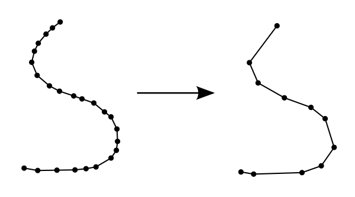
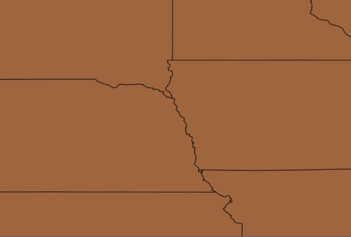
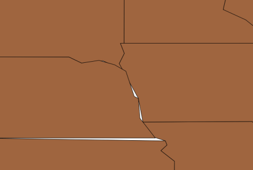
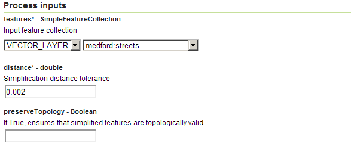
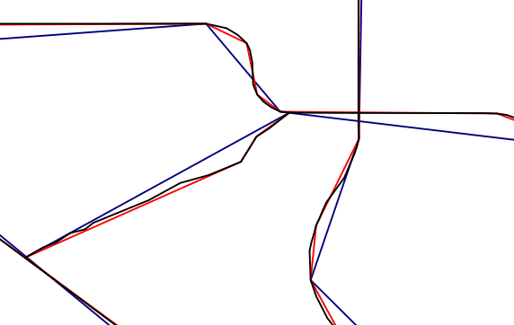

.. _processing.processes.vector.simplify:

Simplify
========

Description
-----------

The ``vec:Simplify`` process takes a feature collection and reduces the number of vertices in each feature, simplifying the geometries.

The adopted simplification method is the `Douglas-Peucker algorithm <http://en.wikipedia.org/wiki/Douglas-Peucker_algorithm>`_. This algorithm uses a distance value as input to determine how the geometries are to be simplified. For a given distance, all vertices in the output simplified geometry will be within this distance of the original geometry. The higher the distance value, the greater the simplification.

The output feature collection may optionally be set to preserve the topology of the features.

   *vec:Simplify*

Inputs and outputs
------------------

``vec:Simplify`` accepts :ref:`processing.processes.formats.fcin` and returns :ref:`processing.processes.formats.fcout`.

Inputs
~~~~~~

.. tabularcolumns:: |p{3.5cm}|p{5cm}|p{4cm}|p{2.5cm}|
.. list-table::
   :header-rows: 1

   * - Name
     - Description
     - Type
     - Usage
   * - ``features``
     - Input feature collection
     - :ref:`SimpleFeatureCollection <processing.processes.formats.fcin>`
     - Required
   * - ``distance``
     - Simplification distance tolerance—Must be non-negative
     - double
     - Required
   * - ``preserveTopology``
     - If True, ensures that simplified features are topologically valid
     - Boolean
     - Optional

Outputs
~~~~~~~

.. list-table::
   :header-rows: 1

   * - Name
     - Description
     - Type
   * - ``result``
     - Simplified feature collection
     - :ref:`SimpleFeatureCollection <processing.processes.formats.fcout>`

Usage notes
-----------

* The distance value is assumed to be in the same units as the feature collection.
* This process can be applied to feature collections with linear and areal geometries. If the input feature collection contains points, the output feature collection will be identical to the input.
* If the ``preserveTopology`` parameter is set to True, the process ensures that each simplified geometry has the same dimension and number of components as the input geometry. In particular, if the input is an areal geometry, the result will have the same number of shells and holes (rings) as the input and in the same order. The resulting rings will touch at *no more* than the number of touching points in the input (they may touch at fewer points).
* When simplifying a layer of contiguous polygons, there is no guarantee the polygons will remain contiguous after being simplified. Empty spaces between polygon edges may appear, or the polygons may overlap in places. The following illustration demonstrates this potential side-effect, showing the ``usa:states`` layer before and after being simplified.

   *Detail of usa:states layer prior to simplification*

   *Detail of usa:states layer following simplification*

Examples
--------

Simplifying street geometries
~~~~~~~~~~~~~~~~~~~~~~~~~~~~~

The following example demonstrates the results of simplifying the ``medford:streets`` feature collection, using different distance values.

Input parameters:

* ``features``: ``medford:streets``
* ``distance``: ``0.002``

:download:`Download complete XML request <xml/simplifyexample.xml>`

   *vec:Simplify example parameters*

The process is then repeated using a ``distance`` value of 0.005.

The following illustration shows the different outputs. The original features are represented by the black lines, the first process output with a ``distance`` value of 0.002 is represented by the red lines, and the second process output with a ``distance`` value of 0.005 is represented by the blue lines.

   *vec:Simplify example output*

.. The following example show the differences between using the default simplifying algorithm, with no topology preserving, and the alternative one that ensures that topology is preserved.

.. any ideas for this??

