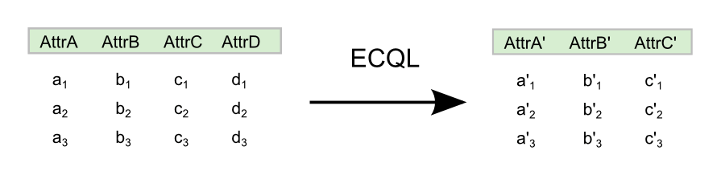

.. _processing.processes.vector.transform:

Transform
=========

Description
-----------

The ``vec:Transform`` process operates on a feature collection using a series of expressions. This process is equivalent to the ``SELECT ... FROM`` clause in SQL, allowing you to define a new feature collection with attributes computed from some, or all, of the input feature collection. The new attributes are computed via `ECQL expressions <../../../geoserver/filter/ecql_reference.html>`_  which can process geometry as well as scalar data.

The ``transform`` string is a sequence of specifiers in the form ``name=expression``. The ``name`` attribute is the name of an attribute used in the output feature collection, and ``expression`` is an ECQL expression using the input attributes and constants.

   *vec:Transform*

Inputs and outputs
------------------

``vec:Transform`` accepts :ref:`processing.processes.formats.fcin` and returns :ref:`processing.processes.formats.fcout`.

Inputs
~~~~~~

.. tabularcolumns:: |p{3cm}|p{5.5cm}|p{4cm}|p{2.5cm}|
.. list-table::
   :header-rows: 1

   * - Name
     - Description
     - Type
     - Usage
   * - ``features``
     - Input feature collection
     - :ref:`SimpleFeatureCollection <processing.processes.formats.fcin>`
     - Required
   * - ``transform``
     - Transform specification—List of specifiers (``name=expression``) delimited by newlines or semicolons
     - String
     - Required

Outputs
~~~~~~~

.. list-table::
   :header-rows: 1

   * - Name
     - Description
     - Type
   * - ``result``
     - Transformed feature collection
     - :ref:`SimpleFeatureCollection <processing.processes.formats.fcout>`

Usage notes
-----------

* The expressions used in the ``transform`` parameter can use all the elements of the `ECQL query language <../../../geoserver/filter/ecql_reference.html>`_.
* Some of the available processes are based on, or have similar, functionality to `GeoServer filter functions <../../../geoserver/filter/function_reference.html>`_. Those functions may be used in ``transform`` parameter expressions.

Examples
--------

The following examples illustrate how to use the ``vec:Transform`` process. All of the examples use the ``medford:bikelanes`` feature collection, with different expressions for the ``transform`` parameter.

#. A new feature collection with a single attribute containing the name of the street each bike lane is on:

   * ``transform``: ``the_geom=the_geom; streetname=streetname``

#. Same as example 1 only renaming the attribute name to ``street_name``:

   * ``transform``: ``the_geom=the_geom; street_name=streetname``

#. Same as example 1 only adding in the length of the feature:

   * ``transform``: ``the_geom=the_geom; street_name=streetname; length = length(the_geom)``

#. Same as example 1 only adding an attribute called ``dif`` containing the difference between the computed length and the value in the ``len`` attribute of the original input layer:

   * ``transform``: ``the_geom=the_geom; street_name=streetname; length = length(the_geom); dif=length(the_geom)-len``

#. A new feature collection containing the x and y coordinates of both the start and end points of the bike lane, in addition to an attribute with the name of the street each bike lane is on:

   * ``transform``: ``the_geom=the_geom; x1=getX(startPoint(the_geom)); y1=getY(startPoint(the_geom)); x2=getX(endPoint(the_geom)); y2=getY(endPoint(the_geom)); streetname=streetname``

#. Using the resulting feature collection from example 5 as input instead of ``medford:bikelanes``, this example will replace the original geometry by a straight line between the start and end points, and add an attribute for the street name.

   * ``transform``: ``the_geom=geomFromWKT(Concatenate('LINESTRING(' ,x1, ' ', y1, ', ', x2, ' ', y2,')')); streetname=streetname``

Related processes
-----------------

Due to its flexibility, the ``vec:Transform`` process can compute results that can also be obtained by other processes, such as :ref:`vec:BufferFeatureCollection <processing.processes.vector.bufferfc>` (using the ``buffer()`` function).

