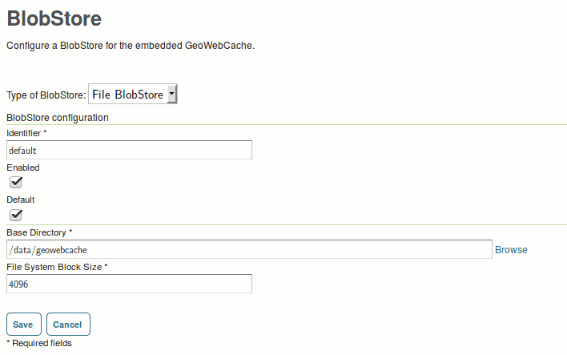
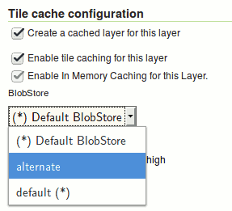

.. _sysadmin.caching.basics:

Introduction
============

By default, Stratus creates a tile layer for each new layer automatically.  This can be disabled in the :guilabel:`Caching Defaults`.   However, these layers will not be functional without a location to store cached tiles.

Creating a Default Blob Store
-----------------------------

The blob store needs to be created under a shared file system, see :ref:`sysadmin.filesystem`.

Under :guilabel:`Blob Stores` create a new blob store with type :guilabel:`File BlobStore`.  The Base Directory should be on a filesystem shared by the nodes in the cluster. Make sure that both the :guilabel:`Enabled` and :guilabel:`Default` flags are set.  The Identifier can be any unique name. The :guilabel:`Block Size` is used by the DiskQuota system.  The default blob store can also be created or modified via `REST <../../geoserver/rest/index.html>`_.

     *Creating a default blobstore*

Additional Blob Stores
~~~~~~~~~~~~~~~~~~~~~~

Besides the default store, you can have additional blob stores.  Layers can be configured to use a specific store instead of the default.  Follow the same steps as for the default store, but don't set that :guilabel:`Default` flag.  You can set the store a layer uses from the :guilabel:`Tile Caching` tab of the :guilabel:`Edit Layer` page or via REST.

Data Security
-------------

By default, tile layers are visible regardless of the security on the layer they are caching.  To enable security rules which automatically track those of the underlying layer, select :guilabel:`Enable Data Security` on the :guilabel:`Caching Defaults` page.

     *Selecting a blobstore named* ``alternate``
