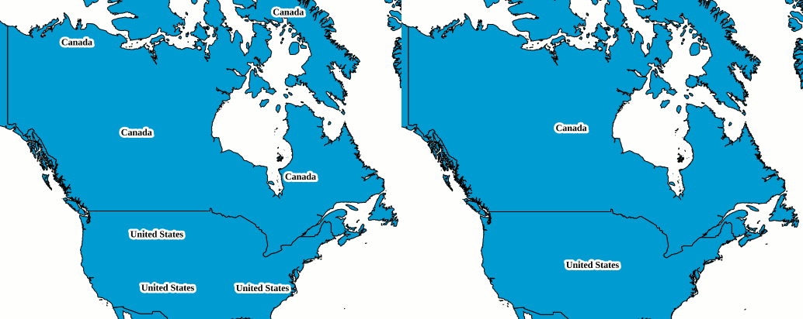

.. _sysadmin.caching.optimization:

Optimizing a tile cache
=======================

While a tile cache for a layer automatically brings many improvements in performance—less time generating images, less redundancy—there are ways to optimize the cache so as to further improve performance and adjust it to your needs.

Use 8-bit images
----------------

PNG (Portable Network Graphics) is a popular file format for bitmap images. PNG is used in most cases except where a lossy compression format like JPEG would produce a more desired file size (for serving imagery). PNGs produced by GeoServer normally have a 24-bit "true color" color palette (2\ :sup:`24` = 16.8 million colors).

In practice, such a large color palette is unnecessary for most map tiles. Unless the layer is rendering imagery files or other content requiring a full color palette, most of the time images will not be using anywhere near that many colors. More importantly, as PNG uses high quality lossless compression, those 24-bit colors take up a lot of unnecessary space.

Consequently, it is recommended to **use PNG8 for tiles whenever possible**. PNG8 forces GeoServer to use an 8 bit ``indexed`` color palette with only 256 colors. This can greatly reduce the size of image files.

For example, here is WMS output for the ``usa:states`` layer with ``format=image/png`` and the same request but using ``format=image/png8``:

  .. figure:: img/optimization_png.png

     *Actual output in PNG format: 31 kB*

  .. figure:: img/optimization_png8.png

     *Actual output in PNG8 format: 14 kB*

The above images were generated using the following requests::

   http://localhost:8080/geoserver/wms/reflect?layers=usa:states&format=image/png
   http://localhost:8080/geoserver/wms/reflect?layers=usa:states&format=image/png8

The sizes are 31,098 bytes and 13,653 bytes, respectively. The PNG8 graphic is less than half the size of the PNG graphic.

The specifics of the disk space savings depend on the disk block size of the storage medium, but in almost all cases, there is a marked decrease in image size, with minor if any visual differences.

Reduce colors in symbology
~~~~~~~~~~~~~~~~~~~~~~~~~~

Designing map symbology with a minimal color palette will ensure that the conversion from PNG to PNG8 does not introduce undesired visual effects. For this reason, using gradients would not be recommended.

Use JPEG tiles
--------------

If your data is largely photographic and doesn't require transparency, JPEG tiles may be a better option.  JPEG uses lossy compression that's more effective than that of PNG, but causes degradation of the image.  This degradation is most noticeable in images with sharp borders between areas of flat high contrast colour or smooth gradients like diagrams, but hard to detect on photographs.

Use Automatic JPEG+PNG tiles
----------------------------

If you require the transparency of PNG tiles in a few places, but most of the tiles will be solid photographic images, then the ``image/vnd.jpeg-png`` type will check if the image has any transparency, and use 24bit PNG if so, but JPEG if not.

Minimize Options
----------------

Each combination of format and gridset is cached separately. If you are using parameter filters such as styles or time, then each combination of allowed values for them is also cached separately.  3 formats, 2 gridsets, 4 styles (plus a default) and 20 time values (plus a default)  would result in 630 caches for a single layer.  If you want to seed them, that's 630 times the render time and space.  If you are caching on the fly then that's 629 ways an otherwise cached tile could still be a miss.  Being restrictive about the options you provide will improve the effectiveness of your cache.

Metatiling
----------

When a tile is requested, GeoWebCache can try to request one large image for several adjacent tiles which are then chopped into individual tiles.  This allows the renderer more flexibility to place labels in a clear and pleasing way.  This increases latency for cache misses and if the load balancer spreads adjacent tile requests over several nodes, each of those nodes may do the same work of rendering the metatile.

     *The same layer without metatiling on the left and and with 4x4 metatiling on the right*

By default PNG and JPEG, are rendered with 4x4 metatiles.  GeoWebCache doesn't know how to split other tile formats and so does not metatile them.

Duplicate rendering of metatiles will not be a problem with :ref:`pre-seeded caches <sysadmin.caching.seeding>`.

Adjusting the Metatiling
~~~~~~~~~~~~~~~~~~~~~~~~

Reducing to 3x3 metatiling can still give good labelling results and reduces the problem.  If the layer doesn't have any labels, or only has labels don't have collision avoidance, then the metatiling can be set to 1x1 with no ill effect and may improve latency on cache misses slightly.

If performance is acceptable but you want better labels, you can increase the metatiling factor.

Sticky Sessions
~~~~~~~~~~~~~~~

Setting your load balancer to use IP based sticky sessions for tile services will eliminate this problem at the expense of not distributing the load as well.  Less load will be placed on the cluster, but the load of any individual client will not be distributed.
