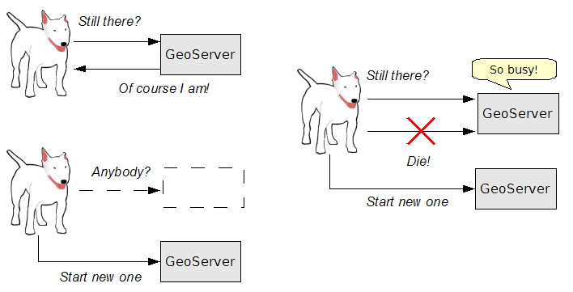
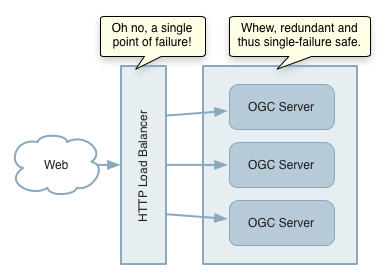
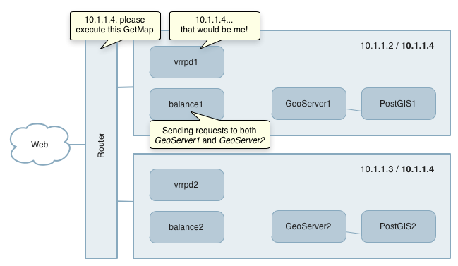
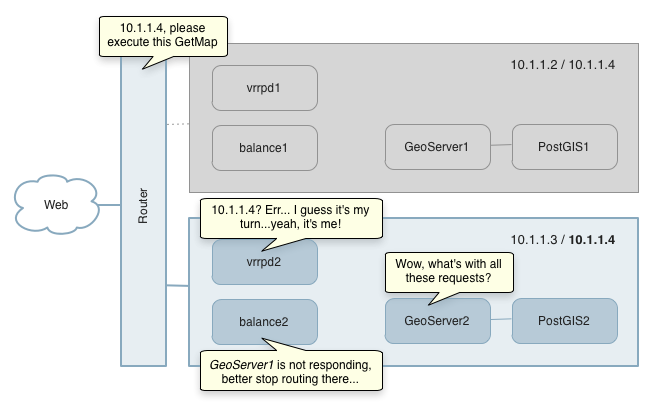

.. _sysadmin.production.availability:

Availability
============

Availability measures the fraction of time a service is available to respond to client requests. It is computed as the available time divided by the total elapsed time (including periods when the service is unavailable due to failure or scheduled downtime)::

  Availability = Available Time / Total Time

Strategies for achieving high availability include:

* Monitoring the server for failure
* Balancing processing load across multiple servers
* Removing single points of failure.

Server Monitoring
-----------------

A high availability deployment can employ a **watchdog process** to monitor the status of GeoServer servers and restart them if the host application server fails or the GeoServer instance becomes unresponsive. The watchdog process is software that runs externally to the application server. It periodically checks that the server is up and running and takes action if it is not.

The following figure shows the three situations that a watchdog addresses.

   *Service monitoring with watchdog*

Some remarks on each situation:

* In normal operation, the watchdog checks to see if GeoServer is running. If it responds within a defined time limit, the watchdog does nothing.
* An abnormal situation can occur where the GeoServer instance is running, but takes too long to respond to a simple query (due to being overloaded or hung). In this case the watchdog kills the application server process and then restarts it.
* Another abnormal situation is where the application server itself has failed.  In this case the watchdog simply restarts the application server.

This example shows a single server, but a watchdog can be used to monitor any number of application servers.

A watchdog can be implemented using a full-featured monitoring application such as `Nagios <http://nagios.org>`_, or it can be as a simple as a custom shell script.  The following is an example of a watchdog script for GeoServer running in Apache Tomcat on a Unix system. The script checks that the Tomcat server process is running, and if so requests a small image file from GeoServer to test responsiveness.  If the process is not running or if the response takes too long, the script kills and restarts Tomcat.  Typically this script would be run on a regular basis as a ``cron`` job:

.. code-block:: bash

   #!/bin/bash

   # Set up script variables
   PID_FILE=/var/run/tomcat8.pid
   HTTP_URL=http://localhost:8080/geoserver
   GeoServer_LOG=/var/opt/stratus/geoserver/data/logs/geoserver.log
   CATALINA_LOG=/usr/share/tomcat8/logs/catalina.out
   LOG_COPY=/home/tomcat
   PID=`cat $PID_FILE`

   # Function to kill and restart application server
   function catalinarestart() {
     service tomcat8 stop
     sleep 5
     kill -9 $PID
     cp $GeoServer_LOG $LOG_COPY
     cp $CATALINA_LOG $LOG_COPY
     service tomcat8 start
   }

   if [ -d /proc/$PID ]
   then
     # App server is running - kill and restart it if there is no response.
     wget $HTTP_URL -T 1 --timeout=20 -O /dev/null &amp;> /dev/null
     if [ $? -ne "0" ]
     then
     echo Restarting Catalina because $HTTP_URL does not respond, pid $PID
     catalinarestart
     # else
     # echo No Problems!
     fi
   else
     # App server process is not running - restart it
     echo Restarting Catalina because pid $PID is dead.
     catalinarestart
   fi

Load Balancing
--------------

Load balancing distributes processing across a pool of servers. By allowing redundancy of computing resources such as servers, CPUs and data stores, it eliminates some single points of failure that may reduce service reliability.

   *Services are redundant, but load balance is a single point of failure*

Load balancing can also increase throughput by enabling horizontal scale-out. For example, OGC protocols such as WMS and WFS are stateless.  Because no session state is maintained across client requests, requests can be routed to any server for processing.  This means that GeoServer can be scaled out via a relatively simple approach utilizing load balancing. The more complex technique of clustering at the application server level is not required.

High Availability Architecture
------------------------------

A high availability (HA) architecture is a configuration that has no single point of failure. This requires that GeoServer, the data source, and the load balancer itself are all replicated to provide redundancy. In this architecture the load balancing layer may be implemented using either a hardware load balancer or purely software-based components.

   *Minimal high availability configuration*

For example, the figure above shows a straightforward architecture for a high availability GeoServer environment with only two servers, though more could easily be added. Open source software can be used to provide load balancing and failover capabilities. A suggested list of components used is:

* `VRRPd daemon <http://off.net/~jme/vrrpd/>`_ providing transparent fail-over behind a single IP address
* `Balance <http://www.inlab.de/balance.html>`_ TCP proxy providing load balancing
* Replicated GeoServer and PostGIS instances

The next figure shows how this high availability deployment operates.

   *High availability configuration in action*

In this deployment, the network router sends the request to one of the VRRPd routers.  The VRRPd routers communicate to elect a Master router for transmitting requests. If the Master router fails, the election process provides dynamic fail-over to the next available VRRPd router. This allows the virtual router IP address to be used as the default first-hop address on the hosts. Once routed, the request is sent by the load balancer to the next available instance of GeoServer to be processed.

Summary
-------

Availability is the amount of uptime during which a system is able to service client requests.  Techniques to increase the availability of Stratus deployments include:

* Use a watchdog process to detect server responsiveness and restart it if necessary
* Use load balancing to distribute request load across a pool of servers
* Provide high availability by using redundant hardware and software components throughout the system
