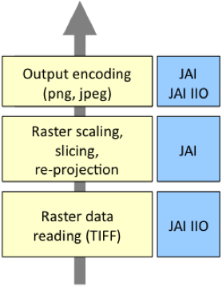
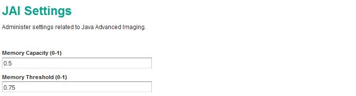

.. _sysadmin.production.performance:

Performance
===========

Performance is a measure of how fast Stratus can fulfill client requests. Factors that affect performance include hardware capacity, data tuning, software versions and configuration, network saturation, caching, and many others. Because of this range of factors, performance of production systems should be analyzed on a case-by-case basis. However, there are some general strategies for improving performance that are effective in most cases.

Note that while performance is often the main focus of system tuning, it is advisable to ensure that the service is reliable before attempting to improve performance. Fortunately, many of the strategies presented earlier for increasing reliability also provide a boost to performance.

Java Virtual Machine
--------------------

For best performance, use the **Oracle (Sun) Java HotSpot Virtual Machine (JVM)**. Testing has shown that the Oracle JVM is significantly faster than other JVM implementations.  For best results evaluate the latest release of the JVM, since each new version has offered significant performance improvements.

The performance optimizations available for each JVM release change. If you are experienced with application server tuning please keep in mind that Stratus handles an unusual workload that includes requests with heavy resource use.

.. note:: Oracle Java 7 provides very detailed memory management and performance tuning options that can be tuned for specific workloads. For details see `Java HotSpot VM Options <http://www.oracle.com/technetwork/java/javase/tech/vmoptions-jsp-140102.html>`_. Oracle's `Java SE 6 Performance White Paper <http://www.oracle.com/technetwork/java/6-performance-137236.html>`_ describes the JVM improvements that were introduced in Java SE 6 (specifically see `Section 2.3 - Ergonomics in the 6.0 Virtual Machine <http://www.oracle.com/technetwork/java/6-performance-137236.html#2.3>`_). Java 7 has introduced Oracle's `Garbage-First Collector <http://docs.oracle.com/javase/7/docs/technotes/guides/vm/G1.html>`_ that should be considered for installations working with 6GB or lager heap space. Java 8 introduces `Metaspace <https://blogs.oracle.com/poonam/entry/about_g1_garbage_collector_permanent>`_ as a replacement for the ``PermGen`` settings used to manage application size.

.. warning:: Stratus requires **Java 8**.

JVM tuning
----------

Certain JVM operating characteristics can be tuned to optimize performance when running Stratus.  The following parameters can be configured:

* ``-server`` forces the use of the Java HotSpot Server VM
* ``-Xms2048m -Xmx2048m`` sets the JVM to use 2048 megabytes (2 GB) of memory for the heap, and allocates it all on startup (the heap size should be adjusted to fit the actual memory available)
* ``-XX:NewRatio=2`` tunes the JVM for handling a large number of short-lived objects

The method of setting these parameters is container-specific. Refer to :ref:`sysadmin.startup` for more details.

JAI and JAI Image I/O
---------------------

GeoServer uses the Java Advanced Imaging (JAI) API for raster manipulation and analysis, and the JAI Image I/O API for image encoding and decoding. The next figure shows where JAI and JAI I/O are utilized in the WMS and WCS processing pipeline.

   *JAI and JAI I/O usage in GeoServer*

The memory made available for image processing is controlled in the GeoServer Admin application on the :menuselection:`Settings --> Global` page.

   GeoServer JAI Settings

**Memory capacity** indicates the proportion of available memory to reserve for image processing. The default setting of `0.5` allows JAI to use up to half of the default ``-Xmx756m`` heap space. This provides up to ``378`` MB for image processing use.

**Memory Threshold** is used to control when JAI will release images that have been temporarily staged in memory. The default value of `0.75` will ensure that out of the ``378`` MB above, ``284`` MB will be used to hold on to imagery in case it can be reused, and ``94`` MB will always be available for quickly working with new imagery.

The JAI and JAI Image I/O APIs provide both Java and native code implementations for most operating system platforms. GeoServer will use the native code implementations by default if they are present.

JDK and JAI Performance Comparison
~~~~~~~~~~~~~~~~~~~~~~~~~~~~~~~~~~

The following figure compares the performance of GeoServer running on the Oracle (Sun) JDK and OpenJDK, with and without JAI native code enabled. The test uses random map requests for TIGER roads data at 1:3M scale, styled with a simple black line. The results demonstrate that using the Oracle JDK with the JAI native code implementation provides the best overall performance by a significant margin.

.. figure:: img/performance_comparison.png
   :align: center

   *Performance comparison*

Data Optimization
-----------------

A major factor affecting GeoServer performance is data optimization. Data that is not optimized reduces performance by requiring more disk I/O and increasing CPU load. Vector (feature) and raster (coverage) data can both be tuned to improve performance by taking advantage of software optimizations and by choosing appropriate formats.

Optimizing data for use in the cloud has some differences from regular data optimization, which are detailed below. Most importantly, avoid anything that requires the server to download an entire file when it only needs a portion of that file's contents.

Vector Data
~~~~~~~~~~~

The first step to improve vector data performance is to use a format that is designed for rapid data retrieval. This means choosing formats that support indexes, such as spatially-enabled databases. Avoid using data interchange formats such as GML, since they are not designed to allow rapid access. Also avoid using file-based formats such as Shapefiles, since in a cloud environment you will often need to transfer the entire contents of the file over the network.

Always use indexes when available for querying.  Indexing increases performance by improving the efficiency of queries and data retrieval. Indexes should be defined on all attributes used in GeoServer queries, including geometry and any non-spatial attributes used in filters.

Reprojecting vector data into a different coordinate system is processor-intensive. For optimal performance data should be stored in the coordinate system that is most commonly requested by service clients.

If the application requires multi-scale rendering, considering using multiple data layers with different levels of generalization. The classic example is storing multiple levels of coastline features with detail dependent on the scale.

Cartographic styling also affects performance. Using scale dependencies (via the ``MaxScaleDenominator`` and ``MinScaleDenominator`` SLD elements) can reduce rendering costs and time by drawing fewer features at small scales. Using a complex style at all zoom levels is usually unnecessary. Use simpler styling at small scales, and reserve complex styling for higher zoom levels.

These map styling guidelines help to improve rendering performance:

* Draw fewer features at small scales (when zoomed out)
* Draw important features at middle and large scales
* Draw no more than approximately 1,000 features per request
* Minimize the use of complex styling such as partial transparency, labeling, halos, multiple feature type styles, and multiple symbolizers per feature, as they can add significant processing overhead

Raster Data
~~~~~~~~~~~

Optimizing raster data is crucial to obtaining good rendering performance. Often raster data is stored in a format that is suitable for archival and distribution, but this usually does not provide optimum performance when serving image data via GeoServer.

When serving single raster images, performance can be enhanced by storing imagery in the GeoTIFF format.  For maximum performance, avoid using image compression.  For large images, internal tiling and image overviews should be used to provide fast access to sub-areas and lower-resolution versions of the image.  The open source `Geospatial Data Abstraction Library <http://gdal.org>`_, or GDAL, is a powerful set of tools for restructuring raster data formats. The ``gdaladdo`` tool from this library allows creating overviews for single image files.  When using multiple files to create image mosaics, the ``gdal_retile`` tool can be used to create external image pyramids in either the file system or a database.

For best performance when using raster data with Stratus, use cloud optimized GeoTIFFs. These are a special type of GeoTIFF file organized such that clients can fetch only the portion of the file that is needed, rather than transfering the whole file over the network whenever it is queried. You can convert existing GeoTiffs into cloud optimized GeoTiffs `using gdal_translate <https://trac.osgeo.org/gdal/wiki/CloudOptimizedGeoTIFF#HowtogenerateitwithGDAL>`_. Cloud optimized GeoTiffs stored in S3 can be acessed using the :ref:`S3 GeoTiff data store <dataadmin.s3.geotiff>`.

As with vector data, reprojecting rasters to a different coordinate system is computationally intensive and will degrade performance. Raster data should be stored in the coordinate system most commonly requested.

Summary
-------

There are many factors that can affect Stratus performance. This section has presented the following general tuning strategies:

* Use the most recent version of the Oracle JVM
* Configure JVM options for maximum performance
* Store vector data using formats such as spatial databases
* Use spatial and attribute indexes where available
* For multi-scale data use multiple layers with different levels of generalization
* Use styling scale dependencies, and avoid performance-intensive styling when rendering large numbers of features
* Store raster data in efficient formats such as cloud optimized GeoTIFF
* Use image tiling and overviews where possible
* Store vector and raster data in the most frequently requested coordinate system
