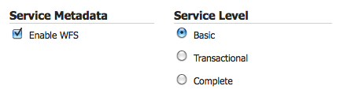
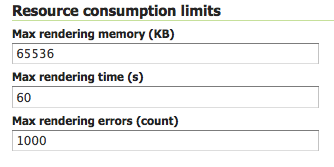
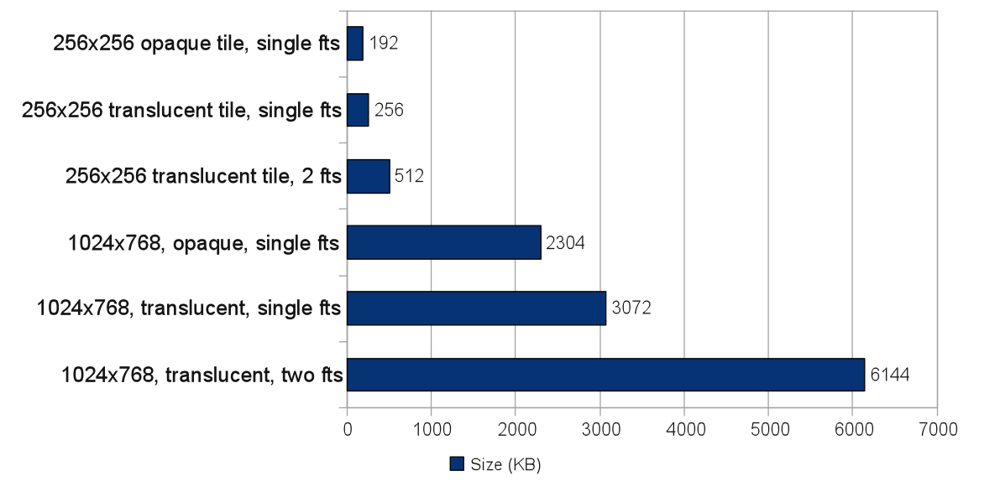
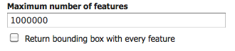
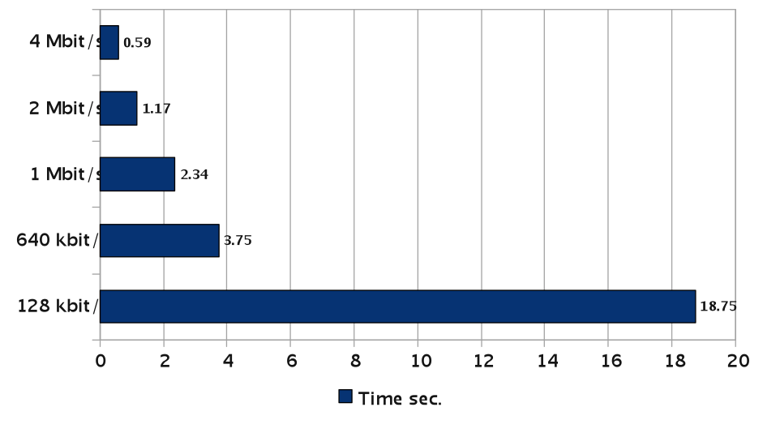

.. _sysadmin.production.reliability:

Reliability
===========

Reliability is a measure of how many requests fail in a given period of time. A failed request is one that does not correctly return the requested resource (such as a map image or feature dataset). Request failures may be caused by lack of or poor configuration of resources such as CPU cycles, memory, and network bandwidth. Requests may also fail because other requests are consuming an excessive amount of resources. For example, a particular request may consume 95% of the allocated server resources, causing other requests to fail due to lack of resources. (Note that reliability does not consider requests that fail because they are incorrectly specified; e.g. asking for layers or styles that do not exist.)

GeoServer reliability can be increased by implementing the following general tuning strategies:

* Disable unused services
* Control server resources
* Limit concurrent requests

Disable Unused Services
-----------------------

To improve resource usage and reduce failure risk, disable all GeoServer services that are not being used. For example, if a GeoServer is used to serve only maps, enable WMS and read-only WFS, and disable WFS-T (Web Feature Service-Transactional) and Web Coverage Service (WCS).

The Web Administration Interface provides controls for enabling and disabling specific services (see below).

   *Service Metadata and Service Level options for WFS services*

Control Server Resources
------------------------

Reliability can be improved by setting limits on the server resources that can be used by individual requests.  For WMS services, the maximum memory allocated and the maximum time allowed per request can be controlled. For WFS services, the maximum number of features returned can be controlled. In addition, choosing efficient WFS response formats improves resource utilization, and allocating sufficient network bandwidth will maximize WFS throughput.

Limit WMS Rendering Memory
~~~~~~~~~~~~~~~~~~~~~~~~~~

The amount of rendering memory a single WMS GetMap request is allowed to use is controlled by the **WMS / Max rendering memory** parameter in the Web Administration Interface or via REST through ``geoserver/rest/services/wms/settings``(stored as ``maxRequestMemory``).

   *Configuration options for WMS services*

The amount of rendering memory needed depends on the requested image size.  There is also a dependency on the number of ``FeatureTypeStyle`` elements used in the Styled Layer Descriptor (SLD). FeatureTypeStyles (FTS) are used in GeoServer to control the graphical stacking of features. For example, drawing cased lines (e.g. a line style for highways) requires using two FTS to draw first thick lines and then thin lines. Each FTS uses a separate drawing buffer, which allows a single scan of the source and improves performance.

The formula to calculate the amount of rendering memory used by a WMS request is::

  BytesUsed = PixelDepth X ImageWidth X ImageHeight X MaximumFeatureTypeStyles

where:

* *PixelDepth* is 3 bytes with no transparency, 4 bytes with transparency
* *ImageWidth* is the width of the requested image, in pixels
* *ImageHeight* is the height of the requested image, in pixels
* *MaximumFeatureTypeStyles* is the maximum number of FeatureTypeStyles used across all features types in the request

The following chart shows the amount of memory used for common request sizes. Rendering memory usage ranges from 200 kilobytes for a typical 256X256 tile request up to 6 megabytes for a 1024X768 screen-sized request with transparency and using 2 FeatureTypeStyle buffers.

   *Memory use of common requests*

In general, 16 megabytes is sufficient to render a 2048X2048 image at 4 bytes per pixel (full color and transparency). This is the size of an 8X8 meta-tile if tiling is being used.

Limit WMS Rendering Time
~~~~~~~~~~~~~~~~~~~~~~~~

GeoServer allows specifying the maximum amount of time that will be spent processing individual WMS requests.  This is controlled by the **WMS / Max rendering time** parameter in the Web Administration Interface or via REST through ``geoserver/rest/services/wms/settings`` (stored as ``maxRenderingTime``). The parameter limits map rendering time, which includes the time it takes to retrieve features and rasterize them into a map image. This does not include the time to send the response back to the client. For example, when a PNG or JPEG image is created, the parameter limits the total rendering time, but not the time used to transmit the image.

When setting the maximum rendering time it is important to take into consideration peak load conditions. For example, under average load GetMap requests may take less than a second. It is desirable to allow requests to take longer under high load situations, but the limit should probably not exceed more than a few minutes.  In most environments a setting of 120 seconds is sufficient to render map requests. A request that processes for a full 120 seconds likely indicates an anomalous situation, such as a GetMap request against a layer using a style that does not have appropriate scale dependencies, and is thus rendering too many features.

Limit WFS Response Size
~~~~~~~~~~~~~~~~~~~~~~~

Excessively large WFS responses can take a long time to process and occupy a large fraction of outgoing bandwidth.  GeoServer allows setting a limit on the number of features in a WFS request via the **WFS / Maximum number of Features** parameter in the Web Administration Interface via REST through ``geoserver/rest/services/wms/settings`` (stored as ``maxFeatures``).

   *Configuration options for WFS services*

The default limit is 1,000,000 features per response.  This can be set lower if it is known that WFS response size will always be smaller (e.g. by determining the maximum feature count over all datasets being served).

Optimize WFS Responses
~~~~~~~~~~~~~~~~~~~~~~

For most WFS output formats (such as GML, JSON, and CSV) GeoServer operates in full streaming mode by default. Streaming the response allows the WFS to use only a small amount of memory when processing a request.

Some formats cannot be streamed, and hence use more server resources.  Output formats that are compressed (such as zipped Shapefiles) are staged on disk, so response time may be reduced by disk latency. Other output formats (such as Microsoft Excel) are staged in memory, and can use potentially large amounts of server memory.  If resources are limited, these formats should be avoided or limited in size.

Some output formats (such as GML and JSON) are verbose and can result in large response payloads.  GeoServer transparently compresses responses to reduce their size (using HTTP 1.1 GZIP compression). If front-end layers such as proxy servers are in use, ensure that they do not defeat this strategy by expanding compressed HTTP responses.

Allocate Network Bandwidth
~~~~~~~~~~~~~~~~~~~~~~~~~~

WFS requests can produce large responses, which can result in high network bandwidth consumption and long request times. The following chart shows, for various values of bandwidth, the time taken to deliver a 300K response payload (this is a typical screen-sized WMS image, or 8,000 WFS features GZIP-compressed).

   *Response times to send 300kb as a function of bandwidth*

The outgoing bandwidth is shared across all active requests, so each response gets only a fraction of it. More concurrent requests results in a smaller portion of bandwidth for each response, and thus longer response times.  If possible, network bandwidth should be sized to accommodate expected peak request load.  To handle situations where available bandwidth is fixed, the following section shows how to control the number of concurrent requests.

Limit Concurrent Requests
-------------------------

Limiting the number of requests processing concurrently inside GeoServer is important for a number of reasons:

* **Performance**:  Testing shows that for GetMap requests against local data sources, maximum throughput is achieved when the number of parallel requests is at most twice the number of CPU cores.  Also, too many concurrent requests can saturate the network bandwidth available for response,  causing all requests to slow down.
* **Resource usage**:  Requests such as GetMap can use a significant amount of memory. The WMS Rendering Memory Limit controls the amount of memory used for each request, but if too many requests run concurrently it is still possible to exceed the heap memory allocated to the host JVM. By limiting the number of concurrent requests the total amount of memory used can be kept below the maximum memory size.
* **Fairness**:  Individual users should be prevented from flooding the server with requests, which denies other users access to services.

GeoServer can control request concurrency by either limiting the number of server threads available, or by controlling request flow via queueing.

Application Server Thread Limit
~~~~~~~~~~~~~~~~~~~~~~~~~~~~~~~

The simplest way to control concurrent requests is to to limit the number of server threads available to process requests. Note that the default setting may be too high for GeoServer's potentially long processing times and large response sizes.  It is recommended that GeoServer instances be limited to around 20 concurrent requests.

You can set the maximum and minimum worker threads with the ``server.tomcat.max-threads=0`` and ``server.tomcat.min-spare-threads=0`` properties. Refer to :ref:`sysadmin.config` for more information on configuring the application.yml properties.

Total Request Count Control
~~~~~~~~~~~~~~~~~~~~~~~~~~~

The maximum number of OWS requests allowed to execute concurrently can be specified with::

    ows.global=<count>

Requests in excess of this count are queued, and executed as other requests complete and execution slots become free.

Per-Request Type Control
~~~~~~~~~~~~~~~~~~~~~~~~

Limits on concurrent requests can be set for specific services and request types using the following syntax::

  ows.<service>[.<request>[.<outputFormat>]]=<count>

where:

* ``<service>``: the OWS service (WMS, WFS, WCS)
* ``<request>``: [optional] the request type. For example, for WMS requests the type can be GetMap, GetFeatureInfo, DescribeLayer, GetLegendGraphics, GetCapabilities
* ``<outputFormat>``: [optional] the output format of the request. For example, for WMS GetMap requests the format can be ``image/png``, ``image/gif``, or any other supported output format

Examples::

  # don't allow more than 16 WCS requests in parallel
  ows.wcs=16

  # don't allow more than 8 WMS GetMap requests in parallel
  ows.wms.getmap=8

  # don't allow more than 2 WFS GetFeature requests with Excel output format
  ows.wfs.getfeature.application/msexcel=2

Per-User Control
~~~~~~~~~~~~~~~~

A limit on the number of requests from individual users can be specified with::

  user=<count>

where ``<count>`` is the maximum number of concurrent requests a single user can execute.

Note that user identity is tracked using HTTP cookies, so this will work for browser-based clients, but possibly not for other kinds of clients.

Request Queue Timeout
~~~~~~~~~~~~~~~~~~~~~

The request queue timeout limit can be specified with::

  timeout=<seconds>

where ``<seconds>`` is the number of seconds a request remains queued while waiting for execution. If a queued request does not enter execution before the timeout expires it is dropped from the queue.

The following is an example of a typical ``controlflow.properties`` file for a server having 4 cores::

  # if a request waits in queue for more than 60 seconds then it's not
  # worth executing, as the client will likely have given up by then
  timeout=60

  # don't allow the execution of more than 100 requests total in parallel
  ows.global=100

  # don't allow more than 10 GetMap requests in parallel
  ows.wms.getmap=10

  # don't allow more than 4 outputs with Excel output as it is memory-bound
  ows.wfs.getfeature.application/msexcel=4

  # don't allow a single user to perform more than 6 requests in parallel
  # (6 being the Firefox default concurrency level at the time of writing)
  user=6

Summary
-------

There are a number of strategies that can be used to increase the reliability of Stratus instances in production environments.  The following checklist summarizes the strategies discussed in this section:

* Disable unused services to simplify the instance and reduce demand on the server
* Set WMS rendering memory allocation and processing time limits
* Set WFS response size limits
* Optimize the types of WFS response formats
* Ensure that WFS response compression is being maintained
* Allocate sufficient bandwidth to handle expected WFS request load
* Limit available server threads to reduce request concurrency
* Implement control flow to queue requests and avoid server overload
