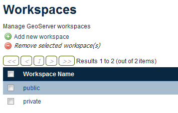

.. _sysadmin.security.multiuser:

Working with multiple GeoServer users
=====================================

This section discusses how to set up GeoServer with multiple users based on a common security scenario.

For more details on the mechanics of how to set up users, please read the `security <../../../geoserver/security>`_ section of the `GeoServer documentation <../../../geoserver/>`_, specifically the section on `users, groups, and roles <../../../geoserver/webadmin/security/ugr.html>`_.

Users in GeoServer
------------------

GeoServer has the ability to create multiple user accounts. These users can have access to any aspect of GeoServer functionality, from the ability to edit the metadata for a workspace to the viewing of a capabilities document.

By default, GeoServer comes with two users:

* An administrative account (``admin``)—This account has the ability to read or write anything in the GeoServer catalog.
* A master, or ``root``, account—This is an administrator account of "last resort" that is only to be used for disaster recovery purposes. This account can not be disabled or modified. See the GeoServer documentation on the `root account <../../../geoserver/security/root.html>`_.

In addition to the named users above, many functions are available through anonymous access, with no user account required. Functions allowed anonymously by default include viewing capabilities documents, executing GetFeature and GetMap requests, and using the Demo Request Builder.

Reasons to set up a multi-user system
-------------------------------------

There are good reasons to set up accounts with granular access. Many of these considerations are not unique to GeoServer, but instead apply to any security situation:

* Need-to-know basis—Not every user should have access to the same information.
* Minimizing disaster—Accounts with more fine-grained access lack the ability to accidentally (or maliciously) inflict widespread damage to the system.
* Audit trail—Sequestering access to certain GeoServer resources allows system administrators to keep track of who has made what changes.

.. todo:: What other reasons? Can we audit who has done what in GeoServer?

Multi-user scenario
-------------------

This tutorial will implement the following basic security scenario:

1. Most of the data to be served is **public information**, so anyone should be able to view map images.
2. Some layers contain **private information** (perhaps personal or confidential), so image viewing should be disallowed unless someone has specialized access to this information.
3. Only certain people should be able to **edit the public layers**
4. Those who can edit the public layers should be the only users able to download the data.
5. Certain other people should be able to **edit the non-public layers**
6. For security and bandwidth reasons, you want to disallow WPS for all users except for the administrator.
7. REST access should be enabled only for the administrator.

Based on this scenario, three accounts will need to be created:

* ``public_editor``—This account will be able to edit the public data
* ``private_viewer``—This account will be able to view the private data
* ``private_editor``—This account will be able to edit the private data

Anonymous access would be retained for viewing the public data, and the administrative account would be retained for administering GeoServer. Any account that can edit (write to) data will have the ability to view (read) that data, but while ``private_editor`` is able to edit the *private* data, the user will not be able to edit the public data.

.. todo:: A figure showing the users and what they can do (like a Venn Diagram) would be great here.

Configuring catalog
-------------------

Public layers as defined above will be in a workspace called ``public``, and private layers will be in a workspace called ``private``.

.. note:: The specific details of the data setup are beyond the scope of this tutorial.

   Workspaces used in this tutorial

Creating roles
--------------

Having identified the scenario and determined what accounts need to be created, the next step is to create the roles that these users will be attached to when the users are created. Based on the the three accounts identified above, the roles to be created will be called ``ROLE_EDIT``, ``ROLE_PRIVATE``, and ``ROLE_PRIVATEEDIT``.

Setting up roles can be done through the GeoServer web admin interface. This will assume that the default role service will be used.

.. note:: For more information, see the GeoServer documentation on `role services <../../../geoserver/security/usergrouprole/roleservices.html>`_.

.. todo:: Show this via REST?

#. Open up the GeoServer web interface and log in as the administrator account.

   .. figure:: img/adminloggedin.png

      Logged in as the administrator

#. Click :guilabel:`Users, Groups, Roles` under the :guilabel:`Security` column on the left side of the page.

   .. figure:: img/ugrlink.png

      Click to open the Users, Groups, Roles area

#. Under the :guilabel:`Role Services` section, click the :guilabel:`default` role service.

   .. figure:: img/roleservicedefaultlink.png

      Click to edit the role service

#. Click the :guilabel:`Roles` tab at the top.

   .. figure:: img/rolestablink.png

      Click to view the existing roles

#. The current list of roles will be shown. Click :guilabel:`Add new role`.

   .. figure:: img/addnewrolelink.png

      Click to add a new role

#. Enter ``ROLE_PRIVATE`` in the :guilabel:`Name` field and click :guilabel:`Save`.

   .. figure:: img/newrole.png

      Adding a new role

#. Repeat the process, adding two more roles, ``ROLE_EDIT`` and ``ROLE_PRIVATEEDIT``.

   .. figure:: img/roles.png

      Full list of roles

Creating users
--------------

The next step is to create users and associate them with the newly-created roles. Note that at this point, the roles won't "do" anything; that will come in a following step.

#. Click back to :guilabel:`Users, Groups, Roles` under the :guilabel:`Security` column on the left side of the page.

#. Under the :guilabel:`User/group services` section, click the :guilabel:`default` user/group service.

   .. figure:: img/ugservicedefaultlink.png

      Click to edit the user/group service

#. Click the :guilabel:`Users` tab. This will show the current list of users.

   .. figure:: img/userstablink.png

      Click to view the existing users

#. Click :guilabel:`Add new user`.

   .. figure:: img/addnewuserlink.png

      Click to add a new user

#. Fill out the form with the following information, leaving all other fields blank:

   * In the :guilabel:`User name` field, enter ``public_editor``.
   * In the :guilabel:`Password` field and :guilabel:`Confirm password` field, enter a password.
   * In the area titled :guilabel:`Roles taken from active role service: default`, click ``ROLE_EDIT`` and slick the right-arrow to move the role to the :guilabel:`Selected` box.

   .. figure:: img/newuser.png

      Adding a new user

#. Click :guilabel:`Save`.

#. Click :guilabel:`Add new user` again and repeat the above process, creating two new users, ``private_viewer`` and ``private_edit``, and associating them with the ``ROLE_PRIVATE`` and ``ROLE_PRIVATEEDIT`` roles, respectively.

Setting permissions
-------------------

With users created and attached to roles, the next step is to apply security restrictions to these roles.

Refer to the above numbered list of requirements for this scenario:

1. Allow anonymous viewing of public layers
~~~~~~~~~~~~~~~~~~~~~~~~~~~~~~~~~~~~~~~~~~~

By default all layers are public, so this requirement has been already been met.

2. Restrict viewing of private layers
~~~~~~~~~~~~~~~~~~~~~~~~~~~~~~~~~~~~~

The ``private`` workspace is set up to store the private data. The ``private_viewer`` and ``private_editor`` accounts should be the only accounts that are able to read the content of this workspace.

#. Click :guilabel:`Data` in the :guilabel:`Security` menu on the left side of the page.

   .. figure:: img/datalink.png

      Click to open the data rules area

#. Click :guilabel:`Add new rule`.

   .. figure:: img/dataaddnewrulelink.png

      Click to add a new rule

#. Fill out the form with the following information:

   * In the :guilabel:`Workspace` box, select :guilabel:`private`.
   * In the :guilabel:`Layer` box, select :guilabel:`* (asterisk)`.
   * In the :guilabel:`Access mode` box, select :guilabel:`Read`.
   * in the :guilabel:`Roles` section, click :guilabel:`ROLE_PRIVATE` and :guilabel:`ROLE_PRIVATEEDIT` and then click the right-arrow to move both roles to the :guilabel:`Selected` box.

   .. figure:: img/newprivateviewrule.png

      Creating a rule to restrict viewing of private layers

#. Click :guilabel:`Save`.

3. Restrict editing of public layers
~~~~~~~~~~~~~~~~~~~~~~~~~~~~~~~~~~~~

The ``public`` workspace is set up to store the public data. While anonymous access will be retained for viewing layers in this workspace, the ``public_editor`` user should be the only user to be able to edit layers in this workspace.

#. Click :guilabel:`Add new rule` again.

#. Fill out the form with the following information:

   * In the :guilabel:`Workspace` box, select :guilabel:`public`.
   * In the :guilabel:`Layer` box, select :guilabel:`* (asterisk)`.
   * In the :guilabel:`Access mode` box, select :guilabel:`Write`.
   * in the :guilabel:`Roles` section, click :guilabel:`ROLE_EDIT` and then click the right-arrow to move the role to the :guilabel:`Selected` box.

   .. figure:: img/newpubliceditrule.png

      Creating a rule to restrict editing of public layers

#. Click :guilabel:`Save`.

4. Restrict downloading of layer data
~~~~~~~~~~~~~~~~~~~~~~~~~~~~~~~~~~~~~

The ``public_editor`` and ``private_editor`` users are the only users that should have access to download layer data. This means that the ``ROLE_EDIT`` and ``ROLE_PRIVATEEDIT`` should be the only roles that have access to WFS.

#. Click :guilabel:`Services` in the :guilabel:`Security` menu on the left side of the page.

   .. figure:: img/serviceslink.png

      Click to open the service rules area

#. Click :guilabel:`Add new rule`.

   .. figure:: img/serviceaddnewrulelink.png

      Click to add a new service rule

#. Fill out the form with the following information:

   * In the :guilabel:`Service` box, select :guilabel:`wfs`.
   * In the :guilabel:`Method` box, select :guilabel:`* (asterisk)`.
   * in the :guilabel:`Roles` section, click :guilabel:`ROLE_EDIT` and :guilabel:`ROLE_PRIVATEEDIT` and then click the right-arrow to move both roles to the :guilabel:`Selected` box.

   .. figure:: img/newservicerule.png

      Creating a new service rule

#. Click :guilabel:`Save`.

   .. figure:: img/wfsrestricted.png

      Completed rule

5. Restrict editing of the private layers
~~~~~~~~~~~~~~~~~~~~~~~~~~~~~~~~~~~~~~~~~

The ``private_editor`` user has been given read access to the ``private`` workspace, but needs to also be given write access as well.

#. Click :guilabel:`Data` in the :guilabel:`Security` menu on the left side of the page.

#. Click :guilabel:`Add new rule`.

#. Fill out the form with the following information:

   * In the :guilabel:`Workspace` box, select :guilabel:`private`.
   * In the :guilabel:`Layer` box, select :guilabel:`* (asterisk)`.
   * In the :guilabel:`Access mode` box, select :guilabel:`Write`.
   * in the :guilabel:`Roles` section, click :guilabel:`ROLE_PRIVATEEDIT` and then click the right-arrow to move the role to the :guilabel:`Selected` box.

   .. figure:: img/newdatarule.png

      Creating a new data access rule

#. Click :guilabel:`Save`.

   .. figure:: img/datarules.png

      Complete list of data access rules

6. Restrict WPS
~~~~~~~~~~~~~~~

The Web Processing Service (WPS) can impose a strong performance penalty if left unsecured. As it is not necessary in this scenario, it will be restricted to the administrator account only.

#. Click :guilabel:`Services` in the :guilabel:`Security` menu on the left side of the page.

#. Click :guilabel:`Add new rule`.

#. Fill out the form with the following information:

   * In the :guilabel:`Service` box, select :guilabel:`wps`.
   * In the :guilabel:`Method` box, select :guilabel:`* (asterisk)`.
   * in the :guilabel:`Roles` section, click :guilabel:`ADMIN` and then click the right-arrow to move the role to the :guilabel:`Selected` box.

   .. figure:: img/newwpsrule.png

      Creating a rule that restricts WPS

#. Click :guilabel:`Save`.

   .. figure:: img/servicerules.png

      Complete list of service access rules

.. note:: WPS processes can be restricted by roles on a per-process or per-process group basis. See the section on :ref:`sysadmin.security.wps` for more details.

7. Restrict REST access except for the administrator
~~~~~~~~~~~~~~~~~~~~~~~~~~~~~~~~~~~~~~~~~~~~~~~~~~~~

The REST interface is configured to be accessed by the administrator by default, so this requirement has already been met.

Viewing permissions
-------------------

Check that the setup is correct by comparing settings to the following configuration resources :ref:`accessible via REST <sysadmin.stratus.resource>`.

Users
~~~~~

In the default user/group service, settings can be read and edited via REST at ``rest/resource/security/usergroup/default/users.xml`` and should look like the following:

.. code-block:: xml

    <?xml version="1.0" encoding="UTF-8"?>
    <userRegistry version="1.0" xmlns="http://www.geoserver.org/security/users">
        <users>
            <user enabled="true" name="admin" password="crypt1:34AorA43+YRaP5Ndflc2plv9et1Lrvz2"/>
            <user enabled="true" name="private_editor" password="crypt1:kMacwSIx/i6t0WMh9Q0g33+DNIJKmd1I"/>
            <user enabled="true" name="private_viewer" password="crypt1:J8XrZXsHP4efI1C8mXqPScvb91I4h3jQ"/>
            <user enabled="true" name="public_editor" password="crypt1:N0aHmlK3ftdguggsXKtL4oeX0amjMW8I"/>
        </users>
        <groups/>
    </userRegistry>

The specific password hashes will differ according to the passwords used.

Roles
~~~~~

In the default role service, settings can be read and edited via REST at ``rest/resource/security/role/default/roles.xml`` and should look like the following:

.. code-block:: xml

    <?xml version="1.0" encoding="UTF-8"?>
    <roleRegistry version="1.0" xmlns="http://www.geoserver.org/security/roles">
        <roleList>
            <role id="ADMIN"/>
            <role id="GROUP_ADMIN"/>
            <role id="ROLE_EDIT"/>
            <role id="ROLE_PRIVATE"/>
            <role id="ROLE_PRIVATEEDIT"/>
        </roleList>
        <userList>
            <userRoles username="admin">
                <roleRef roleID="ADMIN"/>
            </userRoles>
            <userRoles username="private_editor">
                <roleRef roleID="ROLE_PRIVATEEDIT"/>
            </userRoles>
            <userRoles username="private_viewer">
                <roleRef roleID="ROLE_PRIVATE"/>
            </userRoles>
            <userRoles username="public_editor">
                <roleRef roleID="ROLE_EDIT"/>
            </userRoles>
        </userList>
        <groupList/>
    </roleRegistry>

Services
~~~~~~~~

Service permissions can by read an altered via REST at ``rest/resource/security/services.properties`` and should look like this::

    *.*=*
    wfs.*=ROLE_EDIT,ROLE_PRIVATEEDIT
    wps.*=ADMIN

Layers
~~~~~~

Layer permissions can be read and edited via REST at ``rest/resource/security/layers.properties`` and should look like the following::

    *.*.r=*
    *.*.w=*
    private.*.r=ROLE_PRIVATE,ROLE_PRIVATEEDIT
    private.*.w=ROLE_PRIVATEEDIT
    mode=HIDE

Testing the scenario
--------------------

There are a few different tests to ensure that the above rules have been implemented properly.

Anonymous access
~~~~~~~~~~~~~~~~

To test anonymous access, log out of GeoServer and perform the following tests:

.. list-table::
   :header-rows: 1

   * - Test
     - Expected result
   * - View a layer (via the Layer Preview) in the ``public`` workspace
     - *Success*
   * - View a layer (via the Layer Preview) in the ``private`` workspace
     - *Failure*
   * - Execute a WMS GetCapabilities request
     - Only ``public`` layers will display
   * - Execute a WFS GetCapablities request
     - *Failure*
   * - Edit a layer in the ``public`` workspace
     - *Failure*

.. todo:: What's the simplest way to test "editing a layer"?

``public_editor`` access
~~~~~~~~~~~~~~~~~~~~~~~~

To test access via the ``public_editor`` user, log in as that user and perform the following tests:

.. list-table::
   :header-rows: 1

   * - Test
     - Expected result
   * - View a layer (via the Layer Preview) in the ``public`` workspace
     - *Success*
   * - View a layer (via the Layer Preview) in the ``private`` workspace
     - *Failure*
   * - Execute a WMS GetCapabilities request
     - Only ``public`` layers will display
   * - Execute a WFS GetCapablities request
     - Only ``public`` layers will display
   * - Edit a layer in the ``public`` workspace
     - *Success*
   * - Edit a layer in the ``private`` workspace
     - *Failure*

``private_viewer`` access
~~~~~~~~~~~~~~~~~~~~~~~~~

To test access via the ``private_viewer`` user, log in as that user and perform the following tests:

.. list-table::
   :header-rows: 1

   * - Test
     - Expected result
   * - View a layer (via the Layer Preview) in the ``public`` workspace
     - *Success*
   * - View a layer (via the Layer Preview) in the ``private`` workspace
     - *Success*
   * - Execute a WMS GetCapabilities request
     - Both ``public`` and ``private`` layers will display
   * - Execute a WFS GetCapablities request
     - *Failure*
   * - Edit a layer in the ``public`` workspace
     - *Failure*
   * - Edit a layer in the ``private`` workspace
     - *Failure*

``private_editor`` access
~~~~~~~~~~~~~~~~~~~~~~~~~

To test access via the ``private_editor`` user, log in as that user and perform the following tests:

.. list-table::
   :header-rows: 1

   * - Test
     - Expected result
   * - View a layer (via the Layer Preview) in the ``public`` workspace
     - *Success*
   * - View a layer (via the Layer Preview) in the ``private`` workspace
     - *Success*
   * - Execute a WMS GetCapabilities request
     - Both ``public`` and ``private`` layers will display
   * - Execute a WFS GetCapablities request
     - Both ``public`` and ``private`` layers will display
   * - Edit a layer in the ``public`` workspace
     - *Failure*
   * - Edit a layer in the ``private`` workspace
     - *Success*

In addition, the administrator account should be able to accomplish all of the above tests.
