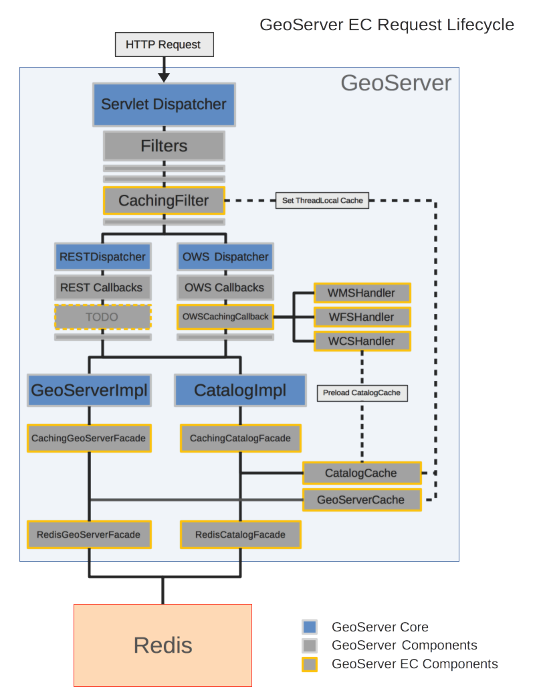

# Stratus 

A Spring Boot packaging of Geoserver that works with 2.10+

# Running the Stratus Application

Requires: Maven 3, Java 8, Local Redis instance

Checkout, then run with:

    mvn spring-boot:run

which will build the default release build. This includes the following profiles:

    gdal,geopkg,gsr,gwc,jp2k,mbstyle,vectortiles,wps

To run a minimal stratus build without any of these profiles, use the `-Dminimal` switch. 
For more information on the available profiles, refer to the [tagging and versioning guidelines](../tagging.md#profiles) or the [stratus-application pom.xml](./pom.xml).

You can enable additional profiles by using "-P" switch:

    mvn spring-boot:run -Pwebadmin

# Deploying with Docker

Before deploying with docker for the first time, [build the base docker image](../../build/docker/README.md).

To build a docker container [gsstratus/stratus](https://docker.io/repository/gsstratus/stratus) (To include additional profiles in the image, use the "-P" flag, same as above):

    mvn clean package docker:build

If you get an error `Exception caught: unauthorized: access to the requested resource is not authorized`, try manually pulling down the problematic base images from docker.io using `docker pull docker.io/gsstratus/$IMAGE_NAME:latest`.

By default, the docker image will be named `latest`. To name the image and push it to docker.io, run:

    docker tag gsstratus/stratus:latest docker.io/gsstratus/stratus:IMAGE_NAME
    docker push docker.io/gsstratus/stratus:IMAGE_NAME

You can also build and push to docker hub using

    mvn clean package docker:build -DpushImageTag

# Stratus Architecture

## Spring Boot application

Stratus runs as a Spring Boot application. This wraps the standard community GeoServer spring context in a spring-boot context. As part of this, all servlet configuration has been moved from the `web.xml` and similar files into annotation-based java cofiguration.

## Redis Catalog

Stratus uses a Redis-backed configuration and catalog. This is accomplished by replacing the DefaultCatalogFacade, DefaultGeoServerFacade, and ResourceStore with redis implementations.

Refer to the [redis-catalog](../stratus-redis-catalog/) submodule for more details.

## Caching

In order to reduce overhead, Stratus caches responses from the redis catalog over the lifetime of each individual request. The implementation of this is illustrated below. Everything included in Community GeoServer is outlined in grey, and anything added by Stratus is outlined in orange.

Request lifecycle:

1. An HTTP Request is recieved by the GeoServer Dispatcher and passed to the filter chain.

2. The CachingFilter constructs CatalogCache and GeoServerCache instances, storing them in ThreadLocals.

3. After all filters have been executed, the request is passed of to a specialized dispatcher, depending on the request type. OWS requests (WMS, WFS, WCS, etc.) are pased to the OWS Dispatcher, Rest requests are passed to the RESTDispatcher. (There is also a seperate dispatcher for Wicket UI requests, not included in this diagram).

4. At each phase of the request dispatch, a number of callbacks attached to the request are triggered. When an OWS request is initialized, the OWSCachingCallback is triggered, which preemptively loads data into the cache based on the content of the request. So far, this preloading is only implemented for WFS and WMS requests. WCS and REST suport is planned for future development.

5. As the dispatcher handles the request, it makes calls to the geoserver catalog (CatalogImpl) and configuration (GeoServerImpl) access points. These delegate to the respecive caching facades, which pull data from the cache. If nothing is found in the cache, we instead query the redis facade and update the cache accordingly (this lets us lazy-load the cache with any data that was not preloaded).

6. As the request completes, the CatalogFilter removes the CatalogCache and GeoServerCache ThreadLocals.

# Releasing Stratus

Prerequesites:

* Git
* Maven
* Docker
* Commit access to https://github.com/gsstratus/stratus/releases
* A Docker hub account, with access to https://docker.io/repository/gsstratus/stratus
* You must be logged into Docker Hub locally in docker

Release Procedure:

1. Checkout the commit that you will be performing the release from:

       git checkout $RELEASE_BRANCH
       git pull upstream $RELEASE_BRANCH

2. Update the Stratus version in the following files (if applicable):

   * The top of each `pom.xml` file.

         find . -type f -name "pom.xml" -exec sed -i '' 's/1.1.0-SNAPSHOT/1.2.1-SNAPSHOT/g' {} \;

   * [stratus-application/src/main/resources/banner.txt](./src/main/resources/banner.txt)

3. Build the release:

       mvn clean install

4. Tag the release (using 1.1.0 here as an example - note the `v` prefix):

       git tag v1.1.0
       git push upstream v1.1.0

5. Build the docker image:

       cd stratus-application
       mvn clean install docker:build -Pweb-admin -DskipTests

6. Publish the image to docker.io:

       docker tag gsstratus/stratus:latest docker.io/gsstratus/stratus:1.1.0
       docker push docker.io/gsstratus/stratus:1.1.0

7. Verify the new git tag is listed at https://github.com/gsstratus/stratus/releases.

8. Still on GitHub, click `Draft a new release`, selecting the tag you just pushed, and fill in details for this release (Only do this for final releases, not RCs).

9. Verify the new docker tag is listed at https://docker.io/repository/gsstratus/stratus?tab=tags

Once the release is complete, you can test the artifacts locally using [single-host-deploy.sh](../../deploy/standalone/single-host-deploy.sh) in stratus:

1. Update `DOCKER_TAG` to the tag you just pushed to docker.io, and ensure that `DOCKER_REPO=docker.io`

2. Run `single-host-deploy.sh`.

3. Navigate to http://localhost:8080/geoserver/web and verify the UI shows up.

4. Navigate to http://localhost:8080/geoserver/rest/manage/info and verify that the git commit id matches that of the tag you pushed to git.
